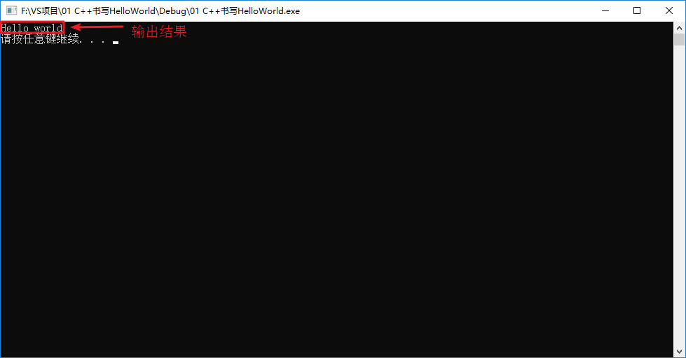
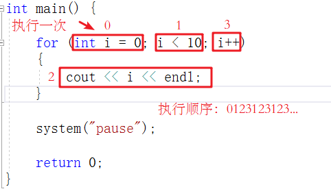

# C++基础入门

## 1 C++初识

### 1.1  第一个C++程序

编写一个C++程序总共分为4个步骤

* 创建项目
* 创建文件
* 编写代码
* 运行程序

#### 1.1.1 创建项目

​	Visual Studio是我们用来编写C++程序的主要工具，我们先将它打开


#### 1.1.2 创建文件

右键源文件，选择添加->新建项


给C++文件起个名称，然后点击添加即可。


#### 1.1.3 编写代码

```c++
#include<iostream>
using namespace std;//using namespace std; 告诉编译器使用 std 命名空间。命名空间是 C++ 中一个相对新的概念。

int main() {

	cout << "Hello world" << endl;

	system("pause");

	return 0;
}
```

#### 1.1.4 运行程序




### 1.2 注释

**作用**：在代码中加一些说明和解释，方便自己或其他程序员程序员阅读代码

**两种格式**

1. **单行注释**：`// 描述信息` 
   - 通常放在一行代码的上方，或者一条语句的末尾，==对该行代码说明==
2. **多行注释**： `/* 描述信息 */`
   - 通常放在一段代码的上方，==对该段代码做整体说明==

> 提示：编译器在编译代码时，会忽略注释的内容


### 1.3 变量

**作用**：给一段指定的内存空间起名，方便操作这段内存

**语法**：`数据类型 变量名 = 初始值;`

**示例：**

```C++
#include<iostream>
using namespace std;//using namespace std; 告诉编译器使用 std 命名空间。命名空间是 C++ 中一个相对新的概念。

int main() {

	//变量的定义
	//语法：数据类型  变量名 = 初始值

	int a = 10;

	cout << "a = " << a << endl;
	
	system("pause");

	return 0;
}
```


> 注意：C++在创建变量时，必须给变量一个初始值，否则会报错


### 1.4  常量

**作用**：用于记录程序中不可更改的数据

C++定义常量两种方式

1. **\#define** 宏常量： `#define 常量名 常量值`
   * ==通常在文件上方定义==，表示一个常量


2. **const**修饰的变量 `const 数据类型 常量名 = 常量值`
   * ==通常在变量定义前加关键字const==，修饰该变量为常量，不可修改

重点：这个`const`修饰的变量是不可以修改的！！之前并没有见过的。


**示例：**

```c++
//1、宏常量
#define day 7

int main() {

	cout << "一周里总共有 " << day << " 天" << endl;
	//day = 8;  //报错，宏常量不可以修改

	//2、const修饰变量
	const int month = 12;
	cout << "一年里总共有 " << month << " 个月份" << endl;
	//month = 24; //报错，常量是不可以修改的
	//这个const修饰的变量不允许被修改！！
	
	system("pause");

	return 0;
}
```


### 1.5 关键字

**作用：**关键字是C++中预先保留的单词（标识符）

* **在定义变量或者常量时候，不要用关键字**


C++关键字如下：

| asm        | do           | if               | return      | typedef  |
| ---------- | ------------ | ---------------- | ----------- | -------- |
| auto       | double       | inline           | short       | typeid   |
| bool       | dynamic_cast | int              | signed      | typename |
| break      | else         | long             | sizeof      | union    |
| case       | enum         | mutable          | static      | unsigned |
| catch      | explicit     | namespace        | static_cast | using    |
| char       | export       | new              | struct      | virtual  |
| class      | extern       | operator         | switch      | void     |
| const      | false        | private          | template    | volatile |
| const_cast | float        | protected        | this        | wchar_t  |
| continue   | for          | public           | throw       | while    |
| default    | friend       | register         | true        |          |
| delete     | goto         | reinterpret_cast | try         |          |

`提示：在给变量或者常量起名称时候，不要用C++得关键字，否则会产生歧义。`


### 1.6 标识符命名规则

**作用**：C++规定给标识符（变量、常量）命名时，有一套自己的规则

* 标识符不能是关键字
* 标识符只能由字母、数字、下划线组成
* 第一个字符必须为字母或下划线
* 标识符中字母区分大小写

> 建议：给标识符命名时，争取做到见名知意的效果，方便自己和他人的阅读


## 2 数据类型

C++规定在创建一个变量或者常量时，必须要指定出相应的数据类型，否则无法给变量分配内存

### 2.1 整型

**作用**：整型变量表示的是==整数类型==的数据

C++中能够表示整型的类型有以下几种方式，**区别在于所占内存空间不同**：

| **数据类型**        | **占用空间**                                    | 取值范围                              |
| ------------------- | ----------------------------------------------- | ------------------------------------- |
| short(短整型)       | 2字节                                           | (-2^15 ~ 2^15-1)(-32768~32767)        |
| int(整型)           | 4字节                                           | (-2^31 ~ 2^31-1) (2^31=2,147,483,648) |
| long(长整形)        | Windows为4字节，Linux为4字节(32位)，8字节(64位) | (-2^31 ~ 2^31-1)                      |
| long long(长长整形) | 8字节                                           | (-2^63 ~ 2^63-1)                      |


### 2.2 sizeof关键字

**作用：**利用sizeof关键字可以==统计数据类型所占内存大小==

**语法：** `sizeof( 数据类型 / 变量)`

**示例：**

```C++
int main() {

	cout << "short 类型所占内存空间为： " << sizeof(short) << endl;

	cout << "int 类型所占内存空间为： " << sizeof(int) << endl;

	cout << "long 类型所占内存空间为： " << sizeof(long) << endl;

	cout << "long long 类型所占内存空间为： " << sizeof(long long) << endl;

	system("pause");

	return 0;
}

//注意：sizeof(变量)这个也是可以的！！
short num1 = 10;
sizeof(num1)和sizeof(short)一样的！都等于2。
```


> **整型结论**：==short < int <= long <= long long==


### 2.3 实型（浮点型）

**作用**：用于==表示小数==

浮点型变量分为两种：

1. 单精度float 
2. 双精度double

两者的**区别**在于表示的有效数字范围不同。

| **数据类型** | **占用空间** | **有效数字范围** |
| ------------ | ------------ | ---------------- |
| float        | 4字节        | 7位有效数字      |
| double       | 8字节        | 15～16位有效数字 |

有效数字：不只是小数点后面的数字，前面的整数也算。3.14：三位有效数字。

**示例：**

```C++
int main() {

	float f1 = 3.14f;
    //最好加上f,不加f，编译器会默认当double双精度来看，然后在转换为单精度
	double d1 = 3.14;
    //默认情况下，输出一个小数，会显示6位有效数字

	cout << f1 << endl;
	cout << d1<< endl;

	cout << "float  sizeof = " << sizeof(f1) << endl;
	cout << "double sizeof = " << sizeof(d1) << endl;

	//科学计数法
	float f2 = 3e2; // 3 * 10 ^ 2 
	cout << "f2 = " << f2 << endl;

	float f3 = 3e-2;  // 3 * 0.1 ^ 2
	cout << "f3 = " << f3 << endl;

	system("pause");

	return 0;
}
```

注意：定义单精度浮点型数据，后面加上f，是什么意思！！

输入输出`cout <<`和`cin >>`


### 2.4 字符型

**作用：**字符型变量用于显示单个字符

**语法：**`char ch = 'a';`


> 注意1：在显示字符型变量时，用单引号将字符括起来，不要用双引号

> 注意2：单引号内只能有一个字符，不可以是字符串


- C和C++中字符型变量只占用==1个字节==。
- 字符型变量并不是把字符本身放到内存中存储，而是将对应的ASCII编码放入到存储单元

<font color=Blue>这一句话，之前学习ASCII码时，都没学过，也可能学了忘记了！！这个重要的！！</font>

 <font color=yellow>我是黄色</font>

示例：

```C++
int main() {
	
	char ch = 'a';
	cout << ch << endl;
	cout << sizeof(char) << endl;

	//ch = "abcde"; //错误，不可以用双引号
	//ch = 'abcde'; //错误，单引号内只能引用一个字符

	cout << (int)ch << endl;  //查看字符a对应的ASCII码
	ch = 97; //可以直接用ASCII给字符型变量赋值
	cout << ch << endl;
	//a:97;A:65;0：48；
	system("pause");

	return 0;
}
```

ASCII码表格：

| **ASCII**值 | **控制字符** | **ASCII**值 | **字符** | **ASCII**值 | **字符** | **ASCII**值 | **字符** |
| ----------- | ------------ | ----------- | -------- | ----------- | -------- | ----------- | -------- |
| 0           | NUT          | 32          | (space)  | 64          | @        | 96          | 、       |
| 1           | SOH          | 33          | !        | 65          | A        | 97          | a        |
| 2           | STX          | 34          | "        | 66          | B        | 98          | b        |
| 3           | ETX          | 35          | #        | 67          | C        | 99          | c        |
| 4           | EOT          | 36          | $        | 68          | D        | 100         | d        |
| 5           | ENQ          | 37          | %        | 69          | E        | 101         | e        |
| 6           | ACK          | 38          | &        | 70          | F        | 102         | f        |
| 7           | BEL          | 39          | ,        | 71          | G        | 103         | g        |
| 8           | BS           | 40          | (        | 72          | H        | 104         | h        |
| 9           | HT           | 41          | )        | 73          | I        | 105         | i        |
| 10          | LF           | 42          | *        | 74          | J        | 106         | j        |
| 11          | VT           | 43          | +        | 75          | K        | 107         | k        |
| 12          | FF           | 44          | ,        | 76          | L        | 108         | l        |
| 13          | CR           | 45          | -        | 77          | M        | 109         | m        |
| 14          | SO           | 46          | .        | 78          | N        | 110         | n        |
| 15          | SI           | 47          | /        | 79          | O        | 111         | o        |
| 16          | DLE          | 48          | 0        | 80          | P        | 112         | p        |
| 17          | DCI          | 49          | 1        | 81          | Q        | 113         | q        |
| 18          | DC2          | 50          | 2        | 82          | R        | 114         | r        |
| 19          | DC3          | 51          | 3        | 83          | S        | 115         | s        |
| 20          | DC4          | 52          | 4        | 84          | T        | 116         | t        |
| 21          | NAK          | 53          | 5        | 85          | U        | 117         | u        |
| 22          | SYN          | 54          | 6        | 86          | V        | 118         | v        |
| 23          | TB           | 55          | 7        | 87          | W        | 119         | w        |
| 24          | CAN          | 56          | 8        | 88          | X        | 120         | x        |
| 25          | EM           | 57          | 9        | 89          | Y        | 121         | y        |
| 26          | SUB          | 58          | :        | 90          | Z        | 122         | z        |
| 27          | ESC          | 59          | ;        | 91          | [        | 123         | {        |
| 28          | FS           | 60          | <        | 92          | /        | 124         | \|       |
| 29          | GS           | 61          | =        | 93          | ]        | 125         | }        |
| 30          | RS           | 62          | >        | 94          | ^        | 126         | `        |
| 31          | US           | 63          | ?        | 95          | _        | 127         | DEL      |

ASCII 码大致由以下**两部分组**成：

* ASCII 非打印控制字符： ASCII 表上的数字 **0-31** 分配给了控制字符，用于控制像打印机等一些外围设备。
* ASCII 打印字符：数字 **32-126** 分配给了能在键盘上找到的字符，当查看或打印文档时就会出现。


### 2.5 转义字符

**作用：**用于表示一些==不能显示出来的ASCII字符==

现阶段我们常用的转义字符有：` \n  \\  \t`

| **转义字符** | **含义**                                | **ASCII**码值（十进制） |
| ------------ | --------------------------------------- | ----------------------- |
| \a           | 警报                                    | 007                     |
| \b           | 退格(BS) ，将当前位置移到前一列         | 008                     |
| \f           | 换页(FF)，将当前位置移到下页开头        | 012                     |
| **\n**       | **换行(LF) ，将当前位置移到下一行开头** | **010**                 |
| \r           | 回车(CR) ，将当前位置移到本行开头       | 013                     |
| **\t**       | **水平制表(HT)  （跳到下一个TAB位置）** | **009**                 |
| \v           | 垂直制表(VT)                            | 011                     |
| **\\\\**     | **代表一个反斜线字符"\\"**              | **092**                 |
| \'           | 代表一个单引号（撇号）字符              | 039                     |
| \"           | 代表一个双引号字符                      | 034                     |
| \?           | 代表一个问号                            | 063                     |
| \0           | 数字0                                   | 000                     |
| \ddd         | 8进制转义字符，d范围0~7                 | 3位8进制                |
| \xhh         | 16进制转义字符，h范围0~9，a~f，A~F      | 3位16进制               |

示例：

```C++
int main() {
	
	
	cout << "\\" << endl;
	cout << "\tHello" << endl;
    //\t:水平制表符，作用可以整齐输出数据
	cout << "\n" << endl;

	system("pause");

	return 0;
}
```


### 2.6 字符串型

**作用**：用于表示一串字符

**两种风格**

1. **C风格字符串**： `char 变量名[] = "字符串值"`和`char ch = 'a'`

   **注意**：和定义字符的区别，一个是要加[]，一个是要用双引号；

   示例：
   
```C++
   int main() {
   
   	char str1[] = "hello world";
   	cout << str1 << endl;
    
   	system("pause");
   
   	return 0;
   }
```

> 注意：C风格的字符串要用双引号括起来

2. **C++风格字符串**：  `string  变量名 = "字符串值"`

示例：

```C++
#include <string>
int main() {

	string str = "hello world";
	cout << str << endl;
	
	system("pause");

	return 0;
}

    char str_char='t';//1字节
	char strchar[]="qwer";//5字节
//然后这样的字符串类型的计算多加一个“/0”字节，做最后结尾！！所以是5字节！！

```

string在C++中占几个字节：

`string`的实现在各库中可能有所不同，但是在同一库中相同一点是，无论你的string 里放多长的字符串，它的`sizeof()`都是固定的，字符串所占的空间是从堆中动态分配 的，与`sizeof()`无关。    `sizeof(string)=4`可能是最典型的实现之一，不过也有`sizeof()` 为12、32字节的库实现


> 注意：C++风格字符串，需要加入头文件==#include\<string>==


### 2.7 布尔类型 bool

**作用：**布尔数据类型代表真或假的值 //`bool`类型的值，只要是非0，就代表真！！

bool类型只有两个值：

* true  --- 真（本质是1）
* false --- 假（本质是0）

**bool类型占 ==1个字节== 大小**

示例：

```C++
int main() {

	bool flag = true;
	cout << flag << endl; // 1

	flag = false;
	cout << flag << endl; // 0

	cout << "size of bool = " << sizeof(bool) << endl; //1
	
	system("pause");

	return 0;
}
```


### 2.8 数据的输入

**作用：用于从键盘获取数据**

**关键字：**cin

**语法：** `cin >> 变量 `

**注意**：`cin`使用的是右运算符>>，`cout`是<<；

示例：

```C++
int main(){

	//整型输入
	int a = 0;
	cout << "请输入整型变量：" << endl;
	cin >> a;
	cout << a << endl;

	//浮点型输入
	double d = 0;
	cout << "请输入浮点型变量：" << endl;
	cin >> d;
	cout << d << endl;

	//字符型输入
	char ch = 0;
	cout << "请输入字符型变量：" << endl;
	cin >> ch;
	cout << ch << endl;

	//字符串型输入
	string str;
	cout << "请输入字符串型变量：" << endl;
	cin >> str;
	cout << str << endl;

	//布尔类型输入
	bool flag = true;
	cout << "请输入布尔型变量：" << endl;
	cin >> flag;//bool类型的值，只要是非0，就代表真！！
	cout << flag << endl;
	system("pause");
	return EXIT_SUCCESS;
}
```

**VS中注释快捷键**：

注释：`Ctrl + K, Ctrl + C`

取消：`Ctrl + K, Ctrl + U`


## 3 运算符

**作用：**用于执行代码的运算

本章我们主要讲解以下几类运算符：

| **运算符类型** | **作用**                               |
| -------------- | -------------------------------------- |
| 算术运算符     | 用于处理四则运算                       |
| 赋值运算符     | 用于将表达式的值赋给变量               |
| 比较运算符     | 用于表达式的比较，并返回一个真值或假值 |
| 逻辑运算符     | 用于根据表达式的值返回真值或假值       |

### 3.1 算术运算符

**作用**：用于处理四则运算 

算术运算符包括以下符号：

| **运算符** | **术语**   | **示例**    | **结果**  |
| ---------- | ---------- | ----------- | --------- |
| +          | 正号       | +3          | 3         |
| -          | 负号       | -3          | -3        |
| +          | 加         | 10 + 5      | 15        |
| -          | 减         | 10 - 5      | 5         |
| *          | 乘         | 10 * 5      | 50        |
| /          | 除         | 10 / 5      | 2         |
| %          | 取模(取余) | 10 % 3      | 1         |
| ++         | 前置递增   | a=2; b=++a; | a=3; b=3; |
| ++         | 后置递增   | a=2; b=a++; | a=3; b=2; |
| --         | 前置递减   | a=2; b=--a; | a=1; b=1; |
| --         | 后置递减   | a=2; b=a--; | a=1; b=2; |

**示例1：**

```C++
//加减乘除
int main() {

	int a1 = 10;
	int b1 = 3;

	cout << a1 + b1 << endl;
	cout << a1 - b1 << endl;
	cout << a1 * b1 << endl;
	cout << a1 / b1 << endl;  //为3；两个整数相除结果依然是整数，将小数部分去除。

	int a2 = 10;
	int b2 = 20;
	cout << a2 / b2 << endl; //0

	int a3 = 10;
	int b3 = 0;
	//cout << a3 / b3 << endl; //报错，除数不可以为0


	//两个小数可以相除
	double d1 = 0.5;
	double d2 = 0.25;
	cout << d1 / d2 << endl;

	system("pause");

	return 0;
}
```

> 总结：在除法运算中，除数不能为0


**示例2：**

```C++
//取模//取余数
int main() {

	int a1 = 10;
	int b1 = 3;

	cout << 10 % 3 << endl;//=1//取模//取余数

	int a2 = 10;
	int b2 = 20;

	cout << a2 % b2 << endl;//=10

	int a3 = 10;
	int b3 = 0;

	//cout << a3 % b3 << endl; //取模运算时，除数也不能为0

	//两个小数不可以取模
	double d1 = 3.14;
	double d2 = 1.1;

	//cout << d1 % d2 << endl;

	system("pause");

	return 0;
}

```

> 总结：两个小数不可以取模，只有整型变量可以进行取模运算


**示例3：**

```C++
//递增
int main() {

	//后置递增
	int a = 10;
	a++; //等价于a = a + 1
	cout << a << endl; // 11

	//前置递增
	int b = 10;
	++b;
	cout << b << endl; // 11

	//区别
	//前置递增先对变量进行++，再计算表达式
	int a2 = 10;
	int b2 = ++a2 * 10;
	cout << b2 << endl;//110

	//后置递增先计算表达式，后对变量进行++
	int a3 = 10;
	int b3 = a3++ * 10;
	cout << b3 << endl;//100

	system("pause");

	return 0;
}

```


> 总结：前置递增先对变量进行++，再计算表达式，后置递增相反


### 3.2 赋值运算符

**作用：**用于将表达式的值赋给变量

赋值运算符包括以下几个符号：

| **运算符** | **术语** | **示例**   | **结果**  |
| ---------- | -------- | ---------- | --------- |
| =          | 赋值     | a=2; b=3;  | a=2; b=3; |
| +=         | 加等于   | a=0; a+=2; | a=2;      |
| -=         | 减等于   | a=5; a-=3; | a=2;      |
| *=         | 乘等于   | a=2; a*=2; | a=4;      |
| /=         | 除等于   | a=4; a/=2; | a=2;      |
| %=         | 模等于   | a=3; a%2;  | a=1;      |


**示例：**

```C++
int main() {

	//赋值运算符

	// =
	int a = 10;
	a = 100;
	cout << "a = " << a << endl;

	// +=
	a = 10;
	a += 2; // a = a + 2;
	cout << "a = " << a << endl;

	// -=
	a = 10;
	a -= 2; // a = a - 2
	cout << "a = " << a << endl;

	// *=
	a = 10;
	a *= 2; // a = a * 2
	cout << "a = " << a << endl;

	// /=
	a = 10;
	a /= 2;  // a = a / 2;
	cout << "a = " << a << endl;

	// %=
	a = 10;
	a %= 2;  // a = a % 2;
	cout << "a = " << a << endl;

	system("pause");

	return 0;
}
```


### 3.3 比较运算符

**作用：**用于表达式的比较，并返回一个真值或假值

比较运算符有以下符号：

| **运算符** | **术语** | **示例** | **结果** |
| ---------- | -------- | -------- | -------- |
| ==         | 相等于   | 4 == 3   | 0        |
| !=         | 不等于   | 4 != 3   | 1        |
| <          | 小于     | 4 < 3    | 0        |
| \>         | 大于     | 4 > 3    | 1        |
| <=         | 小于等于 | 4 <= 3   | 0        |
| \>=        | 大于等于 | 4 >= 1   | 1        |

示例：

```C++
int main() {

	int a = 10;
	int b = 20;

	cout << (a == b) << endl; // 0 

	cout << (a != b) << endl; // 1

	cout << (a > b) << endl; // 0

	cout << (a < b) << endl; // 1

	cout << (a >= b) << endl; // 0

	cout << (a <= b) << endl; // 1
	
	system("pause");

	return 0;
}
```


> 注意：C和C++ 语言的比较运算中， ==“真”用数字“1”来表示， “假”用数字“0”来表示。== 


### 3.4 逻辑运算符

**作用：**用于根据表达式的值返回真值或假值

逻辑运算符有以下符号：

| **运算符** | **术语** | **示例** | **结果**                                                 |
| ---------- | -------- | -------- | -------------------------------------------------------- |
| !          | 非       | !a       | 如果a为假，则!a为真；  如果a为真，则!a为假。             |
| &&         | 与       | a && b   | 如果a和b都为真，则结果为真，否则为假。                   |
| \|\|       | 或       | a \|\| b | 如果a和b有一个为真，则结果为真，二者都为假时，结果为假。 |

**示例1：**逻辑非

```C++
//逻辑运算符  --- 非
int main() {

	int a = 10;
	//在C++中，除了0，都为真
	cout << !a << endl; // 0

	cout << !!a << endl; // 1

	system("pause");

	return 0;
}
```

> 总结： 真变假，假变真


**示例2：**逻辑与

```C++
//逻辑运算符  --- 与
int main() {

	int a = 10;
	int b = 10;

	cout << (a && b) << endl;// 1

	a = 10;
	b = 0;

	cout << (a && b) << endl;// 0 

	a = 0;
	b = 0;

	cout << (a && b) << endl;// 0

	system("pause");

	return 0;
}

```

> 总结：逻辑==与==运算符总结： ==同真为真，其余为假==


**示例3：**逻辑或

```c++
//逻辑运算符  --- 或
int main() {

	int a = 10;
	int b = 10;

	cout << (a || b) << endl;// 1

	a = 10;
	b = 0;

	cout << (a || b) << endl;// 1 

	a = 0;
	b = 0;

	cout << (a || b) << endl;// 0

	system("pause");

	return 0;
}
```

> 逻辑==或==运算符总结： ==同假为假，其余为真==


## 4 程序流程结构

C/C++支持最基本的三种程序运行结构：==顺序结构、选择结构、循环结构==

* 顺序结构：程序按顺序执行，不发生跳转
* 选择结构：依据条件是否满足，有选择的执行相应功能
* 循环结构：依据条件是否满足，循环多次执行某段代码


### 4.1 选择结构

#### 4.1.1 if语句

**作用：**执行满足条件的语句

if语句的三种形式

* 单行格式if语句

* 多行格式if语句

* 多条件的if语句

  

1. 单行格式if语句：`if(条件){ 条件满足执行的语句 }`

   

   示例：

   ```C++
   int main() {

   	//选择结构-单行if语句
   	//输入一个分数，如果分数大于600分，视为考上一本大学，并在屏幕上打印

   	int score = 0;
   	cout << "请输入一个分数：" << endl;
   	cin >> score;

   	cout << "您输入的分数为： " << score << endl;

   	//if语句
   	//注意事项，在if判断语句后面，不要加分号
   	if (score > 600)
   	{
   		cout << "我考上了一本大学！！！" << endl;
   	}

   	system("pause");

   	return 0;
   }
   ```

   


> 注意：if条件表达式后不要加分号


2. 多行格式if语句：`if(条件){ 条件满足执行的语句 }else{ 条件不满足执行的语句 };`


示例：

```C++
int main() {

	int score = 0;

	cout << "请输入考试分数：" << endl;

	cin >> score;

	if (score > 600)
	{
		cout << "我考上了一本大学" << endl;
	}
	else
	{
		cout << "我未考上一本大学" << endl;
	}

	system("pause");

	return 0;
}
```


3. 多条件的if语句：`if(条件1){ 条件1满足执行的语句 }else if(条件2){条件2满足执行的语句}... else{ 都不满足执行的语句}`


示例：

```C++
	int main() {

	int score = 0;

	cout << "请输入考试分数：" << endl;

	cin >> score;

	if (score > 600)
	{
		cout << "我考上了一本大学" << endl;
	}
	else if (score > 500)
	{
		cout << "我考上了二本大学" << endl;
	}
	else if (score > 400)
	{
		cout << "我考上了三本大学" << endl;
	}
	else
	{
		cout << "我未考上本科" << endl;
	}

	system("pause");

	return 0;
}
```


**嵌套if语句**：在if语句中，可以嵌套使用if语句，达到更精确的条件判断


案例需求：

* 提示用户输入一个高考考试分数，根据分数做如下判断
* 分数如果大于600分视为考上一本，大于500分考上二本，大于400考上三本，其余视为未考上本科；
* 在一本分数中，如果大于700分，考入北大，大于650分，考入清华，大于600考入人大。


**示例：**

```c++
int main() {

	int score = 0;

	cout << "请输入考试分数：" << endl;

	cin >> score;

	if (score > 600)
	{
		cout << "我考上了一本大学" << endl;
		if (score > 700)
		{
			cout << "我考上了北大" << endl;
		}
		else if (score > 650)
		{
			cout << "我考上了清华" << endl;
		}
		else
		{
			cout << "我考上了人大" << endl;
		}
		
	}
	else if (score > 500)
	{
		cout << "我考上了二本大学" << endl;
	}
	else if (score > 400)
	{
		cout << "我考上了三本大学" << endl;
	}
	else
	{
		cout << "我未考上本科" << endl;
	}

	system("pause");

	return 0;
}
```


**练习案例：** 三只小猪称体重

有三只小猪ABC，请分别输入三只小猪的体重，并且判断哪只小猪最重？


#### 4.1.2 三目运算符

**作用：** 通过三目运算符实现简单的判断

**语法：**`表达式1 ? 表达式2 ：表达式3`

**解释：**

如果表达式1的值为真，执行表达式2，并返回表达式2的结果；

如果表达式1的值为假，执行表达式3，并返回表达式3的结果。

**示例：**

```C++
int main() {

	int a = 10;
	int b = 20;
	int c = 0;

	c = a > b ? a : b;
	cout << "c = " << c << endl;

	//C++中三目运算符返回的是变量,可以继续赋值

	(a > b ? a : b) = 100;

	cout << "a = " << a << endl;
	cout << "b = " << b << endl;
	cout << "c = " << c << endl;

	system("pause");

	return 0;
}
```

> 总结：和if语句比较，三目运算符优点是短小整洁，缺点是如果用嵌套，结构不清晰

`(a > b ? a : b) = 100;`这个代码之前没见过，C++有，C语言没有

C++中三目运算符返回的是变量，给三目运算符运算结果赋值操作！！


#### 4.1.3 switch语句

**作用：**执行多条件分支语句

**语法：**

```C++
switch(表达式)

{

	case 结果1：执行语句;break;

	case 结果2：执行语句;break;

	...

	default:执行语句;break;

}

```


**示例：**

```C++
int main() {

	//请给电影评分 
	//10 ~ 9   经典   
	// 8 ~ 7   非常好
	// 6 ~ 5   一般
	// 5分以下 烂片

	int score = 0;
	cout << "请给电影打分" << endl;
	cin >> score;

	switch (score)
	{
	case 10:
	case 9:
		cout << "经典" << endl;
		break;//退出当前分支
	case 8:
		cout << "非常好" << endl;
		break;
	case 7:
	case 6:
		cout << "一般" << endl;
		break;
	default:
		cout << "烂片" << endl;
		break;
	}

	system("pause");

	return 0;
}
```

**重点注意：**

> 注意1：switch语句中表达式类型只能是整型或者字符型！！

> 注意2：case里如果没有break，那么程序会一直向下执行！！

> 总结：与if语句比，对于多条件判断时，switch的结构清晰，执行效率高，缺点是switch不可以判断区间

> default语句相当于if-else中的else！！


### 4.2 循环结构

#### 4.2.1 while循环语句

**作用：**满足循环条件，执行循环语句

**语法：**` while(循环条件){ 循环语句 }`

**解释：**==只要循环条件的结果为真，就执行循环语句==


**示例：**

```C++
int main() {

	int num = 0;
	while (num < 10)
	{
		cout << "num = " << num << endl;
		num++;
	}
	
	system("pause");

	return 0;
}
```


> 注意：在执行循环语句时候，程序必须提供跳出循环的出口，否则出现死循环


**while循环练习案例：**==猜数字==

**案例描述：**系统随机生成一个1到100之间的数字，玩家进行猜测，如果猜错，提示玩家数字过大或过小，如果猜对恭喜玩家胜利，并且退出游戏。


1.系统生成随机数

```c++
int num = rand() % 100 + 1;
//rand()%100表示生成0~99随机数
```

需要添加随机数的种子，才能成为真正随机数，利用当前系统时间生成随机数，防止每次随机数都一样。

```c++
//time系统时间头文件包含
#include <ctime>

srand((unsigned int)time(NULL));
```

2.break语句退出循环。


#### 4.2.2 do...while循环语句

**作用：** 满足循环条件，执行循环语句

**语法：** `do{ 循环语句 } while(循环条件);`

**注意：**与while的区别在于==do...while会先执行一次循环语句==，再判断循环条件


**示例：**

```C++
int main() {

	int num = 0;

	do
	{
		cout << num << endl;
		num++;

	} while (num < 10);
	
	
	system("pause");

	return 0;
}
```


> 总结：与while循环区别在于，do...while先执行一次循环语句，再判断循环条件


**练习案例：水仙花数**

**案例描述：**水仙花数是指一个 3 位数，它的每个位上的数字的 3次幂之和等于它本身

例如：1^3 + 5^3+ 3^3 = 153

请利用do...while语句，求出所有3位数中的水仙花数

**需求**：1.100~999

2.所有三位数中找到水仙花数：各位^3+十位^3+百位^3=本身

获取个位，十位，百位：153%10=3；153/10%10=5；153/100=1

对数字取模于10，得到个位；自己推，取模和整除，搞清怎么算的！！

```c++
#include <iostream>
using namespace std;

int main()
{
    //先打印所有三位数
    int num = 100;
    
    do
    {
        //从所有三位数中找到水仙花数
        int a=0;int b=0;int c=0;//保存个位，十位，百位
        
        a = num%10;
        b = num/10%10;
        c = num/100;
        if(a*a*a + b*b*b + c*c*c == num)
        {
            cout << num << "是一个水仙花数" <<endl;
        }
           
    }while(num<1000)
        
    system("pause");
	return 0;
}
```


#### 4.2.3 for循环语句

**作用：** 满足循环条件，执行循环语句

**语法：**` for(起始表达式;条件表达式;末尾循环体) { 循环语句; }`


**示例：**

```C++
int main() {

	for (int i = 0; i < 10; i++)
	{
		cout << i << endl;
	}
	
	system("pause");

	return 0;
}
```


**详解：**




> 注意：for循环中的表达式，要用分号进行分隔

> 总结：while , do...while, for都是开发中常用的循环语句，for循环结构比较清晰，比较常用


**练习案例：敲桌子**

案例描述：从1开始数到数字100， 如果数字个位含有7，或者数字十位含有7，或者该数字是7的倍数，我们打印敲桌子，其余数字直接打印输出。


需求：1.  1~100

2.从这100个数中找到特殊的数字，改为敲桌子。

7的倍数       7，14，21，28……**%7=0**

个位是7       7，17，27，37……**%10=7**

十位是7       70，71，72，73……**/10=7**

==>找共性，写代码


```c++
#include <iostream>
using namespace std;

int main()
{
	for(int i=1 ; i <= 100; i++)
	{
		if(i%7==0 || i%10==7 || i/10==7)//特殊数字
		{
			cout <<"敲桌子"<<endl;
		}
		else
			cout << i << endl;
	}
	system("pause");
	return 0;
}
```


#### 4.2.4 嵌套循环

**作用：** 在循环体中再嵌套一层循环，解决一些实际问题

例如我们想在屏幕中打印如下图片，就需要利用嵌套循环


**示例：**

```C++
int main() {

	//外层循环执行1次，内层循环执行1轮
	for (int i = 0; i < 10; i++)
	{
		for (int j = 0; j < 10; j++)
		{
			cout << "*" << " ";
		}
		cout << endl;//相当于换行处理！！c中是相当于 \n
	}

	system("pause");

	return 0;
}
```


**练习案例：**乘法口诀表

案例描述：利用嵌套循环，实现九九乘法表


```c++
#include <iostream>
using namespace std;

int main()
{
    for(int i = 1; i < 10; i++)
    {
        for(int j = i; j < 10; j++)
        {
            cout << i << "*" << j << i*j <<endl;
        }
    }
    
    
    system("pause");
    return 0;
}
```

这两个代码看似差不多，实际上天差地别，换行的应用，数据的排列等等！！思维上的锻炼！！

想输出口诀表，一行一行的看，一行一行的输出

```c++
#include <iostream>
using namespace std;

int main()
{
    for (int i = 1; i < 10; i++)
    {
        for (int j = 1; j <=i; j++)
        {
            cout << i << "*" << j << "=" << i * j << "  ";
        }
        cout << endl;
    }


    system("pause");
    return 0;
}
```


### 4.3 跳转语句

#### 4.3.1 break语句

**作用:** 用于跳出==选择结构==或者==循环结构==

break使用的时机：

* 出现在switch条件语句中，作用是终止case并跳出switch
* 出现在循环语句中，作用是跳出当前的循环语句
* 出现在嵌套循环中，跳出最近的内层循环语句


**示例1：**

```C++
int main() {
	//1、在switch 语句中使用break
	cout << "请选择您挑战副本的难度：" << endl;
	cout << "1、普通" << endl;
	cout << "2、中等" << endl;
	cout << "3、困难" << endl;

	int num = 0;

	cin >> num;

	switch (num)
	{
	case 1:
		cout << "您选择的是普通难度" << endl;
		break;
	case 2:
		cout << "您选择的是中等难度" << endl;
		break;
	case 3:
		cout << "您选择的是困难难度" << endl;
		break;
	}

	system("pause");

	return 0;
}
```


**示例2：**

```C++
int main() {
	//2、在循环语句中用break
	for (int i = 0; i < 10; i++)
	{
		if (i == 5)
		{
			break; //跳出循环语句
		}
		cout << i << endl;
	}

	system("pause");

	return 0;
}
```


**示例3：**

```C++
int main() {
	//在嵌套循环语句中使用break，退出内层循环
	for (int i = 0; i < 10; i++)
	{
		for (int j = 0; j < 10; j++)
		{
			if (j == 5)
			{
				break;
			}
			cout << "*" << " ";
		}
		cout << endl;
	}
	
	system("pause");

	return 0;
}
```


#### 4.3.2 continue语句

**作用：**在==循环语句==中，跳过本次循环中余下尚未执行的语句，继续执行下一次循环

**示例：**

```C++
int main() {

	for (int i = 0; i < 100; i++)
	{
        //如果是奇数输出，偶数不输出
		if (i % 2 == 0)//0,2,4,6,8
		{
			continue;//执行到本行，就不在执行后面的代码了，而执行下一次循环！！break：直接跳出本次循环
		}
		cout << i << endl;
	}
	
	system("pause");

	return 0;
}
```


> 注意：continue并没有使整个循环终止，而break会跳出循环


#### 4.3.3 goto语句

**作用：**可以无条件跳转语句


**语法：** `goto 标记;`

**解释：**如果标记的名称存在，执行到goto语句时，会跳转到标记的位置


**示例：**

```C++
int main() {

	cout << "1" << endl;

	goto FLAG;

	cout << "2" << endl;
	cout << "3" << endl;
	cout << "4" << endl;

	FLAG://是个冒号！！

	cout << "5" << endl;
	
	system("pause");

	return 0;
}
```


> 注意：在程序中不建议使用goto语句，以免造成程序流程混乱


## 5 数组

### 5.1 概述

所谓数组，就是一个集合，里面存放了相同类型的数据元素


**特点1：**数组中的每个==数据元素都是相同的数据类型==

**特点2：**数组是由==连续的内存==位置组成的


### 5.2 一维数组

#### 5.2.1 一维数组定义方式

一维数组定义的三种方式：

1. ` 数据类型  数组名[ 数组长度 ]; `
2. `数据类型  数组名[ 数组长度 ] = { 值1，值2 ...};`
3. `数据类型  数组名[ ] = { 值1，值2 ...};`


示例

```C++
int main() {

	//定义方式1
	//数据类型 数组名[元素个数];
	int score[10];

	//利用下标赋值
	score[0] = 100;
	score[1] = 99;
	score[2] = 85;

	//利用下标输出
	cout << score[0] << endl;
	cout << score[1] << endl;
	cout << score[2] << endl;


	//第二种定义方式
	//数据类型 数组名[元素个数] =  {值1，值2 ，值3 ...};
	//如果{}内不足10个数据，剩余数据用0补全
	int score2[10] = { 100, 90,80,70,60,50,40,30,20,10 };
	
	//逐个输出
	//cout << score2[0] << endl;
	//cout << score2[1] << endl;

	//一个一个输出太麻烦，因此可以利用循环进行输出
	for (int i = 0; i < 10; i++)
	{
		cout << score2[i] << endl;
	}

	//定义方式3
	//数据类型 数组名[] =  {值1，值2 ，值3 ...};
	int score3[] = { 100,90,80,70,60,50,40,30,20,10 };

	for (int i = 0; i < 10; i++)
	{
		cout << score3[i] << endl;
	}

	system("pause");

	return 0;
}
```


> 总结1：数组名的命名规范与变量名命名规范一致，不要和变量重名

> 总结2：**数组中下标是从0开始索引**


#### 5.2.2 一维数组数组名

一维数组名称的**用途**：

1. 可以统计整个数组在内存中的长度
2. 可以获取数组在内存中的**首地址**


**示例：**

```C++
int main() {

	//数组名用途
	//1、可以获取整个数组占用内存空间大小
	int arr[10] = { 1,2,3,4,5,6,7,8,9,10 };

	cout << "整个数组所占内存空间为： " << sizeof(arr) << endl;//40
	cout << "每个元素所占内存空间为： " << sizeof(arr[0]) << endl;//4
	cout << "数组的元素个数为： " << sizeof(arr) / sizeof(arr[0]) << endl;//10

	//2、可以通过数组名获取到数组首地址
	cout << "数组首地址为： " << (int)arr << endl;//17431292
	cout << "数组中第一个元素地址为： " << (int)&arr[0] << endl;//17431292
	cout << "数组中第二个元素地址为： " << (int)&arr[1] << endl;//17431296

	//arr = 100; 错误，数组名是常量，因此不可以赋值


	system("pause");

	return 0;
}
```


> 注意：**数组名是常量，不可以赋值**

> 总结1：直接打印数组名，可以查看数组所占内存的首地址

>总结2：对数组名进行`sizeof`，可以获取整个数组占内存空间的大小


**练习案例1**：五只小猪称体重

**案例描述：**

在一个数组中记录了五只小猪的体重，如：int arr[5] = {300,350,200,400,250};

找出并打印最重的小猪体重。


思路： int max =0;把元素都遍历一遍，比我认定的数大，就替换掉


```c++
#include <iostream>
using namespace std;

int main()
{
    int arr[5] = {300,350,200,400,250};
    int max = arr[0];
    
    for(int i = 1; i <= 5; i++)
    {
        if(max<arr[i])
        {
            max=arr[i];
        }
        
    }
    
    cout << max << endl;
    
    system("pause");
    return 0;
}
```


**练习案例2：**数组元素逆置

**案例描述：**请声明一个5个元素的数组，并且将元素逆置.

(如原数组元素为：1,3,2,5,4;逆置后输出结果为:4,5,2,3,1);

**分析**


```c++
#include <iostream>
using namespace std;

int main()
{
    //实现数组元素逆置
    int arr[5]={12,34,56,78,9};
    cout <<"数组逆置前："<<endl;
    for(int i=0; i<5; i++)
    {
        cout << arr[i] <<endl;
    }
    
    int start=0;//起始下标
    int end = sizeof(arr)/sizeof(arr[0])-1；//元素结束下标
    while(start < end)
    {
        int temp = arr[start];
        arr[start] = arr[end];
        arr[end] = temp;
        
        start++;end--;
    }
    cout <<"数组逆置后："<<endl;
    for(int i=0; i<5; i++)
    {
        cout << arr[i] <<endl;
    }
    
    system("pause");
    return 0;
}
```


#### 5.2.3 冒泡排序

**作用：** 最常用的排序算法，对数组内元素进行排序

1. 比较相邻的元素。如果第一个比第二个大，就交换他们两个。
2. 对每一对相邻元素做同样的工作，执行完毕后，找到第一个最大值。
3. 重复以上的步骤，每次比较次数-1，直到不需要比较


**示例：** 将数组 { 4,2,8,0,5,7,1,3,9 } 进行升序排序

```C++
int main() {

	int arr[9] = { 4,2,8,0,5,7,1,3,9 };

	for (int i = 0; i < 9 - 1; i++)
	{
		for (int j = 0; j < 9 - 1 - i; j++)
		{
			if (arr[j] > arr[j + 1])
			{
				int temp = arr[j];
				arr[j] = arr[j + 1];
				arr[j + 1] = temp;
			}
		}
	}

	for (int i = 0; i < 9; i++)
	{
		cout << arr[i] << endl;
	}
    
	system("pause");

	return 0;
}
```


**重点是知道循环了几轮！！**

总结：排序的总轮数 = 元素个数 - 1；

每轮对比的个数 = 元素个数 -  排序轮数 - 1；


### 5.3 二维数组

二维数组就是在一维数组上，多加一个维度。


#### 5.3.1 二维数组定义方式

二维数组定义的四种方式：

1. ` 数据类型  数组名[ 行数 ][ 列数 ]; `
2. `数据类型  数组名[ 行数 ][ 列数 ] = { {数据1，数据2 } ，{数据3，数据4 } };`
3. `数据类型  数组名[ 行数 ][ 列数 ] = { 数据1，数据2，数据3，数据4};`
4. ` 数据类型  数组名[  ][ 列数 ] = { 数据1，数据2，数据3，数据4};`


> 建议：以上4种定义方式，利用==第二种更加直观，提高代码的可读性==

示例：

```C++
int main() {

	//方式1  
	//数组类型 数组名 [行数][列数]
	int arr[2][3];
	arr[0][0] = 1;
	arr[0][1] = 2;
	arr[0][2] = 3;
	arr[1][0] = 4;
	arr[1][1] = 5;
	arr[1][2] = 6;

	for (int i = 0; i < 2; i++)
	{
		for (int j = 0; j < 3; j++)
		{
			cout << arr[i][j] << " ";
		}
		cout << endl;
	}

	//方式2 
	//数据类型 数组名[行数][列数] = { {数据1，数据2 } ，{数据3，数据4 } };
	int arr2[2][3] =
	{
		{1,2,3},
		{4,5,6}
	};

	//方式3
	//数据类型 数组名[行数][列数] = { 数据1，数据2 ,数据3，数据4  };
	int arr3[2][3] = { 1,2,3,4,5,6 }; 

	//方式4 
	//数据类型 数组名[][列数] = { 数据1，数据2 ,数据3，数据4  };
	int arr4[][3] = { 1,2,3,4,5,6 };
	
	system("pause");

	return 0;
}
```


> 总结：在定义二维数组时，如果初始化了数据，可以省略行数


#### 5.3.2 二维数组数组名

**重点用途**：

* 查看二维数组所占内存空间
* 获取二维数组首地址


**示例：**

```C++
int main() {

	//二维数组数组名
	int arr[2][3] =
	{
		{1,2,3},
		{4,5,6}
	};

	cout << "二维数组大小： " << sizeof(arr) << endl;//24
	cout << "二维数组一行大小： " << sizeof(arr[0]) << endl;//12
	cout << "二维数组元素大小： " << sizeof(arr[0][0]) << endl;//4

	cout << "二维数组行数： " << sizeof(arr) / sizeof(arr[0]) << endl;//2
	cout << "二维数组列数： " << sizeof(arr[0]) / sizeof(arr[0][0]) << endl;//3

	//地址
	cout << "二维数组首地址：" << arr << endl;
	cout << "二维数组第一行地址：" << arr[0] << endl;
	cout << "二维数组第二行地址：" << arr[1] << endl;

	cout << "二维数组第一个元素地址：" << &arr[0][0] << endl;//这里需要取地址符！！因为它是一个数！
	cout << "二维数组第二个元素地址：" << &arr[0][1] << endl;

	system("pause");

	return 0;
}
```


> 总结1：二维数组名就是这个数组的首地址

> 总结2：对二维数组名进行sizeof时，可以获取整个二维数组占用的内存空间大小

> **总结3：**`arr[0][0]`是一个数，想要知道它的地址，需要加取地址符&，和上面的`arr[0]`等不一样，需要特别注意！！


#### **5.3.3 二维数组应用案例**

**考试成绩统计：**

案例描述：有三名同学（张三，李四，王五），在一次考试中的成绩分别如下表，**请分别输出三名同学的总成绩**

|      | 语文 | 数学 | 英语 |
| ---- | ---- | ---- | ---- |
| 张三 | 100  | 100  | 100  |
| 李四 | 90   | 50   | 100  |
| 王五 | 60   | 70   | 80   |


**参考答案：**

```C++
int main() {

	int scores[3][3] =
	{
		{100,100,100},
		{90,50,100},
		{60,70,80},
	};

	string names[3] = { "张三","李四","王五" };

	for (int i = 0; i < 3; i++)
	{
		int sum = 0;
		for (int j = 0; j < 3; j++)
		{
			sum += scores[i][j];
		}
		cout << names[i] << "同学总成绩为： " << sum << endl;
	}

	system("pause");

	return 0;
}
```


## 6 函数

### 6.1 概述

**作用：**将一段经常使用的代码封装起来，减少重复代码

一个较大的程序，一般分为若干个程序块，每个模块实现特定的功能。

### 6.2 函数的定义

函数的定义一般主要有5个步骤：

1、返回值类型 

2、函数名

3、参数表列

4、函数体语句 

5、return 表达式

**语法：** 

```C++
返回值类型 函数名 （参数列表）
{

       函数体语句

       return表达式//重点：和返回值类型挂钩，函数执行完后，返回相应的数据

}
```


* 返回值类型 ：一个函数可以返回一个值。在函数定义中
* 函数名：给函数起个名称
* 参数列表：使用该函数时，传入的数据
* 函数体语句：花括号内的代码，函数内需要执行的语句
* return表达式： 和返回值类型挂钩，函数执行完后，返回相应的数据


**示例：**定义一个加法函数，实现两个数相加

```C++
//函数定义
int add(int num1, int num2)
{
	int sum = num1 + num2;
	return sum;
}
注意：函数定义时，要求返回的是int类型的数据，所以return sum;sum也是int类型的数据！！
return表达式： 和返回值类型挂钩，函数执行完后，返回相应的数据！！
```


### 6.3 函数的调用

**功能：**使用定义好的函数

**语法：**` 函数名（参数）`

**示例：**

```C++
//函数定义
int add(int num1, int num2) //定义中的num1,num2称为形式参数，简称形参
{
	int sum = num1 + num2;
	return sum;
}

int main() {

	int a = 10;
	int b = 10;
	//调用add函数
	int sum = add(a, b);//调用时的a，b称为实际参数，简称实参
	cout << "sum = " << sum << endl;

	a = 100;
	b = 100;

	sum = add(a, b);
	cout << "sum = " << sum << endl;

	system("pause");//是按任意键继续的功能！！

	return 0;
}
```

> 实参和形参！！
>
> 总结：函数定义里小括号内称为形参，函数调用时传入的参数称为实参
>
> 在调用时，实参的值会传递给形参！！


### 6.4 值传递

* 所谓值传递，就是函数调用时实参将数值传入给形参
* 值传递时，==如果形参发生，并不会影响实参==


**示例：**

```C++
void swap(int num1, int num2)
{
	cout << "交换前：" << endl;
	cout << "num1 = " << num1 << endl;
	cout << "num2 = " << num2 << endl;

	int temp = num1;
	num1 = num2;
	num2 = temp;

	cout << "交换后：" << endl;
	cout << "num1 = " << num1 << endl;
	cout << "num2 = " << num2 << endl;

	//return ; 当函数声明时候，不需要返回值，可以不写return
}

int main() {

	int a = 10;
	int b = 20;

	swap(a, b);

	cout << "mian中的 a = " << a << endl;
	cout << "mian中的 b = " << b << endl;

	system("pause");

	return 0;
}
```


> 总结： 值传递时，形参是修饰不了实参的


### **6.5 函数的常见样式**

常见的函数样式有4种

1. 无参无返
2. 有参无返
3. 无参有返
4. 有参有返

**示例：**

```C++
//函数常见样式
//1、 无参无返
void test01()
{
	//void a = 10; //无类型不可以创建变量,原因无法分配内存
	cout << "this is test01" << endl;
	//test01(); 函数调用
}

//2、 有参无返
void test02(int a)
{
	cout << "this is test02" << endl;
	cout << "a = " << a << endl;
}

//3、无参有返
int test03()
{
	cout << "this is test03 " << endl;
	return 10;
}

//4、有参有返
int test04(int a, int b)
{
	cout << "this is test04 " << endl;
	int sum = a + b;
	return sum;
}
```


### 6.6 函数的声明

**作用：** 告诉编译器函数名称及如何调用函数。函数的实际主体可以单独定义。

函数的声明和函数的定义！！之前还太不明白什么是声明什么是定义呢！！

*  函数的**声明可以多次**，但是函数的**定义只能有一次**


**示例：**

```C++
//声明可以多次，定义只能一次
//声明
int max(int a, int b);
int max(int a, int b);
//定义
int max(int a, int b)
{
	return a > b ? a : b;
}

int main() {

	int a = 100;
	int b = 200;

	cout << max(a, b) << endl;

	system("pause");

	return 0;
}
```

函数有声明了之后，可以写在main()函数的后面！！


### 6.7 函数的分文件编写

**作用：**让代码结构更加清晰

函数分文件编写一般有4个步骤

1. 创建后缀名为.h的头文件  
2. 创建后缀名为.cpp的源文件
3. 在头文件中写函数的声明
4. 在源文件中写函数的定义

**示例：**

```C++
//swap.h文件
#include<iostream>//头文件的包含
using namespace std;//这一行代码也是需要的！！

//实现两个数字交换的函数声明
void swap(int a, int b);

```

```C++
//swap.cpp文件
#include "swap.h"//头文件的包含

void swap(int a, int b)
{
	int temp = a;
	a = b;
	b = temp;

	cout << "a = " << a << endl;
	cout << "b = " << b << endl;
}
```

```C++
#include<iostream>
using namespace std;
//main函数文件
#include "swap.h"//头文件的包含
int main() {

	int a = 100;
	int b = 200;
	swap(a, b);

	system("pause");

	return 0;
}

```

**重点**：函数分文件编写，添加`swap.h`和`swap.cpp`文件（`cpp`就是`C++`文件嘛!!）除了编写对应的函数的声明和函数的定义，最重要的是头文件的添加！！


## 7 指针

### 7.1 指针的基本概念

**指针的作用：** 可以通过指针间接访问内存


* 内存编号是从0开始记录的，一般用十六进制数字表示
* 可以利用指针变量保存地址

  

### 7.2 指针变量的定义和使用

指针变量定义语法： `数据类型 * 变量名；`

**示例：**

```C++
int main() {

	//1、指针的定义
	int a = 10; //定义整型变量a
	
	//指针定义语法： 数据类型 * 变量名 ;
	int * p;

	//指针变量赋值
	p = &a; //指针指向变量a的地址
	cout << &a << endl; //打印数据a的地址
	cout << p << endl;  //打印指针变量p

	//2、指针的使用
	//通过*操作指针变量指向的内存
	cout << "*p = " << *p << endl;

	system("pause");

	return 0;
}
```


指针变量和普通变量的区别

* 普通变量存放的是数据,指针变量存放的是地址
* 指针变量可以通过" * "操作符，操作指针变量指向的内存空间，这个过程称为**解引用**


> 总结1： 我们可以通过 & 符号 获取变量的地址

> 总结2：利用指针可以记录地址

> 总结3：对指针变量解引用，可以操作指针指向的内存


问题一：指针不就是地址嘛

指针和地址确实是相关的概念，但它们并不完全相同。

在计算机中，每个数据单元（如变量、数组元素等）都有一个独一无二的内存地址，可以使用取地址符 `&` 获取它们在内存中存储的位置。例如：

```c++
int num = 123;
int *p = &num; // 取得 num 变量的地址，并将其赋值给指针 p
```

上述代码中，`&num` 表示获取变量 `num` 在内存中的地址，并将该地址赋值给指针变量 `p`。此时，`p` 存储的就是 `num` 变量的地址。

**而指针变量本身则包含两个方面的信息：**指向某个数据单元的首地址，以及该数据单元的类型信息。换句话说，在 C++ 中，指针变量定义了一个指向某类型的指针。

例如，在上述代码中，指针变量 `p` 的类型声明为 `int*`，表示它是一个指向整型数据的指针。因此，我们可以通过解引用符 `*` 来访问 `p` 指向的整型数据，如下所示：

```c++
int num = 123;
int *p = &num; // 取得 num 变量的地址，并将其赋值给指针 p

cout << *p << endl; // 输出 123
```

上述代码中，`*p` 表示访问指针 `p` 所指向的整型数据。由于 `p` 指向变量 `num`，因此可以输出 123。

综上所述，在 C++ 中，地址表示内存单元的位置，而指针则是一个特殊的变量类型，它包含了数据单元的地址信息以及类型信息，并可以通过解引用符来访问该地址值所代表的数据。因此，虽然指针和地址密切相关，但二者并不完全相同。


问题二：那指针为什么要包含指针的类型信息呢？

指针包含数据类型信息的原因主要有两个：

首先，指针的类型信息是编译器在编译时确定的，它告诉编译器指针所指向的内存区域的数据类型，可以帮助编译器判断使用该指针指向的数据时需要进行哪些操作。例如，在对指针进行计算或者解引用时，编译器能够根据指针的类型来确定相应的步长。

其次，指针的类型信息也有助于程序员和调试器进行代码的正确性检查和调试。如果一个指针的类型不存在或匹配不上，则会在编译阶段或运行阶段产生错误信息，从而帮助程序员尽早地发现程序中的问题并及时处理。

可以说，指针的类型信息是 C++ 程序设计语言中一个非常重要的概念，它与 C++ 语言中的强类型机制密切相关，保证了程序的稳定性、可靠性和安全性。


 问题三：为什么指针类型变量都占相同字节数？

所占内存字节数是由指针数据类型决定的，不同数据类型的指针虽然可以指向不同类型的数据，但其指针变量本身所占用的内存大小是相同的，通常是根据机器架构中指针所需的地址长度而决定的。

在大部分计算机中，指针变量通常都占用 4 个字节或 8 个字节。对于 32 位的系统而言，指针变量通常占用 4 个字节，即 32 位；而对于 64 位的系统，则通常使用 8 个字节的指针变量，即 64 位。

**这是因为指针实际上只是一个地址值，它并不存储指向对象的实际值，所以指针在内存中所占据的空间只需要足够存储一个地址值即可。无论指针指向的数据类型是 `int`、`char`、`double` 等，并不会影响指针本身所占用的内存大小，因此不同数据类型的指针一般都占用相同的内存空间。**

注意，在某些特殊情况下，指针所占用的内存空间可能会受到编译器或操作系统的限制，例如在嵌入式系统或者某些 low-level 编程场景下。此外，C++ 标准也规定了指针的内存对齐方式，在使用指针时需要注意相关的内存对齐问题。


### 7.3 指针所占内存空间


提问：指针也是种数据类型，那么这种数据类型占用多少内存空间？


**示例：**

```C++
int main() {

	int a = 10;

	int * p;
	p = &a; //指针指向数据a的地址

	cout << *p << endl; //* 解引用
	cout << sizeof(p) << endl;
	cout << sizeof(char *) << endl;
	cout << sizeof(float *) << endl;
	cout << sizeof(double *) << endl;

	system("pause");

	return 0;
}
```


> **总结：所有指针类型在32位`(X86)`操作系统下是4个字节**


### 7.4 空指针和野指针

**空指针**：指针变量指向内存中编号为0的空间

**用途：**初始化指针变量

**注意：**空指针指向的内存是不可以访问的，内存编号0 ~255为系统占用内存，不允许用户访问


**示例1：空指针**

```C++
int main() {

	//指针变量p指向内存地址编号为0的空间
	int * p = NULL;

	//访问空指针报错 
	//内存编号0 ~255为系统占用内存，不允许用户访问
	cout << *p << endl;

	system("pause");

	return 0;
}
```


**野指针**：指针变量指向非法的内存空间

**示例2：野指针**

```C++
int main() {

	//指针变量p指向内存地址编号为0x1100的空间
	int * p = (int *)0x1100;

	//访问野指针报错 
	cout << *p << endl;

	system("pause");

	return 0;
}
```


> 总结：空指针和野指针都不是我们申请的空间，因此不要访问。


### 7.5 `const`修饰指针（基础）

const修饰指针有三种情况

1. `const`修饰指针   --- 常量指针

   `const int  * p = &a;`常量指针：

   特点：指针的指向可以修改，但是指针指向的值不可以修改

2. `const`修饰常量   --- 指针常量

   `int * const p2 = &a;`

   `const`修饰的是常量，指针指向不可以改，指针指向的值可以更改

3. `const`即修饰指针，又修饰常量

    `const`既修饰指针又修饰常量
   `const int * const p3 = &a;`

```c++
解释：`const`修饰常量   --- 指针常量
int x = 5; // x的值是5
int* const p = &x;// , p的值是x的地址，比如0x00ff00ff
这个指向的地址不可改变，但是可以改变这个地址的值，也就是x 的值
*p = 10;//x的值是10，p的值是x的地址，还是0x00ff00ff
```


**示例：**


```c++
int main() {

	int a = 10;
	int b = 10;

	//const修饰的是指针，指针指向可以改，指针指向的值不可以更改
	const int * p1 = &a; 
	p1 = &b; //正确
	//*p1 = 100;  报错
	

	//const修饰的是常量，指针指向不可以改，指针指向的值可以更改
	int * const p2 = &a;
	//p2 = &b; //错误
	*p2 = 100; //正确

    //const既修饰指针又修饰常量
	const int * const p3 = &a;
	//p3 = &b; //错误
	//*p3 = 100; //错误

	system("pause");

	return 0;
}
```


> 技巧：看const右侧紧跟着的是指针还是常量, 是指针就是常量指针，是常量就是指针常量


### 7.6 指针和数组

**作用：**利用指针访问数组中元素

**示例：**

```C++
int main() {

	int arr[] = { 1,2,3,4,5,6,7,8,9,10 };

	int * p = arr;  //指向数组的指针

	cout << "第一个元素： " << arr[0] << endl;
	cout << "指针访问第一个元素： " << *p << endl;

	for (int i = 0; i < 10; i++)
	{
		//利用指针遍历数组
		cout << *p << endl;
		p++;//p++了就是往后移动了四个字节，因为int* p，p是int类型的指针！！
        //指针的偏移
	}

	system("pause");

	return 0;
}
```


`int * p = arr;  //指向数组的指针`：注意这个arr不用取地址符！！！

这个arr是数组名！！！

数组名称的**用途**：

1. 可以统计整个数组在内存中的长度
2. 可以获取数组在内存中的**首地址**


### 7.7 指针和函数

**作用：**利用指针作函数参数，可以修改实参的值


**示例：**

```C++
//值传递
void swap1(int a ,int b)
{
	int temp = a;
	a = b; 
	b = temp;
}
//地址传递
//感觉这个扩展很重要！！因为现在我接触的RTT里面的代码，函数里面基本都是指针类型的形参！！
void swap2(int * p1, int *p2)
{
	int temp = *p1;
	*p1 = *p2;
	*p2 = temp;
}

int main() {

	int a = 10;
	int b = 20;
	swap1(a, b); // 值传递不会改变实参

	swap2(&a, &b); //地址传递会改变实参

	cout << "a = " << a << endl;

	cout << "b = " << b << endl;

	system("pause");

	return 0;
}
```


> 总结：如果不想修改实参，就用值传递，如果想修改实参，就用地址传递


*p：叫解引用

`swap1(a, b); `// 值传递不会改变实参

`swap2(&a, &b);` //地址传递会改变实参


### 7.8 指针、数组、函数

**案例描述：**封装一个函数，利用冒泡排序，实现对整型数组的升序排序

例如数组：int arr[10] = { 4,3,6,9,1,2,10,8,7,5 };


**示例：**

```c++
//冒泡排序函数
void bubbleSort(int * arr, int len)  //int * arr 也可以写为int arr[]
    //参数1 数组的首地址   参数2  数组长度
{
	for (int i = 0; i < len - 1; i++)
	{
		for (int j = 0; j < len - 1 - i; j++)
		{
			if (arr[j] > arr[j + 1])
			{
				int temp = arr[j];
				arr[j] = arr[j + 1];
				arr[j + 1] = temp;
			}
		}
	}
}

//打印数组函数
void printArray(int arr[], int len)
{
	for (int i = 0; i < len; i++)
	{
		cout << arr[i] << endl;
	}
}

int main() {

	int arr[10] = { 4,3,6,9,1,2,10,8,7,5 };
	int len = sizeof(arr) / sizeof(int);
    
    //传什么？
	bubbleSort(arr, len);//数组和大小
    //传arr就相当于传入这个数组的首地址，数组的长度，上面的函数如何接收！！void bubbleSort(int * arr, int len)这个定义的arr和数组名没关系吧

	printArray(arr, len);

	system("pause");

	return 0;
}
```


> 总结：当数组名传入到函数作为参数时，被退化为指向首元素的指针

数组名称的**用途**：

1. 可以统计整个数组在内存中的长度
2. 可以获取数组在内存中的**首地址**

思考：

1. 函数需要传入的参数

2. 数组名就是首地址，如何接收？`int * arr`:如何使用`arr`指针

   有一个疑问，为什么可以arr[j]，这样使用这个指针？不一样了吧！！


## 8 结构体

### 8.1 结构体基本概念

结构体属于用户==自定义的数据类型==，允许用户存储不同的数据类型


### 8.2 结构体定义和使用

**语法：**`struct 结构体名 { 结构体成员列表 }；`

通过结构体创建变量的方式有三种：

* struct 结构体名 变量名
* struct 结构体名 变量名 = { 成员1值 ， 成员2值...}
* 定义结构体时顺便创建变量

**示例：**

```C++
//结构体定义
struct student
{
	//成员列表
	string name;  //姓名
	int age;      //年龄
	int score;    //分数
}stu3; //结构体变量创建方式3 


int main() {

	//结构体变量创建方式1
	struct student stu1; //struct 关键字可以省略

	stu1.name = "张三";
	stu1.age = 18;
	stu1.score = 100;
	
	cout << "姓名：" << stu1.name << " 年龄：" << stu1.age  << " 分数：" << stu1.score << endl;

	//结构体变量创建方式2
	struct student stu2 = { "李四",19,60 };

	cout << "姓名：" << stu2.name << " 年龄：" << stu2.age  << " 分数：" << stu2.score << endl;


	stu3.name = "王五";
	stu3.age = 18;
	stu3.score = 80;
	

	cout << "姓名：" << stu3.name << " 年龄：" << stu3.age  << " 分数：" << stu3.score << endl;

	system("pause");

	return 0;
}
```


> 总结1：定义结构体时的关键字是struct，不可省略

> 总结2：创建结构体变量时，关键字struct可以省略，注意是创建结构体变量时，并不是结构体定义时，这时不能省!!

> 总结3：结构体变量利用操作符 ''.''  访问成员


### 8.3 结构体数组

**作用：**将自定义的结构体放入到数组中方便维护

**语法：**` struct  结构体名 数组名[元素个数] = {  {} , {} , ... {} }`

这个好像之前并没有见过啊！！结构体数组！！

还是遇到过的！！

**示例：**

```C++
//结构体定义
struct student
{
	//成员列表
	string name;  //姓名
	int age;      //年龄
	int score;    //分数
}

int main() {
	
	//结构体数组
	struct student arr[3]=
	{
		{"张三",18,80 },
		{"李四",19,60 },
		{"王五",20,70 }
	};

	for (int i = 0; i < 3; i++)
	{
		cout << "姓名：" << arr[i].name << " 年龄：" << arr[i].age << " 分数：" << arr[i].score << endl;
	}

	system("pause");

	return 0;
}
```


### 8.4 结构体指针

**作用：**通过指针访问结构体中的成员


* 利用操作符 `-> `可以通过结构体指针访问结构体属性


**示例：**

```C++
//结构体定义
struct student
{
	//成员列表
	string name;  //姓名
	int age;      //年龄
	int score;    //分数
};


int main() {
	
	struct student stu = { "张三",18,100, };
	
	struct student * p = &stu;
	
	p->score = 80; //指针通过 -> 操作符可以访问成员

	cout << "姓名：" << p->name << " 年龄：" << p->age << " 分数：" << p->score << endl;
	
	system("pause");

	return 0;
}
```


> 总结1：结构体指针可以通过 -> 操作符 来访问结构体中的成员
>
> 总结2：`struct student * p = &stu;`数据类型！！这一点要注意，是结构体数据类型
>
> 总结3：有string字符串，需要添加#include <string>


### 8.5 结构体嵌套结构体

**作用：** 结构体中的成员可以是另一个结构体

**例如：**每个老师辅导一个学员，一个老师的结构体中，记录一个学生的结构体

**示例：**

```C++
//学生结构体定义
struct student
{
	//成员列表
	string name;  //姓名
	int age;      //年龄
	int score;    //分数
};

//教师结构体定义
struct teacher
{
    //成员列表
	int id; //职工编号
	string name;  //教师姓名
	int age;   //教师年龄
	struct student stu; //子结构体 学生
};


int main() {

	struct teacher t1;
	t1.id = 10000;
	t1.name = "老王";
	t1.age = 40;

	t1.stu.name = "张三";//子结构体的定义
	t1.stu.age = 18;
	t1.stu.score = 100;

	cout << "教师 职工编号： " << t1.id << " 姓名： " << t1.name << " 年龄： " << t1.age << endl;
	
	cout << "辅导学员 姓名： " << t1.stu.name << " 年龄：" << t1.stu.age << " 考试分数： " << t1.stu.score << endl;

	system("pause");

	return 0;
}
```


**总结：**在结构体中可以定义另一个结构体作为成员，用来解决实际问题

`t1.stu.name = "张三";`//子结构体的定义和使用问题！！需要注意


### 8.6 结构体做函数参数 

**作用：**将结构体作为参数向函数中传递

传递方式有两种：

* 值传递
* 地址传递

**示例：**

```C++
//学生结构体定义
struct student
{
	//成员列表
	string name;  //姓名
	int age;      //年龄
	int score;    //分数
};

//值传递
void printStudent(student stu )
{
	stu.age = 28;
	cout << "子函数中 姓名：" << stu.name << " 年龄： " << stu.age  << " 分数：" << stu.score << endl;
}

//地址传递
void printStudent2(student *stu)
{
	stu->age = 28;
	cout << "子函数中 姓名：" << stu->name << " 年龄： " << stu->age  << " 分数：" << stu->score << endl;
}

int main() {

	student stu = { "张三",18,100};
	//值传递
	printStudent(stu);
	cout << "主函数中 姓名：" << stu.name << " 年龄： " << stu.age << " 分数：" << stu.score << endl;

	cout << endl;

	//地址传递
	printStudent2(&stu);
	cout << "主函数中 姓名：" << stu.name << " 年龄： " << stu.age  << " 分数：" << stu.score << endl;

	system("pause");

	return 0;
}
```

> 总结：如果不想修改主函数中的数据，用值传递，反之用地址传递

**值传递用的是"."，地址传递时用的是“->”**


### 8.7 结构体中 const使用场景

**作用：**用const来防止误操作

**示例：**

```C++
//学生结构体定义
struct student
{
	//成员列表
	string name;  //姓名
	int age;      //年龄
	int score;    //分数
};

//const使用场景
void printStudent(const student *stu) //加const防止函数体中的误操作
{
	//stu->age = 100; //操作失败，因为加了const修饰
	cout << "姓名：" << stu->name << " 年龄：" << stu->age << " 分数：" << stu->score << endl;

}

int main() {

	student stu = { "张三",18,100 };

	printStudent(&stu);

	system("pause");

	return 0;
}
```


将函数中的形参改为指针，可以减少内存空间，而且不会复制一个新的副本出来！！一个结构体的数据肯定要比结构体指针要大，指针占四个字节！！

如果是传入的结构体，每使用一次，就会有一个新的内存空间去复制这个结构体，而使用指针不会。指针只占四个字节！！

Git分支一样，分支是指针，不占用新的内存空间！！


### 8.8 结构体案例

#### 8.8.1 案例1

**案例描述：**

学校正在做毕设项目，每名老师带领5个学生，总共有3名老师，需求如下

设计学生和老师的结构体，其中在老师的结构体中，有老师姓名和一个存放5名学生的数组作为成员

学生的成员有姓名、考试分数，创建数组存放3名老师，通过函数给每个老师及所带的学生赋值

最终打印出老师数据以及老师所带的学生数据。


**示例：**

```C++
struct Student
{
	string name;
	int score;
};
struct Teacher
{
	string name;
	Student sArray[5];
};

void allocateSpace(Teacher tArray[] , int len)
{
	string tName = "教师";
	string sName = "学生";
	string nameSeed = "ABCDE";
	for (int i = 0; i < len; i++)
	{
		tArray[i].name = tName + nameSeed[i];
		
		for (int j = 0; j < 5; j++)
		{
			tArray[i].sArray[j].name = sName + nameSeed[j];
			tArray[i].sArray[j].score = rand() % 61 + 40;
		}
	}
}

void printTeachers(Teacher tArray[], int len)
{
	for (int i = 0; i < len; i++)
	{
		cout << tArray[i].name << endl;
		for (int j = 0; j < 5; j++)
		{
			cout << "\t姓名：" << tArray[i].sArray[j].name << " 分数：" << tArray[i].sArray[j].score << endl;
		}
	}
}

int main() {

	srand((unsigned int)time(NULL)); //随机数种子 头文件 #include <ctime>

	Teacher tArray[3]; //老师数组

	int len = sizeof(tArray) / sizeof(Teacher);

	allocateSpace(tArray, len); //创建数据

	printTeachers(tArray, len); //打印数据
	
	system("pause");

	return 0;
}
```


实参和形参的数据类型的对应！！特别是有指针的情况下，&a，和int * a；的匹配等等

返回值的类型，和函数定义时写的数据类型对应！！return a,那必须搞清楚a是什么数据类型！！在函数定义时写好！！


#### 8.8.2 案例2

**案例描述：**

设计一个英雄的结构体，包括成员姓名，年龄，性别;创建结构体数组，数组中存放5名英雄。

通过冒泡排序的算法，将数组中的英雄按照年龄进行升序排序，最终打印排序后的结果。


五名英雄信息如下：

```C++
		{"刘备",23,"男"},
		{"关羽",22,"男"},
		{"张飞",20,"男"},
		{"赵云",21,"男"},
		{"貂蝉",19,"女"},
```


**示例：**

```C++
//英雄结构体
struct hero
{
	string name;
	int age;
	string sex;
};
//冒泡排序
void bubbleSort(hero arr[] , int len)
{
	for (int i = 0; i < len - 1; i++)
	{
		for (int j = 0; j < len - 1 - i; j++)
		{
			if (arr[j].age > arr[j + 1].age)
			{
				hero temp = arr[j];
				arr[j] = arr[j + 1];
				arr[j + 1] = temp;
			}
		}
	}
}
//打印数组
void printHeros(hero arr[], int len)
{
	for (int i = 0; i < len; i++)
	{
		cout << "姓名： " << arr[i].name << " 性别： " << arr[i].sex << " 年龄： " << arr[i].age << endl;
	}
}

int main() {

	struct hero arr[5] =
	{
		{"刘备",23,"男"},
		{"关羽",22,"男"},
		{"张飞",20,"男"},
		{"赵云",21,"男"},
		{"貂蝉",19,"女"},
	};

	int len = sizeof(arr) / sizeof(hero); //获取数组元素个数

	bubbleSort(arr, len); //排序

	printHeros(arr, len); //打印

	system("pause");

	return 0;
}
```

