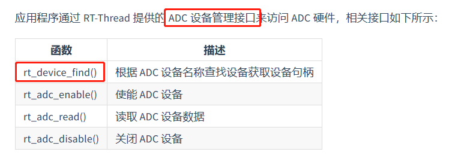

#RT-Thread源码简析之ADC

##ADC框架分析

这些都是一样的，UART里面有，每层对应的代码也在一块！！不多说

##ADC接口函数
  

先从一个简单的ADC采样电压值的代码入手，然后仔细分析每个函数的具体实现功能，这样更能清楚的理解，每个函数是如何使用的！！

	#define ADC_DEV_NAME        "adc1"  /* ADC 设备名称 */
	#define ADC_DEV_CHANNEL     5       /* ADC 通道 */
	#define REFER_VOLTAGE       330    /* 参考电压 3.3V,数据精度乘以100保留2位小数*/
	#define CONVERT_BITS        (1 << 12)   /* 转换位数为12位 */
	
	rt_adc_device_t adc_dev;            /* ADC 设备句柄 */
	rt_uint32_t value；
	/* 查找设备 */
	adc_dev = (rt_adc_device_t)rt_device_find(ADC_DEV_NAME);
	/* 使能设备 */
	rt_adc_enable(adc_dev, ADC_DEV_CHANNEL);
	/* 读取采样值 */
	value = rt_adc_read(adc_dev, ADC_DEV_CHANNEL);
	/* 转换为对应电压值 */
	vol = value * REFER_VOLTAGE / CONVERT_BITS;
	rt_kprintf("the voltage is :%d.%02d \n", vol / 100, vol % 100);

###1、`rt_device_t rt_device_find(const char* name)`函数
这个和UART里面的查找设备是同一函数。