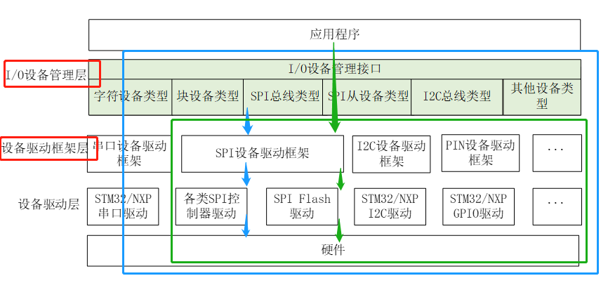
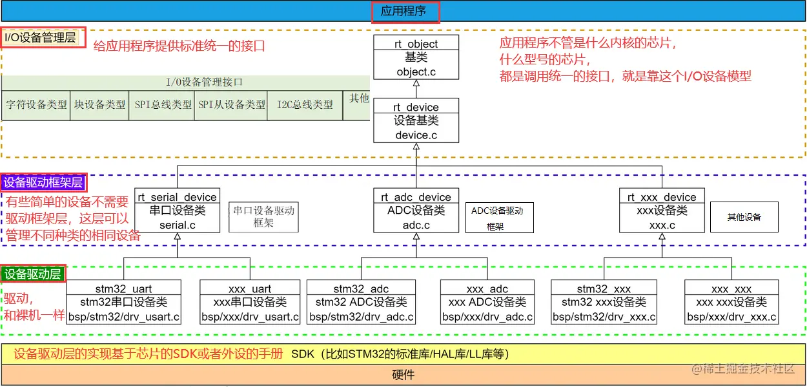
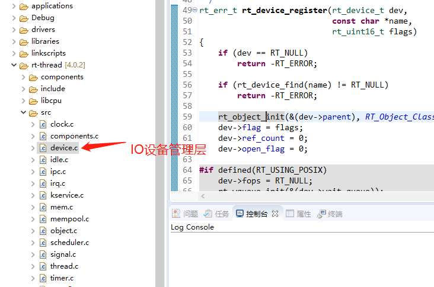
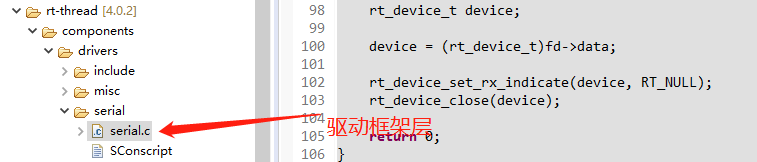
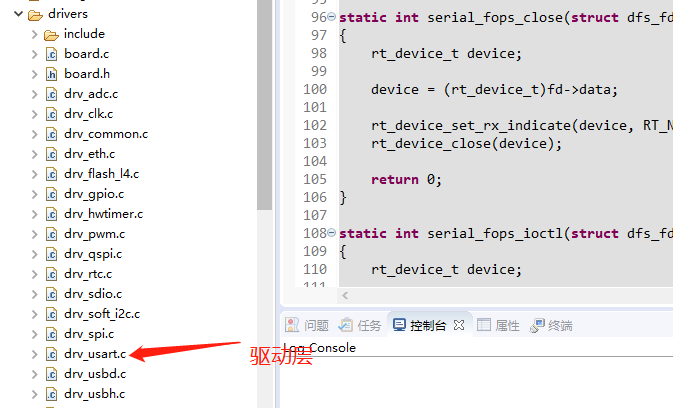
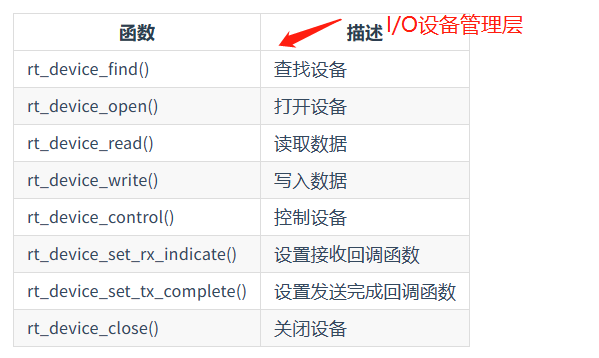

#RT-Thread源码简析之UART

##UART框架分析
###RT-Thread 的面向对象的编程思想  

RT-Thread 作为一个面向对象思想设计的操作系统，必须得全面考虑，需要降低了代码的耦合性、复杂性，提高了系统的可靠性，能够使得系统运行与不同的芯片设备上。

这张图很重要！很重要！！  
应用程序通过 RT-Thread 提供的 PIN 设备管理接口来访问 GPIO，应用程序通过 RT-Thread提供的 I/O 设备管理接口来访问串口硬件。  
也就是说PIN设备管理接口，走的是绿色通道，是直接跳过了I/O设备管理层，而USART走的是蓝色通道！！一层一层的去调用函数，进行实现的！！

现在，必须搞清楚的是，每一层对应的代码是那些！！  

这几个是UART中所对应的驱动层！！ 

##UART相关接口
  
这些函数接口都在I/O设备管理层！！如上图device.c文件中！！  

注意，上面这些函数大部分都是通用的！！像CAN设备，硬件定时器设备等，也是使用这些API函数，来查找设备，打开设备，读取设备等操作的！！

###1.`rt_device_find(const char* name)`函数分析

`rt_device_find`函数再RTT系统中，用于查找当前设备是否在系统设备注册表里，如果是返回设备指针，否则返回NULL。这个函数可能是我们打开RTT设备驱动层大门第一个面对的重要函数了。函数本身语句不多但是可以看到RTT设备驱动层的设计思路和框架。  
首先函数参数是一个字符串，即设备的名称，例如“uart1”之类，这个参数是查找对象，即在当前系统的设备列表里查找是否注册了某个设备，如果是，则函数返回设备对象的指针，也可以称之为设备描述句柄。如果没有查找到，则返回NULL

RTT的设备列表，不是一个简单的数组或者链表，使用一个for循环查询就得到结果。

首先，RTT里有一个全局大数组，定义方式为：

	struct rt_object_information *rt_object_get_information(enum rt_object_class_type type);

`enum rt_object_class_type type`这里在顺便解释一下枚举：  
`enum <类型名> {<枚举常量表>}`  
`rt_object_class_type`:枚举类型；`type`:枚举变量    
枚举变量：（枚举变量的使用！！） 
> 
1. 枚举变量的值只能取枚举常量表中所列的值，就是整型数的一个子集。  
2. 枚举变量占用内存的大小与整型数相同。  
3. 枚举变量只能参与赋值和关系运算以及输出操作，参与运算时用其本身的整数值。  
总结：这里学到了，什么是枚举变量，枚举变量怎么使用！！

这个数组可以称为object容器，设备列表，是这个容器里的一个成员。
	
	enum rt_object_class_type
	{
	    RT_Object_Class_Null   = 0,            /**< The object is not used. */
	    RT_Object_Class_Thread,                /**< The object is a thread. */
	    RT_Object_Class_Semaphore,             /**< The object is a semaphore. */
		...... 
	    RT_Object_Class_Device,                /**< The object is a device */
	    RT_Object_Class_Timer,                 /**< The object is a timer. */
	    RT_Object_Class_Unknown,               /**< The object is unknown. */
	    RT_Object_Class_Static = 0x80   /**< The object is a static object. */
	};
容器中一共有多少个成员，取决于`RT_Object_Class_Unknown`的值，这个值在`rtdef.h`里通过一个枚举变量来确定。　　

这个容器里面有：设备列表、信号列表、时间列表，互斥锁、事件、邮箱、消息队列、内存堆、内存池、设备、定时器等不同类型的对象。  
`RT_Object_Class_Device`这个就是设备列表！！
  
可以看到`RT_Object_Class_Unknown`顺序排到倒数第二个去了。加入我们将来需要扩展这个object容器，则可以把新增的对象列表放在这个枚举列表里，并且放在`RT_Object_Class_Unknown`之前。不过需要注意容器中的列表数量可能不能超过0x80。
	
	rt_device_t rt_device_find(const char *name)
	{
	    struct rt_object *object;
	    struct rt_list_node *node;
	    struct rt_object_information *information;

	    /* try to find device object */
	    information = rt_object_get_information(RT_Object_Class_Device);//关键代码！！要找到UART串口设备，就要靠这个参数！！
	    RT_ASSERT(information != RT_NULL);
	    for (node  = information->object_list.next;
	         node != &(information->object_list);
	         node  = node->next)
	    {
	        object = rt_list_entry(node, struct rt_object, list);
	        if (rt_strncmp(object->name, name, RT_NAME_MAX) == 0)
	        {
	            /* leave critical */
	            if (rt_thread_self() != RT_NULL)
	                rt_exit_critical();
	
	            return (rt_device_t)object;
	        }
	    }
	
	    /* leave critical */
	    if (rt_thread_self() != RT_NULL)
	        rt_exit_critical();
	
	    /* not found */
	    return RT_NULL;
	}
	RTM_EXPORT(rt_device_find);
`information = rt_object_get_information(RT_Object_Class_Device);`这个函数是重点！！

	struct rt_object_information
	{
	    enum rt_object_class_type type;            /**< object class type */
	    rt_list_t                 object_list;     /**< object list */
	    rt_size_t                 object_size;     /**< object size */
	};
仅仅有一个类型用于区别`object`类型，和一个链表指针。我们并没有看到每个设备的实体在哪里。如果采用比较容易理解做法，建立一个数据链表，链表成员为每一个设备对象即可。  

这么做的目的在于，刚才我们看到在Object容器中，有很多个列表的存在，例如设备列表，信号列表，事件列表等等，如果对每个列表都建立一个链表，会出现由于数据类型不同而导致大量冗余代码。

###3.`rt_err_t rt_device_open(rt_device_t dev, rt_uint16_t oflags)`函数解析
####插曲：IPC 机制及相关代码解析
学习这个函数之前先理解一下`RT-Thread` 面向对象的思想。利用IPC相关代码解释一下。  
所有的这些 IPC 机制都被当成一个对象，都有一个结构体控制块，我们用信号量结构体来看一看：

	struct rt_object
	{
	    char       name[RT_NAME_MAX];                       /**< name of kernel object */
	    rt_uint8_t type;                                    /**< type of kernel object */
	    rt_uint8_t flag;                                    /**< flag of kernel object */
		
	    rt_list_t  list;                                    /**< list node of kernel object */
	};
`rt_object`是RT-Thread中所有内核对象的基本结构体，包含了对象的名称、类型、标志位和在系统中的链表节点等信息。
`rt_object` 定义了所有内核对象的通用属性，包括对象名（name）、类型（type）、标志（flag）以及链表节点（list），用于管理不同类型的内核对象。这些内核对象可以是任务（task）、信号量（semaphore）、队列（queue）等，实际上 RT-Thread 操作系统中有超过 40 种不同类型的内核对象。
	
	/*Base structure of IPC object*/ 
	struct rt_ipc_object
	{
	    struct rt_object parent;                            /**< inherit from rt_object */
		
	    rt_list_t        suspend_thread;                    /**< threads pended on this resource */
	};
`rt_ipc_object`是一个基于`rt_object`结构体的结构体，表示一个IPC对象，包含一个链表节点和一个挂起线程列表。

`parent`字段是一个`rt_object`结构体，表示IPC对象的基本属性。`suspend_thread`字段是一个链表节点，用于将挂起在该IPC对象上的线程链接到系统中的链表中。
在 `rt_object` 的基础上，为了实现 IPC 机制，定义了一个 `rt_ipc_object` 结构体。它继承自 `rt_object`，表示 IPC 相关对象的共性特征。 

再详细理解`struct rt_object parent`对这个代码的理解：
这里的 `parent` 是作为 `rt_ipc_object` 结构体中的一个字段存在的。由于 `rt_semaphore` 结构体继承自 `rt_ipc_object`，因此它也拥有了 `rt_ipc_object` 中的所有字段。  
其中，`parent` 表示当前信号量对象的父类对象，也就是所属的 IPC 对象。IPC 对象是用于实现进程间通信的一类对象，比如管道、消息队列等等。在这个结构体中它被定义成了一个 `rt_object` 结构体类型的变量，所以使用时需要通过 `.parent` 来访问实际的 `rt_object` 对象。  
继承 `parent` 字段，使得 `rt_semaphore` 不仅具备了信号量的特性，而且还集成了 IPC 数据结构的支持，方便信号量与其他 IPC 机制的协同工作。
	
	/* Semaphore structure*/
	struct rt_semaphore
	{
	    struct rt_ipc_object parent;                        /**< inherit from ipc_object */
	
	    rt_uint16_t          value;                         /**< value of semaphore. */
	    rt_uint16_t          reserved;                      /**< reserved field */
	};
`rt_semaphore`是一个基于`rt_ipc_object`结构体的结构体，表示一个信号量对象，包含了一个计数器和一个保留字段。  

####总结：（对我来说是一个新知识点！！重点理解parent这个代码！！）  
在这个代码中，`struct rt_object` 是所有内核对象的基本结构体，包含了对象的名称、类型、标志和链表节点等信息。而 `struct rt_ipc_object` 是IPC对象的基本结构体，继承自 `struct rt_object`，并且添加了一些额外的成员变量，如等待该资源的线程列表等。

这里的 `struct rt_object parent` 是 `struct rt_ipc_object` 中的一个成员变量，它的作用是让 `struct rt_ipc_object` 结构体继承 `struct rt_object` 结构体中的所有成员变量和方法。也就是说，通过这个结构体嵌套的方式，`struct rt_ipc_object` 中就可以直接使用 `struct rt_object` 中定义的成员变量和方法了，而不需要再次定义。

例如，如果我们要使用 `struct rt_ipc_object` 结构体中的 `name` 成员变量，可以通过 `parent.name` 来访问。这是因为 `struct rt_ipc_object` 中包含了一个 `struct rt_object` 类型的成员变量 `parent`，它继承了 `struct rt_object` 中的所有成员变量和方法。

综上所述，`struct rt_object parent` 的作用就是实现了结构体的嵌套，让 `struct rt_ipc_object` 结构体继承了 `struct rt_object` 中的所有成员变量和方法。这样可以减少代码的重复和冗余，提高代码的可维护性和可读性。  

####`rt_err_t rt_device_open(rt_device_t dev, rt_uint16_t oflag)`正式代码分析

如果设备没有被初始化，则进行初始化。这里的 `device_init` 是一个函数指针

	#define device_init     (dev->init)
	#define device_open     (dev->open)
	#define device_read     (dev->read)
	#define device_control  (dev->control)
上面的control等等，同样的分析思路，代码都是差不多的！！

    device->init        = rt_serial_init;
    device->open        = rt_serial_open;
    device->read        = rt_serial_read;
    device->control     = rt_serial_control;
	
是这个，怎么又转换到了上面这个了！`dev->init = rt_serial_init` 还没搞明白这一步？

	static rt_err_t rt_serial_init(struct rt_device *dev)
	{
		......
	    /* apply configuration */
	    if (serial->ops->configure)
	        result = serial->ops->configure(serial, &serial->config);//重点部分！！
	
	    return result;
	}
#####重点1！！之前好像还学过，现在怎么一点不知道这代码的含义，和我一开始理解的不一样！！
对这行代码的理解！涉及到这行代码了

    rt_err_t  (*init)   (rt_device_t dev);
    rt_err_t  (*open)   (rt_device_t dev, rt_uint16_t oflag);
    rt_size_t (*read)   (rt_device_t dev, rt_off_t pos, void *buffer, rt_size_t size);
    rt_err_t  (*control)(rt_device_t dev, int cmd, void *args);
这行代码定义了一个名为 `init` 的指针，指向一个函数，该函数接受一个 `rt_device_t` 类型的指针作为参数，返回一个 `rt_err_t` 类型的错误码。在 C 语言中，函数指针的定义方式是将函数名放在括号中，紧接着是指针名和参数列表，例如：`int (*func_ptr)(int, char *);`
该语句定义了一个名为 `func_ptr` 的指针，指向一个函数，该函数接受一个 `int` 类型和一个 `char *` 类型的参数，返回一个 `int` 类型的值。  
在 `RT-Thread` 中，设备驱动程序中的各个函数都定义成了函数指针的形式，并作为设备结构体的成员。在这里，`(*init)` 就是指向设备初始化函数的函数指针，`rt_err_t` 是函数的返回类型，`(rt_device_t dev)` 是函数的参数类型和名称。  
因此，该行代码实际上是为设备结构体中的 init 成员变量定义了一个函数指针类型。

#####重点2！！`(dev->init)`代码的理解

`dev`是什么？`init`是什么？`(dev->init)`含义？ 
 
	`rt_device_t dev`// 声明一个指向 struct rt_device 结构体的指针变量
		==>`typedef struct rt_device *rt_device_t;`不是啊！这个`rt_device_t`，是等价与`struct rt_device *`，是一个结构体指针
			==>struct rt_device
				{
				    struct rt_object          parent;                   /**< inherit from rt_object */
				    rt_uint8_t                device_id;                /**< 0 - 255 */
					......
				    /* common device interface */
				    rt_err_t  (*init)   (rt_device_t dev);
				    rt_err_t  (*open)   (rt_device_t dev, rt_uint16_t oflag);
				    rt_size_t (*read)   (rt_device_t dev, rt_off_t pos, void *buffer, rt_size_t size);
				    rt_err_t  (*control)(rt_device_t dev, int cmd, void *args);
			   }
那推到这里，dev是不是可以指向`init`了！！  

`typedef struct rt_device *rt_device_t;`定义了一个新的数据类型`rt_device_t`，它是一个指向`struct rt_device`结构体的指针类型。

`rt_device_t`=`struct rt_device *`:表示一个指向`struct rt_device`结构体的指针类型，`rt_device_t`**并不是一个结构体的指针变量，而是一个指向结构体的指针类型**。  
通过定义`rt_device_t`这个类型，我们可以方便地声明指向`struct rt_device`结构体的指针变量，例如：

	rt_device_t dev;  // 声明一个指向 struct rt_device 结构体的指针变量 
在实际开发中，`rt_device_t`这个类型常常被用来作为函数参数类型或返回值类型，以便于传递或返回指向`struct rt_device`结构体的指针。同时，使用`rt_device_t`这个类型还可以提高代码的可读性和可维护性。

`(dev->init)`是一个函数指针，它表示指向`dev`所指向的结构体中的`init`成员函数的指针。其中，`dev`是一个指向`struct rt_device`结构体的指针变量，也就是说，`init`是`struct rt_device`结构体中的一个函数成员。

通过`(dev->init)`这种方式，我们可以通过指针调用结构体中的函数，例如：

	dev->init(dev);  // 调用 dev 所指向的结构体中的 init 函数
	rt_err_t  (*init)   (rt_device_t dev);//那这个就是一体的啊 init(dev)
这里的`dev->init`实际上是一个函数指针，它指向了dev所指向的结构体中的init函数。因此，通过`dev->init`可以调用结构体中的函数，而不需要知道函数的具体实现细节。这种方式可以提高代码的可读性和可维护性，也是面向对象编程中常用的方式。

#####重点3！！`result = serial->ops->configure(serial, &serial->config);`的理解

	struct rt_serial_device
	{
	    struct rt_device          parent;
	
	    const struct rt_uart_ops *ops;
	    struct serial_configure   config;
		......
	};
`ops`是这个`struct rt_uart_ops *`结构体的指针变量！！`ops`可以指向`struct rt_uart_ops`所在结构体的成员变量！！有：  
`ops->configure(serial, &serial->config)`  

	struct rt_uart_ops
	{
	    rt_err_t (*configure)(struct rt_serial_device *serial, struct serial_configure *cfg);
	    rt_err_t (*control)(struct rt_serial_device *serial, int cmd, void *arg);
		......
	};
`configure(serial, &serial->config)`这是一个整体。同上面的理解。这个是一个指针，指向一个函数

	static const struct rt_uart_ops stm32_uart_ops =
	{
	    .configure = stm32_configure,
	    .control = stm32_control,
	    .putc = stm32_putc,
	    .getc = stm32_getc,
	    .dma_transmit = stm32_dma_transmit
	};
	static rt_err_t stm32_configure(struct rt_serial_device *serial, struct serial_configure *cfg)
	{
	    uart->handle.Instance          = uart->config->Instance;
	    uart->handle.Init.BaudRate     = cfg->baud_rate;
	    uart->handle.Init.HwFlowCtl    = UART_HWCONTROL_NONE;
	    uart->handle.Init.Mode         = UART_MODE_TX_RX;
	    uart->handle.Init.OverSampling = UART_OVERSAMPLING_16;
这个里面就是串口的一些基本设置了，一层包裹一层，最后到了这里面！！