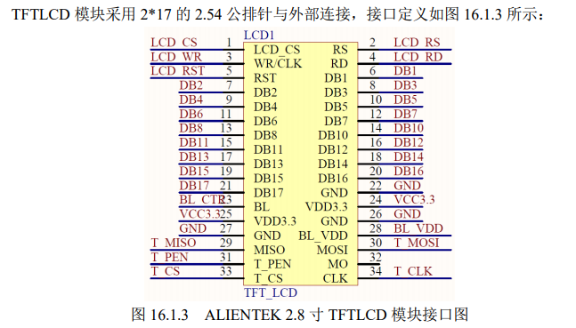
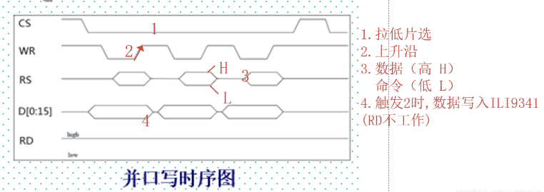
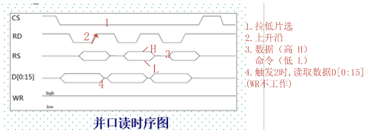
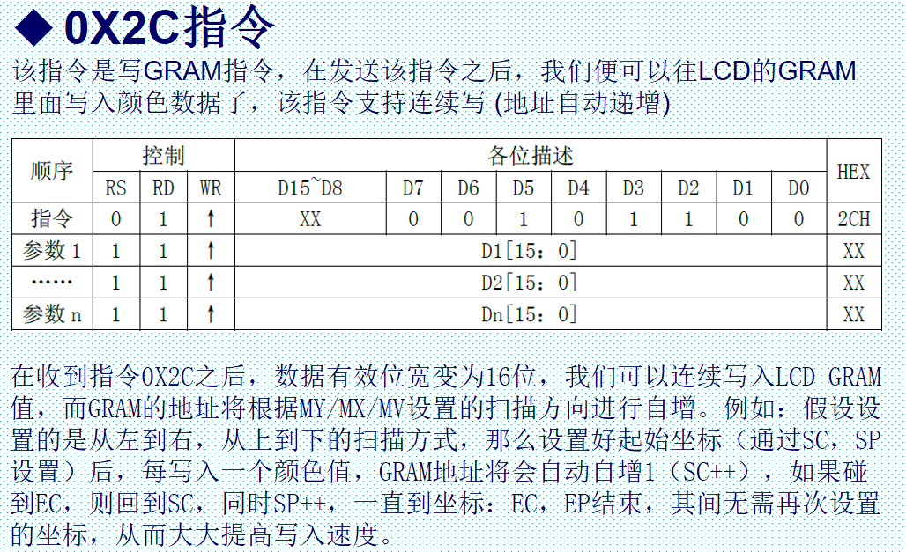
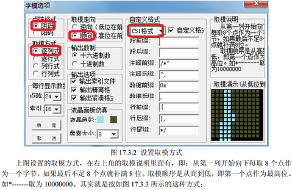
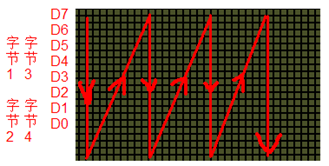

#TFTLCD液晶屏
	目录
		1.硬件连接
		2.`LCD&lcddev`结构体讲解
		3.底层接口函数讲解
		4.初始化函数讲解
		5.坐标设置函数讲解
		6.画点函数讲解
		7.读点函数讲解
		8.字符显示函数讲解

##1.TFTLCD 硬件连接
通过 STM32 的普通 IO 口模拟 8080 总线来控制 TFTLCD 的显示。TFT-LCD 即
薄膜晶体管液晶显示器。其英文全称为：Thin Film Transistor-Liquid Crystal Display。

这个是8080并口的！！我之前搞得stm32l475潘多拉开发板它的OLED屏是SPI接口的！！这一点需要区分！！  

该模块的 80 并口有如下一些信号线：  
CS：TFTLCD 片选信号。  
WR：向 TFTLCD 写入数据。  
RD：从 TFTLCD 读取数据。  
D[15：0]：16 位双向数据线。  
RST：**硬复位** TFTLCD。  
RS：命令/数据标志（0，读写命令；1，读写数据）。  
我们总共需要的 IO 口数目为 21 个。  

##2.`LCD&lcddev`结构体讲解
	//LCD重要参数集
	typedef struct  
	{
	    u16 width;      //LCD 宽度
	    u16 height;     //LCD 高度
	    u16 id;         //LCD ID
	    u8  dir;        //横屏还是竖屏控制：0，竖屏；1，横屏。
	    u16 wramcmd;    //开始写gram指令//wramcmd 是一个指令，它表示开始写入gram（图形存储区域）。
	    u16 setxcmd;    //设置x坐标指令
	    u16 setycmd;   //设置y坐标指令
	} _lcd_dev;

	//LCD参数
	extern _lcd_dev lcddev; //管理LCD重要参数
`lcddev`结构体参数的赋值，基本上都是在`LCD_Display_Dir`函数完成  

gpt没说清楚啊，不是变量啊，

	typedef struct human
	{
		char name[20];
		int age;
		char sex[10];
		char id[20];
	}hu;
这样该结构体就有了两种创建变量的方式`struct human man`和`hu man`都行。可以类比`tpyedef unsigned int size_t`   
只是将`struct human`重新取个名字叫`hu`。本质上还是类型是不占用空间的，只有创建变量时才会开辟空间。当然使用`typedef`就不能在声明结构体的后面直接创建全局变量了。  

这个代码的结构体类型名是 `_lcd_dev`。这个名称用于在代码中定义这个结构体类型的变量，通过 `_lcd_dev my_lcd`; 来声明变量。这里它省略了原本的结构体类型名，然后重命名了这个`_lcd_dev`结构体类型名！！对的！！  
	_lcd_dev my_lcd；
	my_lcd.width = 240;
`lcddev`是变量，声明了一个`_lcd_dev`结构体类型名，`lcddev`可以指向`_lcd_dev`结构体成员变量！！进行访问！！例：

	if (lcddev.id == 0X5510)    //5510 发送读GRAM指令
	if (x >= lcddev.width || y >= lcddev.height)return 0;   //超过了范围,直接返回

##3.代码底层接口函数详解
7个底层接口函数：

	1，写寄存器值函数 ：void LCD_WR_REG(u16 regval)
	2，写数据函数：void LCD_WR_DATA(u16 data)
	3，读数据函数：u16 LCD_RD_DATA(void)
	4，写寄存器内容函数： void LCD_WriteReg(u16 LCD_Reg, u16 LCD_RegValue)
	5，读寄存器内容函数： u16 LCD_ReadReg(u16 LCD_Reg)
	6，开始写GRAM函数： void LCD_WriteRAM_Prepare(void)
	7，写GRAM函数： void LCD_WriteRAM(u16 RGB_Code)
  
###3.1.`LCD_WR_DATA(data)`
第一个是 `LCD_WR_DATA` 函数，该函数在 lcd.h 里面，通过宏定义的方式申明。该函数通过 80 并口向 LCD 模块写入一个 16 位的数据，使用频率是最高的，这里我们采用了宏定义的方式，以提高速度。其代码如下:

	//写数据函数
	#define LCD_WR_DATA(data){\
	LCD_RS_SET;\
	LCD_CS_CLR;\
	DATAOUT(data);\
	LCD_WR_CLR;\
	LCD_WR_SET;\
	LCD_CS_SET;\
	}
**知识点一：**上面函数中的‘\’是 C 语言中的一个转义字符，用来连接上下文，因为宏定义只能是一个串，而当你的串过长（超过一行的时候），就需要换行了，此时就必须通过反斜杠来连接上下文。  

**知识点二：**宏嘛，等价的意思啊！！外面是宏，里面也是宏！！在具体使用时，可以通过直接调用这个宏并传入相应的参数来实现数据的写入。

	#define LCD_CS_SET  GPIOC->BSRR=1<<9    //片选端口      PC9   拉高BSRR
	#define LCD_RS_SET  GPIOC->BSRR=1<<8    //数据/命令     PC8

	#define LCD_WR_CLR  GPIOC->BRR=1<<7     //写数据        PC7   拉低BRR
	#define LCD_RD_CLR  GPIOC->BRR=1<<6     //读数据        PC6
	寄存器的作用！！
	//PB0~15,作为数据线
	#define DATAOUT(x) GPIOB->ODR=x; //数据输出
	#define DATAIN     GPIOB->IDR;   //数据输入

**知识点三：**这段代码定义了一个名为`LCD_WR_DATA`的宏，具体作用是向LCD模块写入数据。该宏使用了一些其他的宏，可以逐个分析如下：

`LCD_RS_SET`: 将`LCD_RS`引脚设置为高电平，表示将写入的是数据（而非指令）。  
`LCD_CS_CLR`: 将`LCD_CS`引脚设置为低电平，表示开始与LCD屏幕通信。  
`DATAOUT(data)`: 定义了一个名为DATAOUT的宏来输出8位数据到LCD模块中。这里的(data)表示传入参数，可以是一个寄存器值、一个变量等。  
`LCD_WR_CLR`: 将`LCD_WR`引脚（即LCD模块的写入使能信号）设置为低电平，表示准备写入数据。  
`LCD_WR_SET`: 将`LCD_WR`引脚设置为高电平，表示写入数据操作完成。  
`LCD_CS_SET`: 将`LCD_CS`引脚设置为高电平，表示结束与LCD屏幕的通信。

###3.2.`LCD_WR_DATAX` 函数 
LCD_WR_DATAX 函数，该函数在 ILI93xx.c 里面定义，功能和 LCD_WR_DATA一模一样，该函数代码如下：

	//写数据函数//可以替代 LCD_WR_DATAX 宏,拿时间换空间.//data:寄存器值
	void LCD_WR_DATAX(u16 data)
	{
		LCD_RS_SET;
		LCD_CS_CLR;
		DATAOUT(data);//#define DATAOUT(x) GPIOB->ODR=x; //数据输出
		LCD_WR_CLR;
		LCD_WR_SET;
		LCD_CS_SET;
	} 

**知识点一**：什么是“拿时间换空间”？  
宏定义函数的好处就是速度快（直接嵌到被调用函数里面去了），坏处就是占空间大。在 `LCD_Init` 函数里面，有很多地方要写数据，如果全部用宏定义的 `LCD_WR_DATA` 函数，那么就会占用非常大的 `flash`，所以我们这里另外实现一个函数：`LCD_WR_DATAX`，专门给 `LCD_Init` 函数调用，从而大大减少 `flash` 占用量。

**知识点二**：模块的8080并口读/写的过程为：  
先根据要写入/读取的数据的类型，设置RS为高（数据）/低（命令），然后拉低片选，选中ILI9341，接着我们根据是读数据，还是要写数据置RD/WR为低，然后：  
1.读数据：在RD的上升沿， 读取数据线上的数据（D[15:0]）;  
2.写数据：在WR的上升沿，使数据写入到ILI9341里面  
  

###3.3.`LCD_WR_REG` 函数
`LCD_WR_REG` 函数，该函数是通过 8080 并口向 LCD 模块写入寄存器命令，因为该函数使用频率不是很高，我们不采用宏定义来做（宏定义占用 FLASH 较多），通过 LCD_RS来标记是写入命令（`LCD_RS=0`）还是数据（`LCD_RS=1`）。该函数代码如下：

	//写寄存器函数//data:寄存器值
	void LCD_WR_REG(u16 data)
	{ 
		LCD_RS_CLR;//写地址		 
		LCD_CS_CLR; 
		DATAOUT(data); 
		LCD_WR_CLR; 
		LCD_WR_SET; 
		LCD_CS_SET; 
	}

###3.4.`LCD_RD_DATA` 函数
`LCD_RD_DATA` 函数该函数用来读取 LCD 控制器的寄存器数据。

 
	//读LCD数据//返回值:读到的值
	u16 LCD_RD_DATA(void)
	{
	    u16 t;
	    GPIOB->CRL=0X88888888; //PB0-7  上拉输入
	    GPIOB->CRH=0X88888888; //PB8-15 上拉输入
	    GPIOB->ODR=0X0000;     //全部输出0
		//这个数据读取时，是需要对数据口做设置的，先是设置上拉输入，结束后设置成上拉输出
	    LCD_RS_SET;//读数据RS=1；
	    LCD_CS_CLR;//片选拉低
	    LCD_RD_CLR;//RD 上升沿读数据；这个和上面的不一样
	
	    opt_delay(2);
	    t=DATAIN;  //#define DATAIN     GPIOB->IDR;   //数据输入
	
	    LCD_RD_SET;
	    LCD_CS_SET; 
	
	    GPIOB->CRL=0X33333333; //PB0-7  上拉输出
	    GPIOB->CRH=0X33333333; //PB8-15 上拉输出
	    GPIOB->ODR=0XFFFF;     //全部输出高
	    return t;  
	}

###3.5.`LCD_WriteReg` 和 `LCD_ReadReg`
	//写寄存器//LCD_Reg:寄存器编号//LCD_RegValue:要写入的值
	void LCD_WriteReg(u16 LCD_Reg,u16 LCD_RegValue)
	{
		LCD_WR_REG(LCD_Reg); 
		LCD_WR_DATA(LCD_RegValue);	 
	} 

	//读寄存//LCD_Reg:寄存器编号//返回值:读到的值
	u16 LCD_ReadReg(u16 LCD_Reg)
	{
		LCD_WR_REG(LCD_Reg); //写入要读的寄存器号	 
		return LCD_RD_DATA(); 
	}
这两个函数函数十分简单，`LCD_WriteReg` 用于向LCD指定寄存器写入指定数据，而`LCD_ReadReg` 则用于读取指定寄存器的数据，这两个函数，都只带一个参数/返回值，所以，在有多个参数操作（读取/写入）的时候，就不适合用这两个函数了，得另外实现。

###3.6.`LCD_WriteRAM_Prepare`和`LCD_WriteRAM`
	//开始写GRAM
	void LCD_WriteRAM_Prepare(void)
	{
	    LCD_WR_REG(lcddev.wramcmd);//`lcddev.wramcmd`具体的数值要取决于所用液晶屏的型号和其对应的手册。不同型号的液晶显示屏，可能会有不同的命令设置。
	} 
该函数名为`LCD_WriteRAM_Prepare()`，是为了准备写入`GRAM（Graphic RAM）`而设置的，在这里`GRAM`指的是液晶显示屏的图形存储区域。    

函数中调用了另一个函数`LCD_WR_REG()`，该函数用于向液晶显示屏发送指令。在这里，参数`lcddev.wramcmd`表示将要发送到显示器的写命令，其中`lcddev`是一个结构体变量，包含了当前使用的液晶显示屏所需的各种配置参数和寄存器设置。
  
因此，该函数实际上的功能是发送“准备写入GRAM”的命令给液晶显示屏，以便接下来的图像数据能够写入GRAM。
	if (lcddev.id == 0x5510)
    {
        lcddev.wramcmd = 0X2C00;
        lcddev.setxcmd = 0X2A00;
        lcddev.setycmd = 0X2B00;
        lcddev.width = 480;
        lcddev.height = 800;
    }

    else                        //其他IC, 包括: 9341 / 5310 / 7789等IC
    {
        lcddev.wramcmd = 0X2C;
        lcddev.setxcmd = 0X2A;
        lcddev.setycmd = 0X2B;
    }
lcddev.wramcmd = 0X2C;  //设置写入GRAM的指令  
可以看到不同id的值，lcddev.wramcmd不一样！！

	//LCD写GRAM
	//RGB_Code:颜色值
	void LCD_WriteRAM(u16 RGB_Code)
	{
	    LCD_WR_DATA(RGB_Code);      //写十六位GRAM
		//其参数RGB_Code表示将要写入GRAM的RGB颜色值,函数执行后，该数据经过处理后写入到GRAM中，即实现了在液晶屏幕上显示特定颜色的效果。
	}

##4.LCD初始化函数
	//LCD初始化
	void LCD_Init(void)
	{
	    初始化GPIO;
	    初始化FSMC;		             	//Mini板不需要
	    读取LCD ID;	
	    printf(“LCD ID:%x\r\n”,lcddev.id);//打印LCD ID，用到了串口1
	                                        //所以必须初始化串口1，否则黑屏	
	    根据不同的ID执行LCD初始化代码;
	    LCD_Display_Dir(0);		 	//默认为竖屏
	    LCD_LED=1;			 	//点亮背光
		//#define LCD_LED PCout(10)               //LCD背光       PC10
	    LCD_Clear(WHITE);			//清屏
	}
这里初始化有一个白色的清屏函数！！初始化一次就行，放在主函数while（1）{}；里面会一直刷屏的！！

##5.LCD坐标设置函数
	//设置光标位置
	//Xpos:横坐标
	//Ypos:纵坐标
	void LCD_SetCursor(u16 Xpos, u16 Ypos)
	{	 
	     if(lcddev.id==0X9341||lcddev.id==0X5310)
	     {		    
	          LCD_WR_REG(lcddev.setxcmd); 
	          LCD_WR_DATA(Xpos>>8);
	          LCD_WR_DATA(Xpos&0XFF);  
	          LCD_WR_REG(lcddev.setycmd); 
			  LCD_WR_DATA(Ypos>>8);
			  LCD_WR_DATA(Ypos&0XFF); 
	     }else if(lcddev.id==XXXX)	//根据不同的LCD型号，执行不同的代码
	     { 
		 ……//省略部分代码
	     }
	}
**知识点一**：根据给定的X、Y坐标值，在液晶屏幕上定位到指定像素点位置，并准备写入相应的颜色数据。这样，就能够在指定位置将相应的颜色值显示出来，实现液晶屏幕的图像内容更新。  

**知识点二**：Xpos >> 8 是一个右移运算符，用于将一个二进制数向右移动8位。在这个代码中，它的作用是取Xpos参数变量的高8位数据，因为低8位数据已经通过与操作符 & 0xFF 提取出来了。  

举例说明，如果Xpos的值为0x1234（二进制形式为0001 0010 0011 0100），那么Xpos >> 8 的结果就是 0x12 （相当于把原二进制数的前8位取出来），用于写入指定液晶屏幕的X坐标寄存器中的高8位。

##6.LCD画点函数`LCD_DrawPoint`
	//画点
	//x,y:坐标
	//POINT_COLOR:此点的颜色
	void LCD_DrawPoint(u16 x,u16 y)
	{
	    LCD_SetCursor(x,y);		//设置光标位置 
	    LCD_WriteRAM_Prepare();	//开始写入GRAM
	    //LCD->LCD_RAM=POINT_COLOR; 	//非Mini板的操作方式 
		LCD_WR_DATA(POINT_COLOR);   //mini  
	}
 

##7.LCD_ReadPoint
LCD读点函数：u16 LCD_ReadPoint(u16 x,u16)   
1，非Mini板的读点函数代码(FSMC方式，适合战舰、精英、探索者F4板)  
2，Mini板的读点函数代码(GPIO方式，适合Mini板)
   
##8.字符显示函数！并不能显示汉字！  

	//在指定位置显示一个字符
	//x,y:起始坐标
	//num:要显示的字符:" "--->"~"
	//size:字体大小 12/16/24
	//mode:叠加方式(1)还是非叠加方式(0)
	void LCD_ShowChar(u16 x,u16 y,u8 num,u8 size,u8 mode)
	{  							  
	       u8 temp,t1,t;
	       u16 y0=y;
	       u8 csize=(size/8+((size%8)?1:0))*(size/2);	//得到字体一个字符对应点阵集所占的字节数	
	       num=num-' ';	//得到偏移后的值（ASCII字库是从空格开始取模，所以-' '就是对应字符的字库）
	       for(t=0;t<csize;t++)
	       {  
				 if(size==12)temp=asc2_1206[num][t]; 		//调用1206字体
	             else if(size==16)temp=asc2_1608[num][t];	//调用1608字体
	             else if(size==24)temp=asc2_2412[num][t];	//调用2412字体
	             else return;			//没有的字库
	             for(t1=0;t1<8;t1++)
	             {			    
				        if(temp&0x80)LCD_Fast_DrawPoint(x,y,POINT_COLOR);
				        else if(mode==0)LCD_Fast_DrawPoint(x,y,BACK_COLOR);
	                    temp<<=1;
	                    y++;
	                    if(y>=lcddev.height)return;		//超区域了
	                    if((y-y0)==size)
	                    {
							y=y0;
							x++;
							if(x>=lcddev.width)return;		//超区域了
							break;
	                     }
	              }  	 
	        }  	    	   	 	  
	} 
**知识点一**：传入了五个参数：x和y表示字符的起始坐标，num是要显示的字符的ASCII码值，size表示字体大小，mode表示显示模式。  

首先会根据传入的size值来计算相应的点阵集所占的字节数（csize），这个csize的值是通过一个公式来计算的。

然后通过将num减去空格字符' '的ASCII码值，得到相应字符的偏移值，并根据size选择相应的字体。在显示时，采用逐个像素点判断的方式，如果该像素点需要显示，则调用一个Fast_DrawPoint函数在该位置绘制一个点，并通过temp <<= 1来更新temp寄存器中待检测位的状态。最后对数值进行一些边界检查操作，如控制字符绘制过程是否超过了LCD可供显示的范围。

另外，因为在显示过程中，是按照列优先的方式显示的，也就是先从左至右，再从上至下，每次显示8个像素点，当显示完一组8个像素点后，会对坐标进行更新操作，以便于显示下一组8个像素点。

**知识点二**：`u8 csize=(size/8+((size%8)?1:0))*(size/2);	//得到字体一个字符对应点阵集所占的字节数`	  
这行代码解析：   
从第一列开始向下每取8个点作为一个字节，最后向下不足8个点就补满作为一个字节，所以这个可以通过`(size/8+((size%8)?1:0))`计算出来表示一列需要的字节数，由于原子的提取的字库都是宽x2=高，则宽度就是列数，是高的一半`(size/2)`；则列字节数x列数=一个字符所占用的字节数。 

如：12号字体，就需要2*（12/2）=12,生成字模时是12个字节，16号字体就需要16个字节！！
假设传入的size = 16，则：  
size / 8 = 2（字节数，因为每个字节可以存储8个比特位）  
size % 8 = 0，因此返回0，表示不需要额外再开辟一个字节  
csize = 2 * (16 / 2) = 16（字节数），因为一个字符需要16个点阵来表示（每个点阵占用半个字节，所以乘以16/2）。    
因此，当前的字体大小为16时，每个字符所对应的点阵集数据所需占用16个字节。  
   
可以改动公式为`u8 csize=(size/8+((size%8)?1:0))*列数`，这样可以适用于所有大小的字符。 

PC2LCD2002取模方式设置：阴码+逐列式+顺向+C51格式

从第一列开始向下每取8个点作为一个字节，如果最后不足8个点就补满8位。取模顺序是从高到低，即第一个点作为最高位。如*-------取为10000000    
也不必太深究！！  

**知识点三**：`if(temp&0x80)LCD_Fast_DrawPoint(x,y,POINT_COLOR);`和`temp<<=1;`用来判断每一位是否需要画点，他有一个左移的操作，就可以把每一个从大到小送到这个第八位的位置上，所以她是在这个循环上面的！！ 
`y++;`也只是加了一个像素点！！
要求：    
  

 
