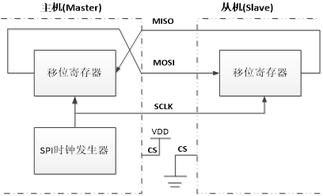
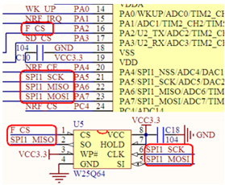
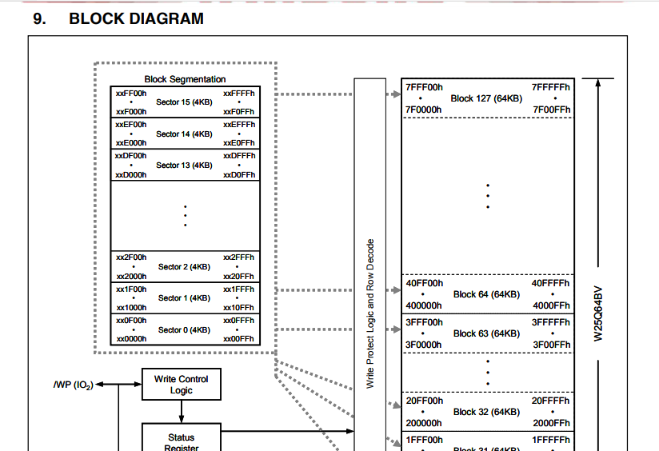
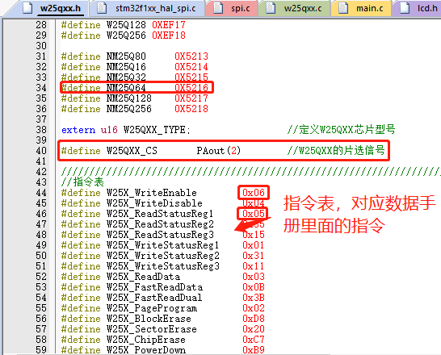
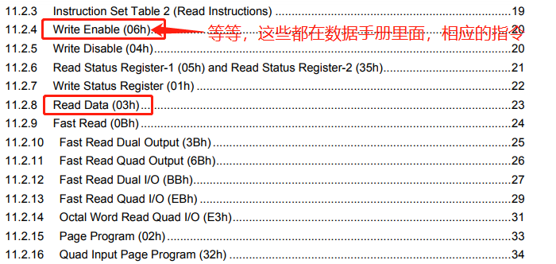
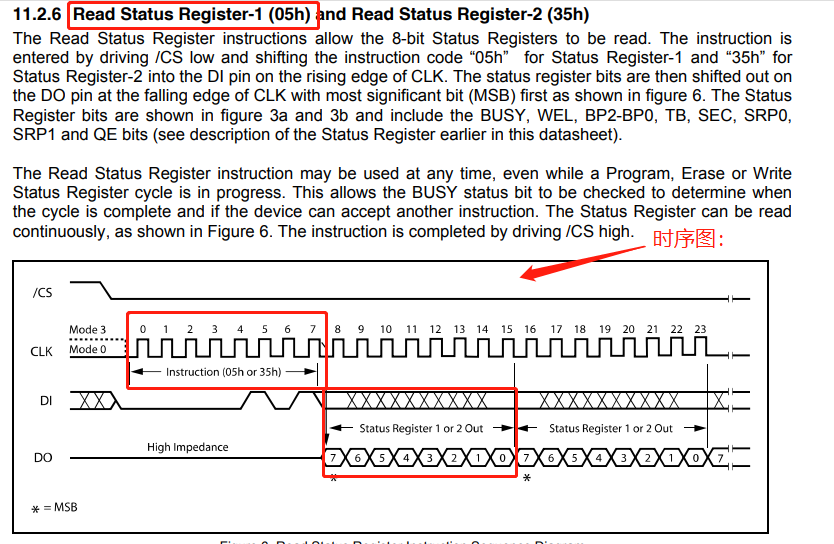
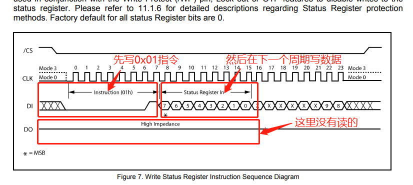
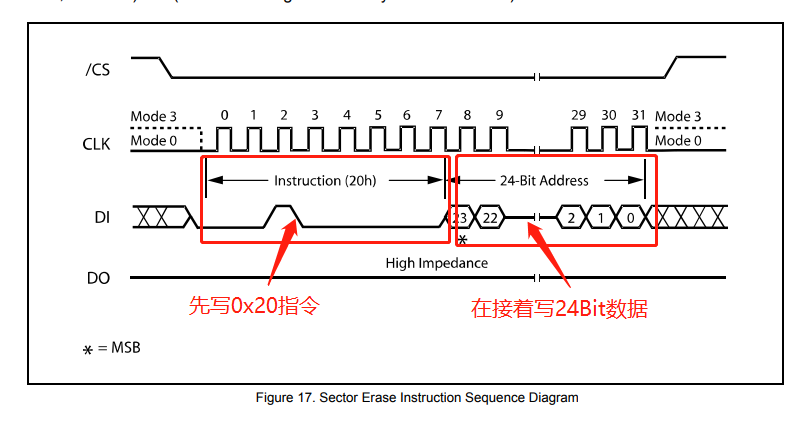
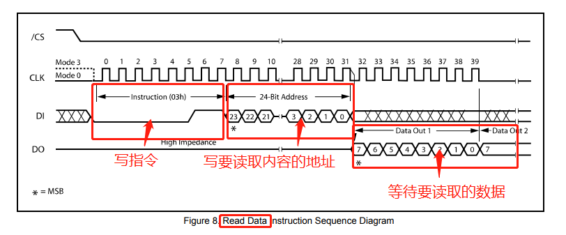
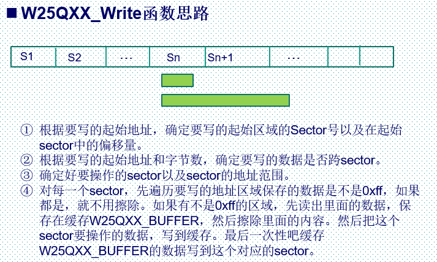

#SPI通信实现对外部 FLASH（W25Q64）的读写

##SPI接口简介
SPI 是英语`Serial Peripheral interface`的缩写，顾名思义就是串行外围设备接口。是`Motorola`首先在其`MC68HCXX`系列处理器上定义的。

SPI，是一种高速的，全双工，同步的通信总线，并且在芯片的管脚上只占用四根线，节约了芯片的管脚，同时为PCB的布局上节省空间，提供方便，主要应用在 `EEPROM`，`FLASH`，实时时钟，AD转换器，还有数字信号处理器和数字信号解码器之间。  

   

最主要的是理解这个环形的移位寄存器！！主机的数据一位一位的传到从机，从机的数据一位一位的传到主机里面去！！  
SPI去写一个字节的同时也会收到一个字节！！下面的工作原理里面说的也很清楚！！  

SPI接口一般使用4条线通信：  
MISO 主设备数据输入，从设备数据输出。  
MOSI 主设备数据输出，从设备数据输入。  
SCLK时钟信号，由主设备产生。  
CS从设备片选信号，由主设备控制。  

##SPI工作原理

1. 硬件上为4根线。  
2. 主机和从机都有一个串行移位寄存器，主机通过向它的SPI串行寄存器写入一个字节来发起一次传输。  
3. 串行移位寄存器通过MOSI信号线将字节传送给从机，从机也将自己的串行移位寄存器中的内容通过MISO信号线返回给主机。这样，两个移位寄存器中的内容就被交换。  
4. 外设的写操作和读操作是同步完成的。如果只进行写操作，主机只需忽略接收到的字节；反之，若主机要读取从机的一个字节，就必须发送一个空字节来引发从机的传输。  

##SPI相关代码解析
###代码1：SPI初始化代码

	SPI_HandleTypeDef SPI1_Handler;  //SPI1句柄

	//以下是SPI模块的初始化代码，配置成主机模式 //SPI口初始化//这里针是对SPI1的初始化
	void SPI1_Init(void)
	{
	    SPI1_Handler.Instance=SPI1;                         //SPI1
	    SPI1_Handler.Init.Mode=SPI_MODE_MASTER;             //设置SPI工作模式，设置为主模式
	    SPI1_Handler.Init.Direction=SPI_DIRECTION_2LINES;   //设置SPI单向或者双向的数据模式:SPI设置为双线模式
	    SPI1_Handler.Init.DataSize=SPI_DATASIZE_8BIT;       //设置SPI的数据大小:SPI发送接收8位帧结构
		......
	    SPI1_Handler.Init.CRCPolynomial=7;                  //CRC值计算的多项式
	    HAL_SPI_Init(&SPI1_Handler);//初始化
	    
	    __HAL_SPI_ENABLE(&SPI1_Handler);                    //使能SPI1
		
	    SPI1_ReadWriteByte(0Xff);                           //启动传输
	}

**首先**，定义了一个`SPI_HandleTypeDef`结构体类型的变量`SPI1_Handler`，并将其`Instance`成员定义为SPI1，表示这个结构体变量与SPI1有关联。

	SPI1_Handler.Instance=SPI1;                         //SPI1
	#define SPI1                ((SPI_TypeDef *)SPI1_BASE)
SPI1是一个外设寄存器，它在STM32的芯片手册中被定义为一个结构体类型——`SPI_TypeDef`。

在这个代码中，SPI1是已经被定义和初始化好的寄存器实例，在STM32芯片中唯一对应一个物理SPI模块。通过`SPI1_TypeDef`的内部成员变量地址来初始化`SPI1_Handler`的`Instance`成员，将两者关联起来。
因此，这个语句`SPI1_Handler.Instance=SPI1`; 是将`SPI1_Handle`这个结构体的实例与SPI1这个外设寄存器对应起来，便于后续操作控制SPI1这个硬件模块。

**然后**，通过`SPI1_Handler.Init`成员设置了SPI的工作模式、数据模式、数据大小、串行同步时钟的空闲状态、采样点以及一些CRC等相关参数。这些参数都是通过对应的宏定义来设置的，具体定义和含义可以参考STM32的SPI库文档。

**接着**，调用`HAL_SPI_Init`函数进行SPI的初始化，这个函数会根据前面设定的参数自动配置相应的寄存器，使SPI能够正常工作。

**最后**，通过`__HAL_SPI_ENABLE`函数使能SPI，并且需要发送一个0xff的字节来启动传输。在SPI通信过程中，NSS信号控制从机的使能状态（低电平使能，高电平不使能），这里设置为软件控制模式（内部NSS信号由SSI位控制）。

**总之**，这段代码实际上是对SPI进行硬件参数和功能的配置和初始化，必须熟悉STM32的SPI库以及芯片的SPI外设工作原理才能更好地理解和使用。

注：代码详解：
  
1. `SPI_HandleTypeDef SPI1_Handler;  //SPI1句柄`这个代码算是非常熟悉了啊，只要你写初始化，就要用到这个代码，`SPI_HandleTypeDef`是定义的结构体类型，`SPI1_Handler`是定义的结构体变量！！使用这个结构体变量`SPI1_Handler`来访问这个结构体`SPI_HandleTypeDef`里面的成员变量！！
2. 结构体`SPI_HandleTypeDef`，它算是比较复杂的了！！！

		typedef struct __SPI_HandleTypeDef
		{
		  SPI_TypeDef      *Instance;  /*!< SPI registers base address */		
		  SPI_InitTypeDef  Init;       /*!< SPI communication parameters*/		
		  uint8_t          *pTxBuffPtr; /*!< Pointer to SPI Tx transfer Buffer*	
		  uint16_t         TxXferSize;    /*!< SPI Tx Transfer size  */
		  ......
		} SPI_HandleTypeDef;
其中一小段，这个`typedef`定义的结构体，这个含义太熟了，只要认真看源码了，不管是什么源码，st啊，RTT啊，都会有的！！这里面的成员变量有点复杂！！这才是重点
3. `SPI_InitTypeDef  Init;`代码详解  
这个代码是定义结构体变量Init,使用`SPI1_Handler.Init.Mode=SPI_MODE_MASTER;`!  
这行代码，将`SPI1_Handler`（SPI1结构体句柄）的Init成员中的Mode字段赋值为`SPI_MODE_MASTER`，即将该SPI模块配置为主模式（Master Mode）。此时，表示SPI模块将对外部器件进行控制，协调传输速率和时序，并生成串行时钟信号（SCLK），使能从机设备进行数据通信。

		typedef struct
		{
		  uint32_t Mode;                /*!< Specifies the SPI operating mode.
		  This parameter can be a value of @ref SPI_Mode */
		
		  uint32_t Direction;           /*!< Specifies the SPI bidirectional mode state.his parameter can be a value of @ref SPI_Direction */
		
		  uint32_t DataSize;            /*!< Specifies the SPI data size.
		  This parameter can be a value of @ref SPI_Data_Size */
		
		  uint32_t CLKPolarity;         /*!< Specifies the serial clock steady state.This parameter can be a value of @ref SPI_Clock_Polarity */
		  ......
		  uint32_t CRCPolynomial;       /*!< Specifies the polynomial used for the CRC calculation.This parameter must be an odd number between Min_Data = 1 and Max_Data = 65535 */
		} SPI_InitTypeDef;
这些正点原子的源码还行！如何知道`SPI1_Handler.Init.Mode`等于什么，它的传参如何知道的！！后面都有的，根据这个线索去找`@ref SPI_Mode`,虽然，有的不会跳转，但，每一个都可以搜索的！！这是在RTT里面学到的！！他们都使用VScode!!去搜索代码，关键字啥的！！方便调试代码！！

4. 除了`"SPI_MODE_MASTER"`，`"SPI_MODE_SLAVE"`之外，`SPI1_Handler.Init.Mode`还可以等于其他枚举类型所定义的值。通过阅读相关库文件或者官方文档，我们可以查询到这个枚举类型所能够取到的所有可能值。  
例如，在`STM32CUBEMX`的代码生成工具中，我们可以看到在初始化配置表中有相应的选项来设置SPI模式字段（Mode），可以通过下拉菜单选择设置为`SPI_MODE_MASTER`或者`SPI_MODE_SLAVE`。也可以进一步查看`STM32 HAL`库相应头文件中的注释，以了解`typedef`定义的`SPI_HandleTypeDef`结构体，其中包含了Init成员，即SPI模块的初始化参数结构体，其中又包含Mode字段。 
总之，在编写代码时，开发者需要根据SPI模块工作的实际需求，合理选择对应的工作模式和参数，通过查阅文档和反复实验，用代码将SPI模块进行必要的配置和控制。  

###代码2：SPI读写字节代码
	
	//SPI1 读写一个字节
	//TxData:要写入的字节
	//返回值:读取到的字节
	u8 SPI1_ReadWriteByte(u8 TxData)
	{
	    u8 Rxdata;
	    HAL_SPI_TransmitReceive(&SPI1_Handler,&TxData,&Rxdata,1, 1000);       
	 	return Rxdata;          		    //返回收到的数据		
	}

##SPI常用寄存器
	SPI控制寄存器1（SPI_CR1)
	SPI控制寄存器2（SPI_CR2)
	SPI状态寄存器（SPI_SR)
	SPI数据寄存器（SPI_DR)
	SPI_I2S配置寄存器（SPI_I2S_CFGR)
	SPI_I2S预分频寄存器（SPI_I2SPR)

##SPI相关库函数：
	void SPI_I2S_DeInit(SPI_TypeDef* SPIx);
	void SPI_Init(SPI_TypeDef* SPIx, SPI_InitTypeDef* SPI_InitStruct);
	void SPI_Cmd(SPI_TypeDef* SPIx, FunctionalState NewState);
	void SPI_I2S_ITConfig(SPI_TypeDef* SPIx, uint8_t SPI_I2S_IT, FunctionalState NewState);
	void SPI_I2S_DMACmd(SPI_TypeDef* SPIx, uint16_t SPI_I2S_DMAReq, FunctionalState NewState);
	void SPI_I2S_SendData(SPI_TypeDef* SPIx, uint16_t Data);
	uint16_t SPI_I2S_ReceiveData(SPI_TypeDef* SPIx);
	void SPI_DataSizeConfig(SPI_TypeDef* SPIx, uint16_t SPI_DataSize);
	
	FlagStatus SPI_I2S_GetFlagStatus(SPI_TypeDef* SPIx, uint16_t SPI_I2S_FLAG);
	void SPI_I2S_ClearFlag(SPI_TypeDef* SPIx, uint16_t SPI_I2S_FLAG);
	ITStatus SPI_I2S_GetITStatus(SPI_TypeDef* SPIx, uint8_t SPI_I2S_IT);
	void SPI_I2S_ClearITPendingBit(SPI_TypeDef* SPIx, uint8_t SPI_I2S_IT);
这里需要注意的是，`STM32 SPI`接口可配置为支持`SPI`协议或者支持`I2S`音频协议，默认是`SPI`模式。可以通过软件切换到`I2S`方式。    
这里的函数名有SPI和I2S,实际上只能使用其中的一个，并不能同时使用！！  

##程序配置过程
	①配置相关引脚的复用功能，使能SPIx时钟
	    void GPIO_Init(GPIO_TypeDef* GPIOx, GPIO_InitTypeDef* GPIO_InitStruct);
	②初始化SPIx,设置SPIx工作模式
	    void SPI_Init(SPI_TypeDef* SPIx, SPI_InitTypeDef* SPI_InitStruct);
	③使能SPIx
	    void SPI_Cmd(SPI_TypeDef* SPIx, FunctionalState NewState);
	④SPI传输数据
	    void SPI_I2S_SendData(SPI_TypeDef* SPIx, uint16_t Data);
	    uint16_t SPI_I2S_ReceiveData(SPI_TypeDef* SPIx) ;
	⑤查看SPI传输状态
	   SPI_I2S_GetFlagStatus(SPI2, SPI_I2S_FLAG_RXNE);

##W25Q128(W25Q64)

  
    
注意到图中，还有 NRF_CS/SD_CS 等片选信号，他们和 W25Q64 一样，都是使用的 SPI1，也就是说这三个器件，共用一个 SPI，所以在使用的时候，必须分时复用（通过片选控制）。针对MINI板子！！

`W25Q128(W25Q64)`将16M(8M)的容量分为`256(128)`个块（`Block`），每个块大小为64K字节，每个块又分为16个扇区（`Sector`），每个扇区4K个字节。`W25Qxx`的最小擦除单位为一个扇区，也就是每次必须擦除4K个字节。这样我们需要给`W25Qxx`开辟一个至少4K的缓存区，这样对SRAM要求比较高，要求芯片必须有4K以上SRAM才能很好的操作。
  
  

扇区的大小！！使用前先要看这个4K的扇区是不是0xFF,如果不是，需要擦除，在擦除前，我们需要给`W25Qxx`开辟一个至少4K的缓存区，保存和写入数据，然后在放入扇区！！

 
 
###代码块1：`W25QXX_ReadSR`

	u8 W25QXX_ReadSR(void)   
	{  
		u8 byte=0;    
		W25QXX_CS=0;   //使能器件   拉低片选，就能对芯片进行读写操作！！
		SPI1_ReadWriteByte(W25X_ReadStatusReg1); //发送读取状态寄存器命令    
		byte=SPI1_ReadWriteByte(0Xff);          //读取一个字节  
		W25QXX_CS=1;                            //取消片选     
		return byte;   
	} 
这是W25QXX芯片的读函数，从上面看，读指令是0x05,并且函数代码中也是宏定义了！！  

 
  
`SPI1_ReadWriteByte(W25X_ReadStatusReg1)` ：对这个W25QXX芯片发送0x05指令！！寄存器指令！从时序图中可以看出，先写0x05指令，然后再读；写的时候其实，同时也读取一个字节回来！！但我们并不去使用！！因为我们是在下一个周期去读取数据，这里刚写入时，从图上看，就是第一个方框正下方的数据，正下面的数据并没有用！！  
`byte=SPI1_ReadWriteByte(0Xff)`：下面的这个代码，我们就要去读取有用的数据，因为读的时候同时也需要发送一个数据，这里发送一个0xff，代表的是一个空字节！！  

###代码块2:`W25QXX_Write_SR`
	//写W25QXX状态寄存器
	void W25QXX_Write_SR(u8 sr)   
	{    
		W25QXX_CS=0;                            //使能器件   
		SPI1_ReadWriteByte(W25X_WriteStatusReg1); //发送写取状态寄存器命令    
		SPI1_ReadWriteByte(sr);                 //写入一个字节  
		W25QXX_CS=1;                            //取消片选     	      
	} 

W25X_WriteStatusReg1=0x01；

   

其他的看代码，看时序，并不难！！

	//W25QXX写使能	
	//将WEL置位   
	void W25QXX_Write_Enable(void)   
	{
		W25QXX_CS=0;                            //使能器件   
	    SPI1_ReadWriteByte(W25X_WriteEnable);   //发送写使能  
		W25QXX_CS=1;                            //取消片选     	      
	} 
	//W25QXX写禁止	
	//将WEL清零  
	void W25QXX_Write_Disable(void)   
	{  
		W25QXX_CS=0;                            //使能器件   
	    SPI1_ReadWriteByte(W25X_WriteDisable);  //发送写禁止指令    
		W25QXX_CS=1;                            //取消片选     	      
	} 

###代码块3：`W25QXX_Erase_Sector`擦除
	//擦除一个扇区
	//Dst_Addr:扇区地址 根据实际容量设置
	//擦除一个扇区的最少时间:150ms
	void W25QXX_Erase_Sector(u32 Dst_Addr)   
	{  
		//监视falsh擦除情况,测试用   
	 	//printf("fe:%x\r\n",Dst_Addr);	  
	 	Dst_Addr*=4096;
	    W25QXX_Write_Enable();                  //SET WEL 	 
	    W25QXX_Wait_Busy();   
	  	W25QXX_CS=0;                            //使能器件   
	    SPI1_ReadWriteByte(W25X_SectorErase);   //发送扇区擦除指令 
	    if(W25QXX_TYPE==W25Q256)                //如果是W25Q256的话地址为4字节的，要发送最高8位
	    {
	        SPI1_ReadWriteByte((u8)((Dst_Addr)>>24)); 
	    }
	    SPI1_ReadWriteByte((u8)((Dst_Addr)>>16));  //发送24bit地址    
	    SPI1_ReadWriteByte((u8)((Dst_Addr)>>8));   
	    SPI1_ReadWriteByte((u8)Dst_Addr);  
		W25QXX_CS=1;                            //取消片选     	      
	    W25QXX_Wait_Busy();   				    //等待擦除完成
	}  

 

看上面时序图，在分析代码！！其实并不难理解！！  
`#define W25X_SectorErase		0x20`擦除扇区的指令0x20，数据手册上的，上面的指令集都是根据数据手册上写的！！  

###代码块4： `W25QXX_Read`

	//读取SPI FLASH  
	//在指定地址开始读取指定长度的数据
	//pBuffer:数据存储区
	//ReadAddr:开始读取的地址(24bit)
	//NumByteToRead:要读取的字节数(最大65535)
	void W25QXX_Read(u8* pBuffer,u32 ReadAddr,u16 NumByteToRead)   
	{ 
	 	u16 i;   										    
		W25QXX_CS=0;                            //使能器件   
	    SPI1_ReadWriteByte(W25X_ReadData);      //发送读取命令  
	    if(W25QXX_TYPE==W25Q256)                //如果是W25Q256的话地址为4字节的，要发送最高8位
	    {
	        SPI1_ReadWriteByte((u8)((ReadAddr)>>24));    
	    }
	    SPI1_ReadWriteByte((u8)((ReadAddr)>>16));   //发送24bit地址    
	    SPI1_ReadWriteByte((u8)((ReadAddr)>>8));   
	    SPI1_ReadWriteByte((u8)ReadAddr);   
	    for(i=0;i<NumByteToRead;i++)
		{ 
	        pBuffer[i]=SPI1_ReadWriteByte(0XFF);    //循环读数  
	    }
		W25QXX_CS=1;  				    	      
	}  

  
读数据的时序图，指令是0x03，写24Bit地址，读数据。 `#define W25X_ReadData	0x03 ` 
  
###代码块5：`W25QXX_Write`和上面的读相似，但要难一点，写入flash
	  u8 W25QXX_BUFFER[4096];         // 定义一个4KB大小的缓存区
	  void W25QXX_Write(u8* pBuffer, u32 WriteAddr, u16 NumByteToWrite) {
	  u32 secpos;
	  u16 secoff;
	  u16 secremain;
	  u16 i;
	  u8 * W25QXX_BUF;               // 定义一个指针，用于操作缓存区的数据
	  W25QXX_BUF = W25QXX_BUFFER;    // 将指针指向缓存区的起始位置 
	  // 计算待写入数据所在的扇区地址  
	  secpos = WriteAddr / 4096;      
	  // 计算待写入数据在所在扇区内的偏移量 
	  secoff = WriteAddr % 4096;
	  // 计算待写入数据能够放置在该扇区内的最大剩余空间               
	  secremain = 4096 - secoff;          
	  if (NumByteToWrite <= secremain) 
	    // 如果需要写入的数据不超过该扇区的剩余空间，则直接将数据复制到缓存区并写入Flash     
	    secremain = NumByteToWrite;                   
	  while (1) {
	    // 将整个扇区的数据读出至缓存区
	    W25QXX_Read(W25QXX_BUF, secpos * 4096, 4096);
	    for (i = 0; i < secremain; i++) {
	      // 判断是否需要进行擦除操作  
	      if (W25QXX_BUF[secoff + i] != 0XFF)
	        break; 
	    }
	    if (i < secremain) {
	      W25QXX_Erase_Sector(secpos); // 对该扇区进行擦除     
	      for (i = 0; i < secremain; i++) {                        
	        W25QXX_BUF[i + secoff] = pBuffer[i];
	      }                                                 
	      W25QXX_Write_NoCheck(W25QXX_BUF, secpos * 4096, 4096);  // 将缓存区的数据写入Flash中          
	    } else
	      W25QXX_Write_NoCheck(pBuffer, WriteAddr, secremain);  // 直接将数据写入扇区内，因为已经进行过擦除操作                
	    if (NumByteToWrite == secremain)
	      break;  // 数据全部写入完成，结束函数    
	    else {                                                 
	      secpos++;  // 转到下一个扇区      
	      secoff = 0;  // 偏移量清零       
	      pBuffer += secremain;  // 进行指针偏移，以便写入余下的数据             
	      WriteAddr += secremain;  // 写地址进行偏移           
	      NumByteToWrite -= secremain;  // 字节数进行递减               
	      if (NumByteToWrite > 4096)     // 下一个扇区也不能完全写入              
	        secremain = 4096;      
	      else                           
	        secremain=NumByteToWrite;  // 下一个扇区能够完全写入           
	    }  
	  };     
	}
真的牛，解释的很详细！！
首先`WriteAddr/4096`，一个扇区4K=4096,计算在那个扇区，扇区1，扇区2.....
`WriteAddr%4096`在扇区内的偏移  

  
    
差不多懂了！！ 

pBuffer：待写入数据的缓存指针。  
WriteAddr：写入地址，即待写入数据在Flash中的起始地址。  
NumByteToWrite：待写入数据的字节数。   

	// 将整个扇区的数据读出至缓存区
	W25QXX_Read(W25QXX_BUF, secpos * 4096, 4096); 
`W25QXX_BUF`是指针！！定义的读函数，就是定义的指针类型！！
  