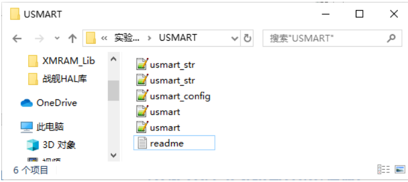

#USMART调试组件实验

##什么是USMART？

一个十分重要的辅助调试工具：`USMART` 调试组件。该组件由 `ALIENTEK` 开发提供，功能类似 **linux 的 shell（RTT 的 finsh 也属于此类）**。USMART 最主要的功能就是通过串口调用单片机里面的函数，并执行，对我们调试代码是很有帮助的。  
RTT的finsh我还没学到呢！！  

USMART 的实现流程简单概括就是：第一步，添加需要调用的函数（在 `usmart_config.c` 里面的 `usmart_nametab` 数组里面添加）；第二步，初始化串口；第三步，初始化 `USMART`（通过
`usmart_init` 函数实现）；第四步，轮询 `usmart_scan` 函数，处理串口数据。

##USMART 组件的移植

  

`usmart.c` 负责与外部互交等。`usmat_str.c` 主要负责命令和参数解析。`usmart_config.c` 主要由用户添加需要由 `usmart` 管理的函数。  
`usmart.h` 和 `usmart_str.h` 是两个头文件，其中 `usmart.h` 里面含有几个用户配置宏定义，可以用来配置 `usmart` 的功能及总参数长度(直接和 SRAM 占用挂钩)、是否使能定时器扫描、是否使用读写函数等。    
`USMART` 的移植，只需要实现 5 个函数。其中 4 个函数都在 `usmart.c` 里面，另外一个是串口接收函数，必须由用户自己实现，用于接收串口发送过来的数据。

###USMART配置步骤：就是将你的工程文件加入USMART调试组件（移植） 
- 1.将`USMART`包添加到工程中，头文件要包含到`path`。  
这一步两个操作，希望别不记得如何添加文件到工程中，还有将文件添加到路径中！！  
- 2.添加需要调用的函数到`usmart_config.c`文件中。  
这里是`usmart_config.c`文件中内容，自己按照格式去添加自己的需要的函数！！

		//函数名列表初始化(用户自己添加)
		//用户直接在这里输入要执行的函数名及其查找串
		struct _m_usmart_nametab usmart_nametab[]=
		{
		#if USMART_USE_WRFUNS==1 	//如果使能了读写操作
			(void*)read_addr,"u32 read_addr(u32 addr)",
			(void*)write_addr,"void write_addr(u32 addr,u32 val)",	 
		#endif		   
			(void*)delay_ms,"void delay_ms(u16 nms)",
		 	(void*)delay_us,"void delay_us(u32 nus)",	 
			(void*)LCD_Clear,"void LCD_Clear(u16 Color)",
			(void*)LCD_Fill,"void LCD_Fill(u16 xsta,u16 ysta,u16 xend,u16 yend,u16 color)",
			(void*)LCD_Draw_Circle,"void Draw_Circle(u16 x0,u16 y0,u8 r)",
			(void*)LCD_ReadPoint,"u16 LCD_ReadPoint(u16 x,u16 y)",				 
			(void*)LCD_Display_Dir,"void LCD_Display_Dir(u8 dir)",
			(void*)LCD_ShowxNum,"void LCD_ShowxNum(u16 x,u16 y,u32 num,u8 len,u8 size,u8 mode)", 
			
			(void*)Chinese_Show_one, "void Chinese_Show_one(u8 x, u8 y,  u8 num, u8 size,u8 mode)",
			//这个函数是我自己写的，我按照这个格式添加，完全可以用的！！
			
			(void*)led_set,"void led_set(u8 sta)",						
		};	

  
- 3.主函数中调用`usmart_dev.init`函数初始化`usmart`。  
既然添加了usmart组件，就在主函数中，添加初始化，初始usmart函数/组件  
如何初始化usmart  

		//usmart控制管理器
		struct _m_usmart_dev
		{
			struct _m_usmart_nametab *funs;	//函数名指针
		
			void (*init)(u8);				//初始化
			u8 (*cmd_rec)(u8*str);			//识别函数名及参数
			void (*exe)(void); 				//执行 
			void (*scan)(void);             //扫描
			u8 fnum; 				  		//函数数量
			u8 pnum;                        //参数数量
			u8 id;							//函数id
			......

		};
`struct _m_usmart_dev`定义了一个这样的结构体！里面`void (*init)(u8);`是一个函数指针！这不是刚在RT-Thread里面学的吗！！  
  
		extern struct _m_usmart_dev usmart_dev;		//在usmart_config.c里面定义
		usmart_dev:定义了一个`struct _m_usmart_dev`类型的结构体变量

		//函数控制管理器初始化//得到各个受控函数的名字//得到函数总数量
		struct _m_usmart_dev usmart_dev=
		{
			usmart_nametab,
			usmart_init,//是一个初始化函数啊，这是
			usmart_cmd_rec,
			usmart_exe,
			usmart_scan,
			sizeof(usmart_nametab)/sizeof(struct _m_usmart_nametab),//函数数量
			0,	  	//参数数量
			0,	 	//函数ID
			......
		}; 

下面这个是一个`usmart_init(u8 sysclk)`函数啊，参数是时钟频率，F1是72兆HZ

		//初始化串口控制器//sysclk:系统时钟（Mhz）
		void usmart_init(u8 sysclk)
		{
		#if USMART_ENTIMX_SCAN==1
			Timer4_Init(1000,(u32)sysclk*100-1);//分频,时钟为10K ,100ms中断一次,注意,计数频率必须为10Khz,以和runtime单位(0.1ms)同步.
		#endif
			usmart_dev.sptype=1;	//十六进制显示参数
		}

综上分析！！  
`usmart_dev.init(72);//自己添加的usmart调试组件`为usmart初始化代码！！

- 4.即可通过助手发送命令，调用在`usmart`注册过的函数。

注：移植过程中会编译出错！！这不是非常非常常见的吗！！自己通过BSP的移植，也算是见过世面了！！通过编译报错信息去解决问题！！  

注：**函数指针**  
必须知道函数指针的实质是一个是一个指针，并不是函数，函数有自己的函数体，而指针只是一个变量，也就比如我们常声明的int a = 0中的a一样。  
细致的讲，如果在程序中定义了一个函数，那么在编译时系统就会为这个函数代码分配一段存储空间，这段存储空间的首地址称为这个函数的地址。而且函数名表示的就是这个地址。既然是地址我们就可以定义一个指针变量来存放，这个指针变量就叫作函数指针变量，简称函数指针。

举例：学习函数指针怎么定义，怎么使用的！！
  
	int add(int x, int y) {    //add是一个函数，会分配一段储存地址，而add就是这个函数的首地址
	    return x + y;
	}
	
	int main() {
	    int (*pFunc)(int, int) = add;  // 定义了一个函数指针`pFunc`,将add函数的地址赋值给pFunc
	    int result = pFunc(1, 2);      // 通过pFunc调用add函数
	    printf("%d\n", result);        // 输出结果3
	    return 0;
	}

在这个示例中，我们定义了一个函数`add`，它接受两个`int`类型的参数并返回它们的和。然后，我们定义了一个函数指针`pFunc`，它指向一个返回`int`类型的函数，接受两个`int`类型的参数。我们将`add`函数的地址赋值给`pFunc`，然后通过`pFunc`调用`add`函数，并输出结果。

