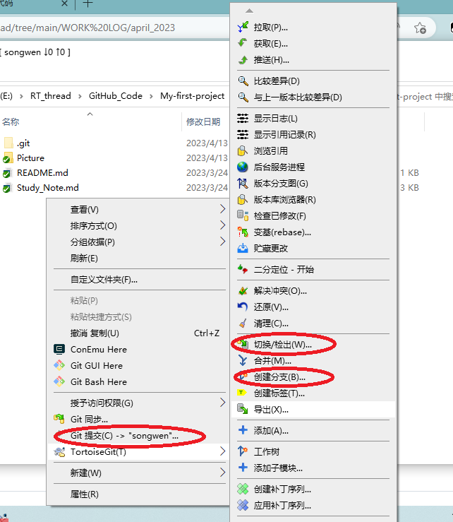
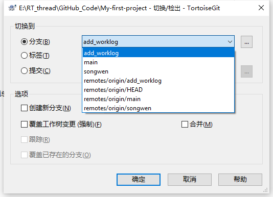
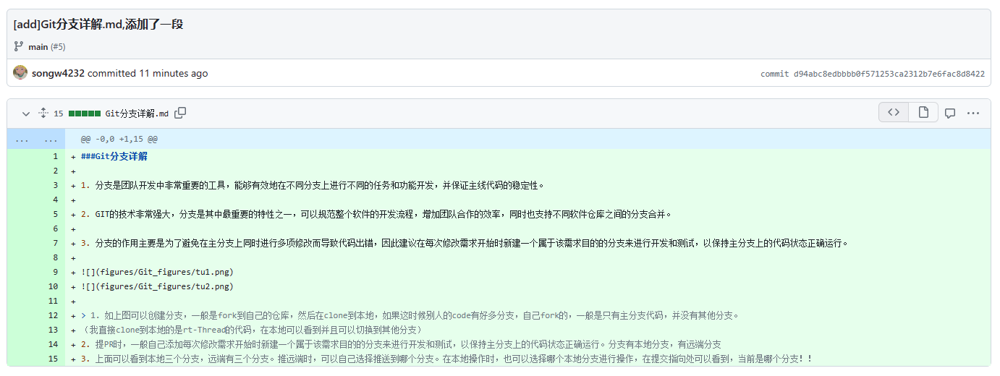
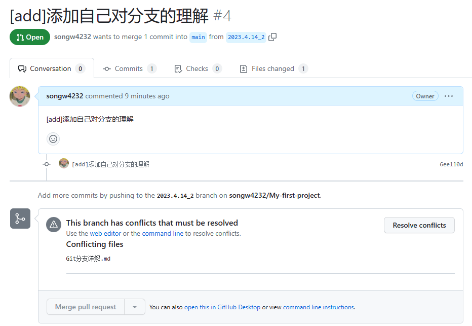
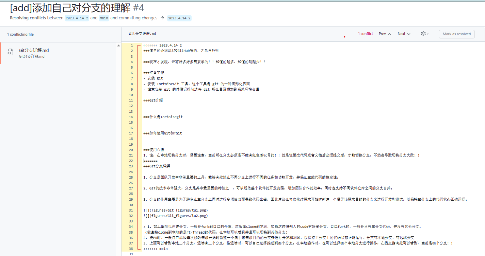
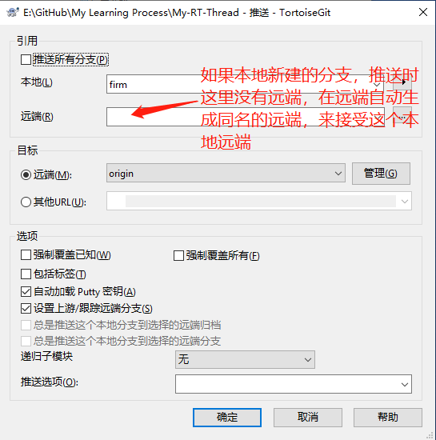
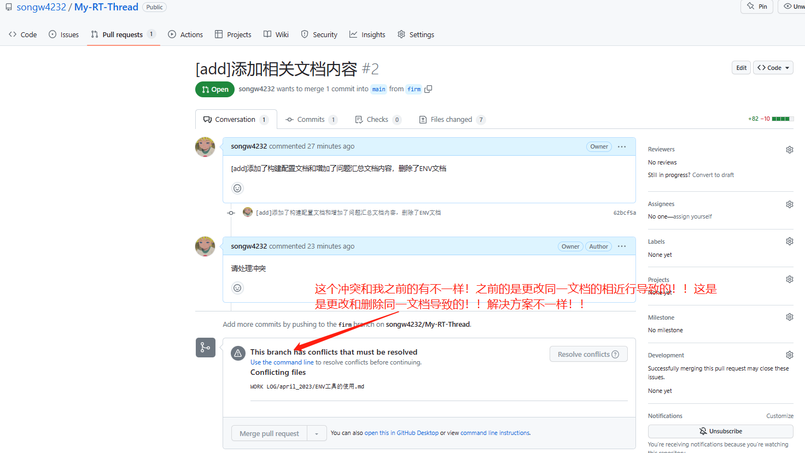

#Git的使用教程

注：本部分介绍一下Git工具，对于我来说也是一个新的工具嘛，同时它又是一个重要的工具，本部分就介绍一下Git，同时衍生出来的Tortoise git（Tgit/小乌龟）这个工具介绍一下，最后在说一下使用心得等等！！总结经验！！
####现在才发现，还有好多好多需要学的！！知道的越多，知道的就越少！！ 

##Git工具
 
###准备工作  
- 安装 git  
- 安装 TortoiseGit 工具，这个工具是 git 的一种图形化界面  
- 注意安装 git 的时候记得勾选将 git 所在目录添加到系统环境变量   

###Git介绍
  
Git是目前世界上最先进的分布式版本控制系统（没有之一）。  
这个软件用起来就应该像这个样子，能记录每次文件的改动   

###在Windows上安装Git
在Windows上使用Git，可以从Git官网直接下载安装程序，然后按默认选项安装即可。  
安装完成后，在开始菜单里找到“Git”->“Git Bash”，蹦出一个类似命令行窗口的东西，就说明Git安装成功！  
因为Git是分布式版本控制系统，所以，每个机器都必须自报家门：你的名字和Email地址。    
 
##Tortoisegit
[TGit教程](https://www.cnblogs.com/anayigeren/p/10177027.html)  
   
本教程应该称作TortoiseGit入门指南。因为下面要借助一个图形化的软件，TortoiseGit来操作git。用GUI（图形界面）再谈CLI（命令行），我相信这会更容易让人接受。
 
- TortoiseGit 简称 tgit， 中文名海龟Git。TortoiseGit是一个开放的GIT版本控制系统的源客户端。
- TortoiseGit 支持Winxp/vista/win7/Win10，提供有中文版支持。
- TortoiseGit 可以恢复您的文件的旧版本，并研究如何以及合适改变了历史数据，谁改变了它。  

##如何使用Git和TGit/将代码提交到服务器

详细过程见[将代码提交到服务器(TGit的使用).md](将代码提交到服务器(TGit的使用).md)  

###使用心得 
1. 注：在本地切换分支时，需要注意，当前所在分支必须是不能有红色感叹号的！！就是说更改代码或者文档后必须提交后，才能切换分支，不然会导致切换分支失败！！

###Git分支详解

1. 分支是团队开发中非常重要的工具，能够有效地在不同分支上进行不同的任务和功能开发，并保证主线代码的稳定性。

2. GIT的技术非常强大，分支是其中最重要的特性之一，可以规范整个软件的开发流程，增加团队合作的效率，同时也支持不同软件仓库之间的分支合并。

3. 分支的作用主要是为了避免在主分支上同时进行多项修改而导致代码出错，因此建议在每次修改需求开始时新建一个属于该需求目的的分支来进行开发和测试，以保持主分支上的代码状态正确运行。

  

 
> 1. 如上图可以创建分支，一般是fork到自己的仓库，然后在clone到本地，如果这时候别人的code有好多分支，自己fork的，一般是只有主分支代码，并没有其他分支。  
（我直接clone到本地的是rt-Thread的代码，在本地可以看到并且可以切换到其他分支）
2. 提PR时，一般自己添加每次修改需求开始时新建一个属于该需求目的的分支来进行开发和测试，以保持主分支上的代码状态正确运行。分支有本地分支，有远端分支
3. 上面可以看到本地三个分支，远端有三个分支。推远端时，可以自己选择推送到哪个分支。在本地操作时，也可以选择哪个本地分支进行操作，在提交指向处可以看到，当前是哪个分支！！

####分支含义  

在Git中，分支并不是相当于主线的复制内容，而是在主线的基础上创建了一个新的指针，指向一个新的代码版本。在创建分支时，Git会将当前代码状态保存在一个新的分支上，然后在这个新的分支上进行开发和修改，不会影响主线的代码版本。因此，分支可以看作是主线的一个副本，但并不是完全的复制内容。

在本地进行分支开发时，分支会占用一定的内存空间，但是占用的空间相对较小，通常不会对计算机性能造成明显的影响。Git采用的是类似于指针的方式来管理分支，因此分支的创建和切换时不需要对代码进行复制，只需要修改指针的指向即可。当分支合并到主线之后，分支的代码版本也会被删除，不会占用额外的内存空间。因此，使用Git进行分支开发是一种非常高效和灵活的方式。

###解释提PR时，冲突怎么来的？如何解决？

####情况一：冲突是由修改同一文档的相近行产生的
因为自己前两天提PR时，由于提PR的战线有点长！！两个人同时修改了同一个文件，别人的先合并，那么我的就会出现冲突问题！   
什么是 GitHub 冲突？小明和小强对同一个文件的同一行或相近行都进行了编辑，且进行了先后提交，便产生了冲突。  

这种好事都被我遇到了！人家来了半年了，估计都没遇到！我这才第二次提PR，就产生冲突了！！六！！  

看我的实验部分：  

我先后提交了两次，并且两次都是修改了同一个文档！！都在第一行开始添加的内容！！当合并另一个时，另一个就产生了冲突！！再有合并全权限的情况下，我把需要的内容保留后，删除冲突符号，就完成了合并！！

由下面的冲突文件中的冲突内容我们了解到：

	<<<<<<< HEAD
	6月19日 pingrixuexilianxi添加了内容
	=======
	6月18日 pingrixuexilianxi2修改了这个文件哦
	>>>>>>> a8284fd41903c54212d1105a6feb6c57292e07b5

<<<<<<< HEAD到 =======里面的【6月19日 pingrixuexilianxi添加了内容】是自己刚才的Commit提交的内容
=======到 >>>>>>> a8284fd41903c54212d1105a6feb6c57292e07b5里面的【6月18日 pingrixuexilianxi2修改了这个文件哦】是远程代码库更新的内容（即为pingrixuexilianxi2本地代码库推送修改内容）。  

冲突比较少，处理起来比较简单。例如只有一处或两处。  
__手动冲突解决方法:__  
根据项目需求删除不需要的代码就行了，假如都需要的话我们只需要把 <<<<<<< HEAD=======     >>>>>>> a8284fd41903c54212d1105a6feb6c57292e07b5都删掉冲突就解决了（注意，在项目中最后这些符号都不能存在，否则可能会报异常）。  

(我靠，那当时我这起冲突时，直接删了，不就好了？不知道没有合并权限的，能否这样操作啊！！这个是我自己的仓库，可以直接把删除了！解决冲突了，然后就直接合并了，解决问题)

####情况二：冲突是由修改和删除同一文档产生的

要解决由对文件进行竞争更改而导致的合并冲突，对于一个人删除分支中的文件而另一个人编辑同一文件的情况，您必须选择是删除还是将删除的文件保留在新提交中。  

这个今天(2023.4.17)刚遇到，之前的准备工作没做好，本地主分支没有及时拉取，然后我就想到新建一个分支，再推到远端！！结果就出现了这个冲突问题！！解决方案：看了Git上面的操作步骤，一顿操作下来，好了，但我不知道怎么好的！！

我就把主分支更新一下，因为主分支也是我更改过的！（这个是不熟练，没有创建子分支来操作！！后面应该不会了）所以，拉取时，会出现冲突问题，和上面的GitHub里面的一样，映射到本地了！！好家伙！！因为我就是需要删除这个文档！所以我在本地把他删除了，提交的时候操作确认，然后推送到远端！我刚刚提交的分支就自动合并了！！六有点不知所以然啊！！后面如果在遇到了，在详细记录！！  

