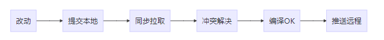
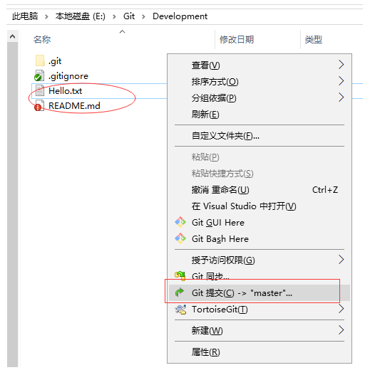
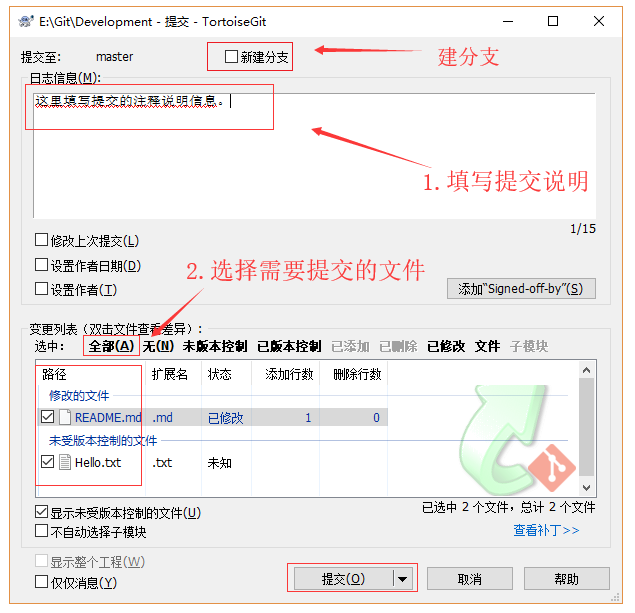
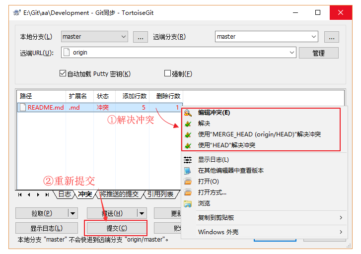

##如何使用Git和TGit/将代码提交到服务器

Git的使用类似TFS、SVN等源代码或者文件管理器，惯例的流程：

####第一步：改动，修改本地项目中的某些文件，如修改 README.md 内容，还可以增加一些文件， 如Hello.txt。 

####第二步：提交本地，在本地项目的空白处点击鼠标右键，选择 【Git提交(C) -> "master"...】
注：这里可以不用一开始去新建一个分支，直接就在本地的主分支上进行修改，添加等相关操作！！一点问题没用！！但是在后面提交时，必须是新建分支进行提交，**这样主分支的内容并不会改变**！！

在弹出提交（Commit）对话框中完成提交说明信息，和选择需要提交的文件，可根据需要新建分支，然后点击 【提交】 按钮，将修改提交到本地仓库：  

当然这里也可以直接从一开始就建立一个新的分支进行修改，按照任务创建新分支！！不如上面的方便，但也就方便一点点！！  
弹出提交进度窗口，提交成功后还需要“推送”将本地仓库的修改推送到远程仓库。  

####第3步：同步拉取，在实际工作中，如果多人协作或者多个客户端进行修改，那么我们还要拉取别人推送到在线仓库的内容，所以在推送之前需要先执行同步拉取(Pull ...)操作。  
注：这里你修改过了代码的内容，并且新建分支提交了！！之后你在去主仓库去拉取时，并不会改变提交后你修改过的内容的！！这很重要！！目的是，看看是否会产生冲突！！

**如果服务器上的文件被修改过了（本地文件修改前不是最新版本），就会提示冲突。先要解决冲突，然后再提交结果：**

需要注意的是，和使用TFS、SVN的习惯一样，你在修改本地内容之前，最好先 拉取（pull）一下，减少冲突的可能。

####第四步：推送远程，将提交到本地仓库的修改推送到远程仓库，可以直接在提交成功后的提示窗口上点击【推送(H)...】，或者在Git同步窗口点击【推送(H)...】，鼠标右击的菜单上也有相应的快捷操作：选择 【TortoiseGit(T)】→【推送(H)...】

总结：总之！！一句话，会用就行！！这东西也没什么技术啥的在里面，你会用了，就会用了！！最快速的学会，怎么快速学会，就是好方法！！最快的方法，让别人给你演示一遍，别人愿意教你的话！这样学最快，这东西，不需要技术含量！！

学会了，就是学会了！！当然不用的话也会忘记的！！所以做个笔记，方便日后巩固！！