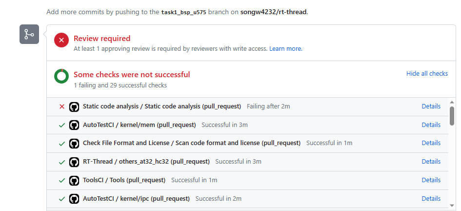
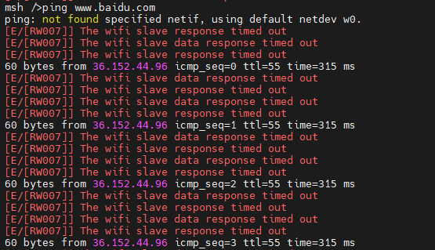

#问题汇总

##1.提交PR时，会对工程代码进行编译，下图是出现的错误

1.1 Static code analysis静态代码分析

    Static code analysis / Static code analysis (pull_request)-->details；看看具体的错误在处理！！ 
	Error: Process completed with exit code 1.
这个问题目前还没解决！
这个有可能是GitHub里面编译器的误报。先不用考虑

1.2这个是代码不规范，没有按照rt-thread代码规范

    Check File Format and License / Scan code format and license (pull_request) 
使用formatting扫描，把Tab自动换成四个空格！！非常滴好用！我刚学会。  
formatting是python代码  
__如何使用这个python脚本！！__  
首先按住键盘“Shift”键，然后点击鼠标右键，选择“在此处打开 Powershell 窗口”即可。
  
	PS E:\GitHub\formatting-master> python.exe .\formatting.py E:\GitHub\task1\rt-thread\bsp\stm32\stm32u575-st-nucleo\board

##2.做BSP移植时，使用SPI驱动RW007，可以成功使用，且连上热点了！但是一直出现超时问题，并没有解决
  

