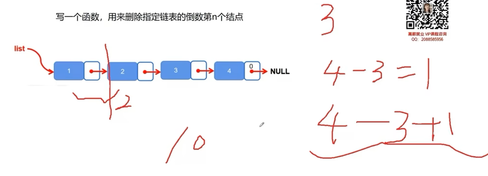

# c语言链表详解

链表是一种常见的基础数据结构，结构体指针在这里得到了充分的利用。链表可以动态的进行存储分配，也就是说，链表是一个功能极为强大的数组，他可以在节点中定义多种数据类型，还可以根据需要随意增添，删除，插入节点。链表都有一个头指针，一般以head来表示，存放的是一个地址。链表中的节点分为两类，头结点和一般节点，头结点是没有数据域的。链表中每个节点都分为两部分，一个数据域，一个是指针域。说到这里你应该就明白了，链表就如同车链子一样，head指向第一个元素：第一个元素又指向第二个元素；……，直到最后一个元素，该元素不再指向其它元素，它称为“表尾”，它的地址部分放一个“NULL”（表示“空地址”），链表到此结束。

作为有强大功能的链表，对他的操作当然有许多，比如：链表的创建，修改，删除，插入，输出，排序，反序，清空链表的元素，求链表的长度等等。

初学链表，一般从单向链表开始  


[TOC]

## 创建链表
```c
	typedef struct student{
		int score;
		struct student *next;//这个是指针！！并不是结构体本身！！
	} LinkList; 

	struct student a;//是一个节点
	struct student b;//是一个节点
	struct student* list = NULL; //空链表
//空链表可以用一个指针变量来表示，该指针变量指向 NULL 或者空值。

	list = &a;//list链表，含有一个节点

	a.next = &b;
	b.next = NULL;
//这就是一个链表表示结构了！！当然不能这么写！！作为理解
```

`struct student`，定义了一个结构体！这个结构体目前包含了一个int数据，和一个指针。

指针哎，别管它定义的是什么样的数据类型！！它简单理解就是一个地址！！就是需要保存下一个节点的地址数据的！！这一点需要搞清楚！！

一般创建链表我们都用`typedef  struct`，因为这样定义结构体变量时，我们就可以直接可以用`LinkList  *a`;定义结构体类型变量了。 


初始化一个链表，n为链表节点个数。

```c
LinkList *creat(int n){
	LinkList *head, *node, *end;//定义了三个指针变量 head、node、end，分别代表头节点、普通节点和尾部节点
	head = (LinkList*)malloc(sizeof(LinkList));//分配地址
	end = head;         //若是空链表则头尾节点一样
	for (int i = 0; i < n; i++) {
		node = (LinkList*)malloc(sizeof(LinkList));//分配了与 LinkList 类型所需内存大小相等的内存空间，并将该内存空间的首地址赋值给了 node 指针。
		scanf("%d", &node->score);
		end->next = node;//链接
		end = node;//end = node可以这么写！但是不直观，可以这样写 p = p->next;
        //end = end->next;//end指针后移！！
	}
	end->next = NULL;//结束创建
	return head;
}
//这个scanf马上都不会了！！这里只不过是scanf("%d", &node->score);
//scanf("输入控制符", 输入参数);
//功能：将从键盘输入的字符转化为“输入控制符”所规定格式的数据，然后存入以输入参数的值为地址的变量中。
//第二个要弄清楚的是：&是一个取地址运算符，&后面加变量名表示“该变量的地址”，所以&i就表示变量 i 的地址。&i又称为“取地址i”，就相当于将数据存入以变量 i 的地址为地址的变量中。
```
### 1.`LinkList *creat(int n)`
`LinkList *creat(int n)`：函数 `creat `接受一个整数类型的参数 n，表示需要创建链表的长度。它返回的是一个指向` LinkList `结构体的指针。  

`int* p` 宣告了一个指向整型变量的指针变量 `p`，`int*` 表示该指针变量所指向的数据类型是 `int`，而 `p` 则是该指针变量的名字，可以使用该名字来操作指针变量本身以及通过指针访问所指向的数据。

#### 为什么它要返回的是一个指向 `LinkList` 结构体的指针?
返回一个指向` LinkList `结构体的指针是因为，链表是由节点所组成的集合，而节点之间通过指针来链接。它上面的定义的头节点，普通节点，尾节点都是结构体指针，并且最后返回的是头节点。**因为，返回头结点的指针，就相当于获取了整个链表的起始地址**，从而可以依次访问每个节点并进行相关操作。

### 2.`LinkList *head, *node, *end;`
这里的 `LinkList *head, *node, *end;` 并没有创建三个链表节点，而是声明了三个指向 `LinkList` 类型的指针变量 head、node 和 end，用来分别指向头节点、普通节点和尾部节点。这些指针变量只是占用内存空间，不会直接创建链表节点。实际上，在下面的代码中，通过动态内存分配函数 `malloc `才会创建每个具体的节点，并将其地址赋值给 head、node 和 end 等指针变量，使得它们能够顺序地连接起来形成链表结构。

#### 指针变量为什么会代表节点？

定义了三个指针变量 head、node、end，分别代表头节点、普通节点和尾部节点，我们通常使用指针变量来代表内存中的某个地址。在链表的实现中，每一个节点都需要占据一段内存空间，因此我们可以定义一个结构体来表示节点的数据类型，并使用指针变量来动态地为每个节点分配内存。

而 head、node、end 均是指向该结构体类型的**指针变量**，具体地，head 表示链表的头节点，end 则始终指向链表的最后一个节点（便于新节点的追加），而 node 相当于一个临时变量，用于创建新节点并将其插入到链表末尾。

**当我们说 head 是链表的头节点时，是指 head 实际上是指向链表第一个节点所在内存地址的指针变量。**

head并不是头节点本身，而是指向头节点的指针。

#### 这里为什么要定义头节点和尾节点?

定义头结点和尾节点的方式是为了方便链表的插入和删除操作。具体来说，头结点和尾节点的作用如下：

头结点：不存储实际数据，仅仅作为链表表头使用。它的主要作用是为链表提供一个固定的起点，可以保证链表中的其他节点能够被顺序地链接起来。

尾节点：它是链表的最后一个节点，并且 next 指针指向 NULL。其主要使用场景在于添加新节点的时候，我们可以很方便地找到链尾，从而对链表完成赋值或者插入操作。

在这段代码中，定义头结点可以使得初始空链表不会出现访问空指针（NULL）的问题；定义尾节点方便新节点的插入。同时，定义头结点和尾节点也可以让链表数据结构更加正规化和标准化，增强了代码的可扩展性和可读性。

#### 什么是头节点？？什么是头指针？？

头节点是指第一个真实存储数据的节点前面的一个节点。头指针是指向头节点的指针变量。

```c++
ListNode* head = new ListNode();  // 创建头节点并分配内存
ListNode* p = head; // 头指针指向头节点
```

`LinkList *head;` 是一个指向 LinkList 类型的指针变量 head 的定义，它作为头指针用来指向链表的第一个节点。

而 `head = (LinkList*)malloc(sizeof(LinkList));` 则是使用动态内存分配函数 malloc 来为头节点分配内存空间，并将该节点的地址赋值给头指针 head。实际上，这里的 `head` 既充当了头指针一角色，也充当了头节点一角色，因为**实质上头节点就是一个结构体类型变量，其占据了一段内存空间，并且可以通过地址访问其各个成员变量。**

所以，整个过程包含两部分，首先通过 `LinkList *head;` 定义了头指针，然后通过 `head = (LinkList*)malloc(sizeof(LinkList));` 动态分配了内存并将地址赋值给头指针，从而使得头指针指向了新分配的头节点。


###  3.`head = (LinkList*)malloc(sizeof(LinkList))`//分配地址
#### head 既是指向链表第一个节点的指针变量，也可以用来代表链表的头节点。

为头节点分配内存空间，这里使用了动态内存分配函数 `malloc`，可以根据链表节点的大小申请相应的内存空间。这里用 `sizeof(LinkList) `表示一个` LinkList `结构体所占的空间大小。

`malloc`：使用了C语言中的动态内存分配函数 `malloc`，它的返回值是` void* `类型，即一个无类型指针，指向所分配内存的起始地址。

**由于链表的头结点是一个结构体类型，因此在进行内存分配时需要将 `void*` 指针进行强制类型转换为 `LinkList*` 类型（`LinkList `为结构体名），从而能够得到一个` LinkList `结构体类型的指针。**  

注意一定是动态分配`malloc`,保存在堆区，如果不写，直接分配一个内存，不对，分配在栈区，函数用完就被释放了！！那就不对了！！这点之前肯定不知道，看了C++的一些基础知识点才知道！！

#### 动态分配地址返回的是这段地址的首地址，然后用指针保存

在 C 语言中，通过动态内存分配函数（如 malloc、calloc 等）可以为一个对象分配一段指定大小的内存，返回的是这段内存块的首地址。我们通常使用指针来保存该地址，以便后续对其进行操作。

在链表中，同样通过动态内存分配函数为每个节点动态分配内存空间，得到的就是一个连续的、新的、唯一的内存地址。我们可以使用指针变量保存这个地址，并通过指针访问该节点的数据域和指向下一个节点的指针域，从而完成链表的操作。

#### 那既然head不是头节点，那头结点用什么表示的？

注意这里说是head不是头节点，head 可以表示链表的头节点。当我们说 head 是链表的头节点时，是指 head 实际上是指向链表第一个节点所在内存地址的指针变量。

在这个函数中，头节点并没有单独定义一个变量来表示，而是通过动态分配内存，在函数的第二行代码中创建了一个头节点，并将该头节点的地址赋值给了head指针。因此，在这个函数中，头节点的实际表示方式就是head指针所指向的节点。可以理解为head指针扮演了头节点的角色。需要注意的是，头节点并不包含任何有用的信息，其主要作用是为链表提供方便的操作。

### 4. `end = head`:是不是像head一样，也在堆区分配了一块内存

不是的，这里的 `end = head;` 只是将指针变量 `end` 指向了之前创建的头节点，没有分配额外的内存。这么做是为了在遍历链表时方便地找到链表的尾部。它们都是指向同一块内存区域的指针，在链表开始时它们都指向头节点，然后随着新节点的加入，`end` 指针会移动到链表的尾部节点，而 `head` 指针仍然指向头节点。所以，这里并没有在堆区分配新的内存空间，只是让 `end` 指针指向了 `head` 指针所指向的地址。

### 5.`for (int i = 0; i < n; i++)`这是关键代码
在 for 循环中，循环 n 次。每一次都会申请一个 `LinkList `的内存空间，并读入一个整数到节点的` score `域中。然后将上一个节点的 next 指针指向当前节点，同时更新尾节点的指针，使其指向新插入的节点，从而构建出链表的数据结构。

```c
end->next = node;//的作用是将原本指向空的尾节点的 next 指针指向新节点，这样就将新节点接到了链表的末尾，完成了插入操作。
end = node;//的作用是将 end 指针重新指向新的尾节点，以便下一次插入操作可以正确地找到
//链表的末尾进行插入。如果没有这一步操作，在下一次插入时就会找不到链表末尾，从而导致插入失败或覆盖上一个节点。

自己的理解：这两个代码重中之重！！
end->next = node;//链接
end = node;//end = node可以这么写！但是不直观，可以这样写 p = p->next;
//end = end->next;//后移！！

好，知道了end就是一个指针变量，并没有像head一样在堆区分配一段内存地址。
因为end也是这个结构体的指针变量嘛，所以可以end->next操作，访问里面的也是这个结构体的指针变量成员，用来链接刚定义的一个中间节点的首地址指针。链接！！
然后需要end指针后移，保证这个end指针指向最后一个节点！！所以end=end->next;或者end = node;英文这个node就是当前的最后一个节点的首地址！！
```

那普通节点是不是也是并没有单独定义一个变量来表示？

是的，函数中并没有单独定义一个变量来表示普通节点，而是通过动态分配内存，在循环中每次创建一个新的普通节点，并将输入的成绩存储在该节点的score成员中，然后将该节点挂载到链表末尾。由于普通节点在整个链表中都是平等的，因此不需要为其单独定义一个变量来表示。在创建完节点之后，只需要通过指针变量来引用它即可。

#### `end->next`为什么可以这样表述

当然，end是结构体类型的指针，这个指针如何访问成员变量的呢！！当然就是这样访问成员变量的啊

结构体指针是一种特殊的指针类型，它指向存储在内存中的一个结构体变量的地址，可以方便地操作结构体成员。使用结构体指针访问结构体成员可以使用两种不同的操作符：`->` 和 `.`。

`p->age` 可以看作是一个变量，但实际上它只是表示结构体变量中的 `age` 成员变量。

需要注意的是，`p` 是一个指向结构体的指针变量，而不是一个结构体变量，因此 `p->age` 本身不是一个变量，它只是用于访问结构体变量中 `age` 成员的方式。在这个例子中，它用于给结构体变量中的 `age` 成员变量赋值，实现了对该变量的修改操作。

总之，尽管 `p->age` 可以看作是一个变量，但实际上它只是一种访问结构体变量成员的语法方式，用于简化代码的表达，可以方便地使用指针操作结构体变量中的成员变量。

### 5.`return head`

返回头结点指针。此时，通过遍历头结点的 next 指针，就可以依次访问整个链表中的每一个节点了。

## 修改链表节点值
修改链表节点值很简单。下面是一个传入链表和要修改的节点，来修改值的函数。
	

```c
void change(LinkList *list,int n) {//n为第n个节点
	LinkList *t = list;
	int i = 0;
	while (i < n && t != NULL) {
		t = t->next;
		i++;
	}
	if (t != NULL) {
		puts("输入要修改的值");
		scanf("%d", &t->score);
	}
	else {
		puts("节点不存在");
	}
}
```
1.参数列表包含一个指向链表头结点的指针和目标节点的编号 n。    
2.`LinkList *t = list;`:首先定义一个指针变量 t 指向**头结点**，将计数器 i 初始化为 0，表示从头结点开始遍历整个链表。    
3.在循环中，每次将指针 t 移动到链表的下一个节点，并且计数器 i 加 1，直到找到目标节点或者遍历完链表。

一定是头节点！！不然遍历的节点不对！！

具体来说，函数中使用了一个带有指针类型参数的指针变量 `list` 来表示链表头节点。遍历链表时，使用了另外一个指针变量 `t` 来存储当前节点的地址。在循环中，通过指针变量 `t` 沿着链表向后遍历，并判断是否到达了需要修改的节点位置 n。如果已经到达了 n 节点，则将输入的新数据赋值给该节点的 score 成员变量，否则继续向后遍历。如果链表中没有第 n 个节点，则输出提示信息 "节点不存在"。

#### 为什么`LinkList *t = list`让指针t等于头节点指针之后，就可以使用指针t来遍历这个链表了？

使用`t = t->next;`就可以遍历链表了！！

那你知道为什么就返回一个头节点就可以遍历整个链表了嘛！！指针！！就是地址啊，找到了第一个的地址，就可以得到这个头节点了，头节点里面还包含了下一个链表节点的地址信息啊！！就完全可以实现了！！这个有这个疑问，就是链表的概念不牢！！很牛的！！


## 删除链表节点
  

**删除链表的元素也就是把前节点的指针域**越过要删除的节点指向下下个节点。即：p->next = q->next;然后放出q节点的空间，即free(q);  

记住链表的删除操作就是要找到当前删除点的前一个节点的指针域！！并不是当前节点的指针域！！具体代码怎么做随便你怎么写！！可以像下面的一样，写两个指针来操作！！还有其他方法很多很多！！	

```c
void delet(LinkList *list, int n) {
	LinkList *t = list, *in;
	int i = 0;
	while (i < n && t != NULL) {
		in = t;//核心代码
		t = t->next;
		i++;
	}
	if (t != NULL) {
		in->next = t->next;//核心代码
		free(t);//核心代码
	}
	else {
		puts("节点不存在");
	}
}
```
1.首先定义一个指针变量 t 指向头结点，同时使用另一个指针变量 in 记录 t 的前一个节点指针，以便在遍历链表时能够找到目标节点的前一个节点。

2.在循环中，每次将指针 t 移动到链表的下一个节点，并且计数器 i 加 1，直到找到目标删除节点或者遍历完链表。同时，将指针 in 及时更新为指向当前节点 t 的前一个节点，从而方便后面删除操作的实现。

3.**如果找到了目标删除节点，则将 in 的 next 指针指向节点 t 的 next 指针所指向的节点（即删除节点 t 的下一个节点），并释放节点 t 所占用的内存空间，完成删除操作。**

4.如果没有找到目标删除节点，则输出提示信息 “节点不存在”。

总之，这个函数可以在单链表中根据给定的节点编号删除对应节点，并正确更新原链表结构。需要注意的是，在执行删除操作时一定要先找到待删除节点的前一个节点 in，否则将无法准确地更新链表结构。

## 插入链表节点


我们可以看出来，插入节点就是用插入前节点的指针域链接上插入节点的数据域，再把插入节点的指针域链接上插入后节点的数据域。根据图，插入节点也就是：e->next = head->next;  head->next = e;

增加链表节点用到了两个结构体指针和一个int数据。

```c
void insert(LinkList *list, int n) {
	LinkList *t = list, *in;
	int i = 0;
	while (i < n && t != NULL) {
		t = t->next;
		i++;
	}
	if (t != NULL) {
		in = (LinkList*)malloc(sizeof(LinkList));
		puts("输入要插入的值");
		scanf("%d", &in->score);
		in->next = t->next;//填充in节点的指针域，也就是说把in的指针域指向t的下一个节点
		t->next = in;//填充t节点的指针域，把t的指针域重新指向in
	}
	else {
		puts("节点不存在");
	}
}
```
1.将新节点 in 的 next 指针指向节点 t 的下一个节点（即链表在第 n 个节点处断开，并将之后的所有节点后移一位），并重新将节点 t 的 next 指针指向新节点 in。

```c
in->next = t->next;//填充in节点的指针域，也就是说把in的指针域指向t的下一个节点
t->next = in;//填充t节点的指针域，把t的指针域重新指向in
```
不看解释还没理解呢，这个t->next是什么！！  
**这两行代码是在单链表中插入节点的核心代码**

第一行将新节点 in 的 next 指针指向了链表中目标插入位置的下一个节点，即节点 t 的 next 指针指向的节点。 
第二行则将节点 t 的 next 指针指向了新插入的节点 in，从而实现将新节点插入到链表中目标位置的操作。  

综合这两行代码，我们可以明白这样一个插入操作的效果：  
假设当前链表为：A->B->C->D  
如果要将一个新节点 E 插入到节点 B 和节点 C 之间，则应该选择在头结点后移动 2 步找到 B 节点数据结构指针 t（计数器加 1，因为头结点也算一个），然后使用 malloc 函数动态分配内存，创建一个新节点 E 并填充数据项的内容和 next 指针，并将其安装于链表中间，成为 A->B->E->C->D。

**具体实现方法是，首先使用 in->next = t->next; 告诉新节点 E 它的下一个节点是节点 C，然后使用 t->next = in; 将节点 B 指向新节点 E，这样链表结构就被更新成了 A->B->E->C->D。**

#### 总结：在链表中插入一个新节点的步骤

可以用以下伪代码表示：

```c++
1. 创建一个新节点 new_node，存储需要插入的数据
2. 将 new_node 的 next 指针指向当前节点 t 的下一个节点（new_node->next = t->next）
3. 将当前节点 t 的 next 指针重新指向新节点（t->next = new_node）
```

其中，第一步是动态分配内存空间来创建新节点，并存储需要插入的数据。第二步是将新节点的 next 指针指向当前节点 t 的下一个节点，这里使用了 `->` 操作符来访问结构体指针成员变量。第三步是将当前节点 t 的 next 指针重新指向新节点，这里也使用了 `->` 操作符来访问结构体指针成员变量。

通过这三步操作，就可以将新节点插入到链表中，并保证链表的正确性。值得注意的是，在实际应用中，如果链表为空或插入位置越界等情况，需要进行额外的处理。


## 输出链表
输出链表很简单，边遍历边输出就行了。

```c
while (h->next != NULL) {
	h = h->next;
	printf("%d  ", h->score);
}
```

## 删除指定链表的倒数第N个节点



一开始的思路：先遍历数一下这个链表的大小，然后推算出公式计算，如上图删除倒数第三个，总数4个，然后就是4-3+1，删除正数第二个！！对！！当然对的！！但这样做的话，在大厂不及格！！

我就是这样的思想，还没写出来！！

正确做法：不用先数一遍！！太浪费时间了！！快慢指针去处理！！


```c
/*
 * Definition for singly-linked list.
 * struct ListNode {
 *     int val;
 *     struct ListNode *next;
 * };
 */

struct ListNode* removeNthFromEnd(struct ListNode* head, int n){
    struct ListNode* fast = head;
    struct ListNode* slow = head;
    struct ListNode* prev = NULL;
    int count = 0;

    // 让 fast 指针先移动 n 步
    for (int i = 0; i < n; i++) {
        if (fast == NULL) return NULL; // 如果链表长度小于 n，则直接返回 NULL
        fast = fast->next;
        count++;
    }

    // 同时移动 fast 和 slow 指针，直到 fast 指向最后一个节点
    while (fast != NULL) {
        prev = slow;//prev 指向目标节点的前一个节点
        fast = fast->next;
        slow = slow->next;
        count++;
    }

    // 删除目标节点
    if (prev == NULL) {
        // 删除的是头节点
        head = head->next;
    } else {
        prev->next = slow->next;
    }
    free(slow);//内存的释放

    return head;
}
```

#### 举例说明快慢指针

好的，我来举个例子说明快慢指针的作用。

假设链表为：1 -> 2 -> 3 -> 4 -> 5，要删除倒数第二个节点即删除节点 4。假设 n = 2，也就是要删除倒数第 2 个节点。

在双指针法中，可以使用快慢指针分别指向头节点，然后让快指针先移动 n 步，即移动 2 步，指向节点 3。

此时，快指针和慢指针之间的距离就是 n，然后快指针和慢指针同时开始向后移动，直到快指针移动到最后一个节点。

具体来说，快指针在移动的过程中，每次都向后移动一步；而慢指针在第一次移动前不动，之后每次移动一步，与快指针保持 n 的距离。

**当快指针移动到最后一个节点时，慢指针所指向的就是目标节点的前一个节点**，也就是节点 3。此时程序会将节点 4 删除，并将节点 3 的 next 指针指向节点 5，实现了删除倒数第 2 个节点的操作。具体代码实现中，`prev `指针就是用来指向目标节点的前一个节点的。

需要注意的是，在删除链表节点时，应该释放被删除节点所占用的内存空间，同时需要特别处理删除头节点的情况。例如在本例中，如果要删除头节点 1，那么需要将头指针 head 指向节点 2，同时释放节点 1 的内存空间。


#### 内存泄露

内存泄漏是指程序中没有释放已经被分配的内存空间，导致这些内存空间一直被占用，无法再次分配给需要内存的其他部分。

避免内存泄漏的方法有以下几种：

1. 显式地释放已经分配的内存空间，常用函数是 `free()`。在进行动态内存分配时，一定要注意在不需要使用这块内存空间时，及时地调用 `free()` 函数释放已经分配的内存。
2. 采用垃圾回收技术。垃圾回收是指由程序自动扫描内存，找出不再使用的对象，然后自动释放这些对象占用的内存的过程。Java 和 Python 等高级编程语言都支持垃圾回收技术，可以大大简化内存管理的工作量。
3. 使用智能指针。C++11 引入了智能指针，可以在不需要访问对象时自动释放它们所占用的内存空间。智能指针可以大大减少因为遗忘释放内存而导致的内存泄漏。
4. 编写代码时增加断言（assert）判断。断言是程序中一种可以让程序员在运行时捕获错误的技术，在开发和测试阶段，可以在代码中增加一些断言，来在某些情况下触发对应的错误信息，提醒程序员进行修正和改进，以及规避内存泄漏等问题。

总之，避免内存泄漏的方法有很多种，不同的场景和编程语言使用的方法也略有差异。在实际开发中，需要根据具体情况选择最适合的方法来避免内存泄漏问题。


## 合并两个有序链表

将两个升序链表合并为一个新的 **升序** 链表并返回。新链表是通过拼接给定的两个链表的所有节点组成的。 

```c

/**
 * Definition for singly-linked list.
 * struct ListNode {
 *     int val;
 *     struct ListNode *next;
 * };
 */
#include <malloc.h>

struct ListNode* mergeTwoLists(struct ListNode* list1, struct ListNode* list2){
    if(list1==NULL) {
        return list2;
    } else if(list2==NULL) {
        return list1;
    }

    struct ListNode* pS=(struct ListNode*)malloc(sizeof(struct ListNode));
    struct ListNode* temp=pS;
    while(list1!=NULL && list2!=NULL) {
        if(list1->val<=list2->val) {
            temp->next=list1;
            list1=list1->next;
        } else {
            temp->next=list2;
            list2=list2->next;
        }
        temp=temp->next;
    }

    if(list1!=NULL) {
        temp->next=list1;
    } 
    if(list2!=NULL) {
        temp->next=list2;
    }

    return pS->next;
}
```

