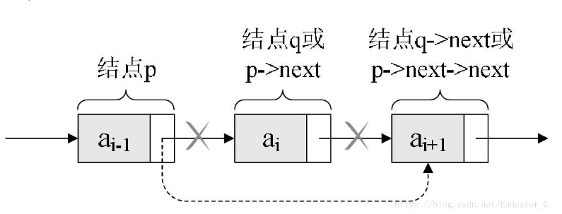
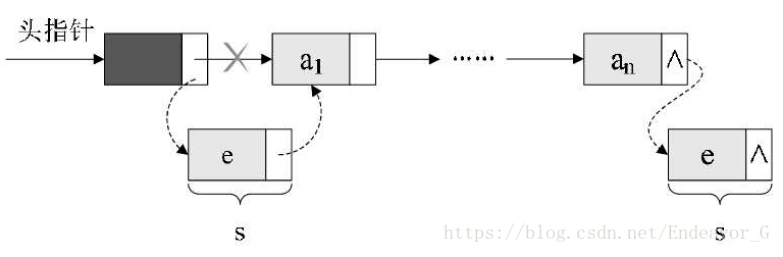

# c语言链表详解

链表是一种常见的基础数据结构，结构体指针在这里得到了充分的利用。链表可以动态的进行存储分配，也就是说，链表是一个功能极为强大的数组，他可以在节点中定义多种数据类型，还可以根据需要随意增添，删除，插入节点。链表都有一个头指针，一般以head来表示，存放的是一个地址。链表中的节点分为两类，头结点和一般节点，头结点是没有数据域的。链表中每个节点都分为两部分，一个数据域，一个是指针域。说到这里你应该就明白了，链表就如同车链子一样，head指向第一个元素：第一个元素又指向第二个元素；……，直到最后一个元素，该元素不再指向其它元素，它称为“表尾”，它的地址部分放一个“NULL”（表示“空地址”），链表到此结束。

作为有强大功能的链表，对他的操作当然有许多，比如：链表的创建，修改，删除，插入，输出，排序，反序，清空链表的元素，求链表的长度等等。

初学链表，一般从单向链表开始  


[TOC]

## 创建链表
```c
	typedef struct student{
		int score;
		struct student *next;
	} LinkList; 
```


一般创建链表我们都用`typedef  struct`，因为这样定义结构体变量时，我们就可以直接可以用`LinkList  *a`;定义结构体类型变量了。  

初始化一个链表，n为链表节点个数。

```c
LinkList *creat(int n){
	LinkList *head, *node, *end;//定义头节点，普通节点，尾部节点；
	head = (LinkList*)malloc(sizeof(LinkList));//分配地址
	end = head;         //若是空链表则头尾节点一样
	for (int i = 0; i < n; i++) {
		node = (LinkList*)malloc(sizeof(LinkList));
		scanf("%d", &node->score);
		end->next = node;
		end = node;
	}
	end->next = NULL;//结束创建
	return head;
}
```
### 1.`LinkList *creat(int n)`
`LinkList *creat(int n)`：函数 `creat `接受一个整数类型的参数 n，表示需要创建链表的长度。它返回的是一个指向` LinkList `结构体的指针。  

`int* p` 宣告了一个指向整型变量的指针变量 `p`，`int*` 表示该指针变量所指向的数据类型是 `int`，而 `p` 则是该指针变量的名字，可以使用该名字来操作指针变量本身以及通过指针访问所指向的数据。

#### 为什么它要返回的是一个指向 `LinkList` 结构体的指针?
返回一个指向` LinkList `结构体的指针是因为，链表是由节点所组成的集合，而节点之间通过指针来链接。它上面的定义的头节点，普通节点，尾节点都是结构体指针，并且最后返回的是头节点。**因为，返回头结点的指针，就相当于获取了整个链表的起始地址**，从而可以依次访问每个节点并进行相关操作。

### 2.`LinkList *head, *node, *end;`
#### 这里为什么要定义头节点和尾节点?
定义头结点和尾节点的方式是为了方便链表的插入和删除操作。具体来说，头结点和尾节点的作用如下：

头结点：不存储实际数据，仅仅作为链表表头使用。它的主要作用是为链表提供一个固定的起点，可以保证链表中的其他节点能够被顺序地链接起来。

尾节点：它是链表的最后一个节点，并且 next 指针指向 NULL。其主要使用场景在于添加新节点的时候，我们可以很方便地找到链尾，从而对链表完成赋值或者插入操作。

在这段代码中，定义头结点可以使得初始空链表不会出现访问空指针（NULL）的问题；定义尾节点方便新节点的插入。同时，定义头结点和尾节点也可以让链表数据结构更加正规化和标准化，增强了代码的可扩展性和可读性。

###  3.`head = (LinkList*)malloc(sizeof(LinkList))`//分配地址
为头节点分配内存空间，这里使用了动态内存分配函数 `malloc`，可以根据链表节点的大小申请相应的内存空间。这里用 `sizeof(LinkList) `表示一个` LinkList `结构体所占的空间大小。

`malloc`：使用了C语言中的动态内存分配函数 `malloc`，它的返回值是` void* `类型，即一个无类型指针，指向所分配内存的起始地址。

**由于链表的头结点是一个结构体类型，因此在进行内存分配时需要将 `void*` 指针进行强制类型转换为 `LinkList*` 类型（`LinkList `为结构体名），从而能够得到一个` LinkList `结构体类型的指针。**  

### 4.`for (int i = 0; i < n; i++)`
在 for 循环中，循环 n 次。每一次都会申请一个 `LinkList `的内存空间，并读入一个整数到节点的` score `域中。然后将上一个节点的 next 指针指向当前节点，同时更新尾节点的指针，使其指向新插入的节点，从而构建出链表的数据结构。

```c
end->next = node;//的作用是将原本指向空的尾节点的 next 指针指向新节点，这样就将新节
点接到了链表的末尾，完成了插入操作。
end = node;//的作用是将 end 指针重新指向新的尾节点，以便下一次插入操作可以正确地找到
//链表的末尾进行插入。如果没有这一步操作，在下一次插入时就会找不到链表末尾，从而导致插入失败或覆盖上一个节点。
```

### 5.`return head`
返回头结点指针。此时，通过遍历头结点的 next 指针，就可以依次访问整个链表中的每一个节点了。

## 修改链表节点值
修改链表节点值很简单。下面是一个传入链表和要修改的节点，来修改值的函数。
	

```c
void change(LinkList *list,int n) {//n为第n个节点
	LinkList *t = list;
	int i = 0;
	while (i < n && t != NULL) {
		t = t->next;
		i++;
	}
	if (t != NULL) {
		puts("输入要修改的值");
		scanf("%d", &t->score);
	}
	else {
		puts("节点不存在");
	}
}
```
1.参数列表包含一个指向链表头结点的指针和目标节点的编号 n。    
2.`LinkList *t = list;`:首先定义一个指针变量 t 指向**头结点**，将计数器 i 初始化为 0，表示从头结点开始遍历整个链表。    
3.在循环中，每次将指针 t 移动到链表的下一个节点，并且计数器 i 加 1，直到找到目标节点或者遍历完链表。

一定是头节点！！不然遍历的节点不对！！

## 删除链表节点
  

删除链表的元素也就是把前节点的指针域越过要删除的节点指向下下个节点。即：p->next = q->next;然后放出q节点的空间，即free(q);  
	
```c
void delet(LinkList *list, int n) {
	LinkList *t = list, *in;
	int i = 0;
	while (i < n && t != NULL) {
		in = t;//核心代码
		t = t->next;
		i++;
	}
	if (t != NULL) {
		in->next = t->next;//核心代码
		free(t);//核心代码
	}
	else {
		puts("节点不存在");
	}
}
```
1.首先定义一个指针变量 t 指向头结点，同时使用另一个指针变量 in 记录 t 的前一个节点指针，以便在遍历链表时能够找到目标节点的前一个节点。

2.在循环中，每次将指针 t 移动到链表的下一个节点，并且计数器 i 加 1，直到找到目标删除节点或者遍历完链表。同时，将指针 in 及时更新为指向当前节点 t 的前一个节点，从而方便后面删除操作的实现。

3.**如果找到了目标删除节点，则将 in 的 next 指针指向节点 t 的 next 指针所指向的节点（即删除节点 t 的下一个节点），并释放节点 t 所占用的内存空间，完成删除操作。**

4.如果没有找到目标删除节点，则输出提示信息 “节点不存在”。

总之，这个函数可以在单链表中根据给定的节点编号删除对应节点，并正确更新原链表结构。需要注意的是，在执行删除操作时一定要先找到待删除节点的前一个节点 in，否则将无法准确地更新链表结构。

## 插入链表节点


我们可以看出来，插入节点就是用插入前节点的指针域链接上插入节点的数据域，再把插入节点的指针域链接上插入后节点的数据域。根据图，插入节点也就是：e->next = head->next;  head->next = e;

增加链表节点用到了两个结构体指针和一个int数据。

```c
void insert(LinkList *list, int n) {
	LinkList *t = list, *in;
	int i = 0;
	while (i < n && t != NULL) {
		t = t->next;
		i++;
	}
	if (t != NULL) {
		in = (LinkList*)malloc(sizeof(LinkList));
		puts("输入要插入的值");
		scanf("%d", &in->score);
		in->next = t->next;//填充in节点的指针域，也就是说把in的指针域指向t的下一个节点
		t->next = in;//填充t节点的指针域，把t的指针域重新指向in
	}
	else {
		puts("节点不存在");
	}
}
```
1.将新节点 in 的 next 指针指向节点 t 的下一个节点（即链表在第 n 个节点处断开，并将之后的所有节点后移一位），并重新将节点 t 的 next 指针指向新节点 in。

```c
in->next = t->next;//填充in节点的指针域，也就是说把in的指针域指向t的下一个节点
t->next = in;//填充t节点的指针域，把t的指针域重新指向in
```
不看解释还没理解呢，这个t->next是什么！！  
**这两行代码是在单链表中插入节点的核心代码**

第一行将新节点 in 的 next 指针指向了链表中目标插入位置的下一个节点，即节点 t 的 next 指针指向的节点。 
第二行则将节点 t 的 next 指针指向了新插入的节点 in，从而实现将新节点插入到链表中目标位置的操作。  

综合这两行代码，我们可以明白这样一个插入操作的效果：  
假设当前链表为：A->B->C->D  
如果要将一个新节点 E 插入到节点 B 和节点 C 之间，则应该选择在头结点后移动 2 步找到 B 节点数据结构指针 t（计数器加 1，因为头结点也算一个），然后使用 malloc 函数动态分配内存，创建一个新节点 E 并填充数据项的内容和 next 指针，并将其安装于链表中间，成为 A->B->E->C->D。

**具体实现方法是，首先使用 in->next = t->next; 告诉新节点 E 它的下一个节点是节点 C，然后使用 t->next = in; 将节点 B 指向新节点 E，这样链表结构就被更新成了 A->B->E->C->D。**

## 输出链表
输出链表很简单，边遍历边输出就行了。

```c
while (h->next != NULL) {
	h = h->next;
	printf("%d  ", h->score);
}
```