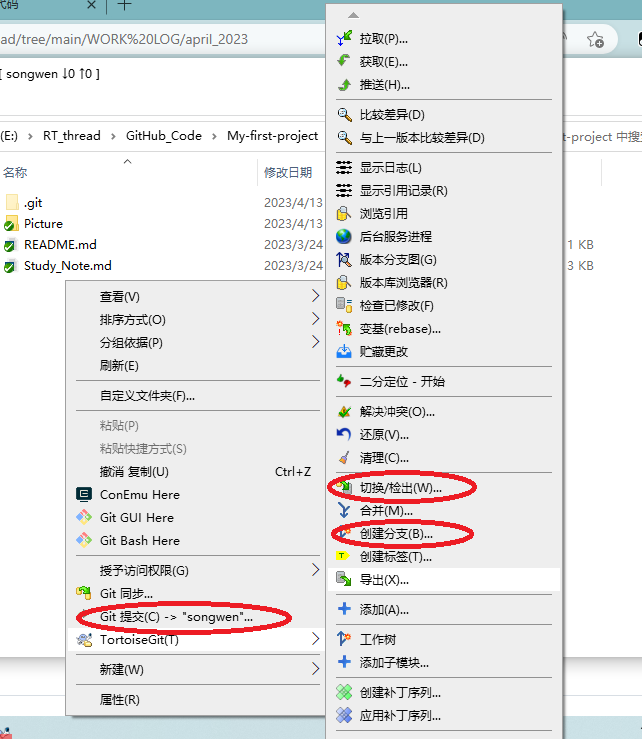
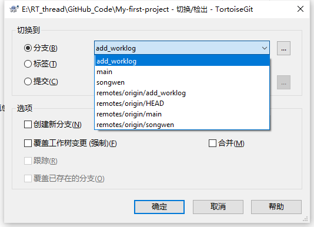
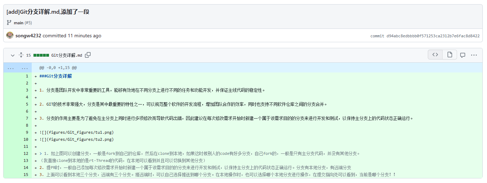
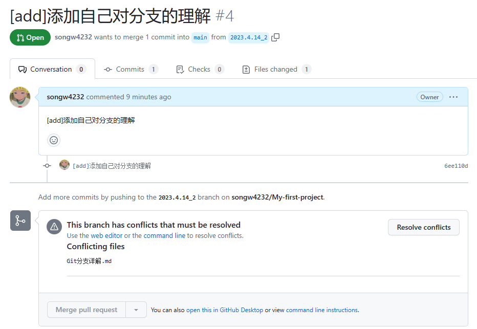
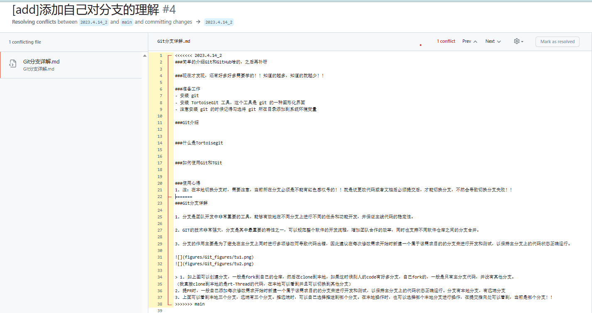

###简单的介绍Git和GitHub啥的，之后再补呀

###现在才发现，还有好多好多需要学的！！知道的越多，知道的就越少！！  

###准备工作  
- 安装 git  
- 安装 TortoiseGit 工具，这个工具是 git 的一种图形化界面  
- 注意安装 git 的时候记得勾选将 git 所在目录添加到系统环境变量   

###Git介绍  

###什么是Tortoisegit 

 
###如何使用Git和TGit

###使用心得 
1. 注：在本地切换分支时，需要注意，当前所在分支必须是不能有红色感叹号的！！就是说更改代码或者文档后必须提交后，才能切换分支，不然会导致切换分支失败！！

###Git分支详解

1. 分支是团队开发中非常重要的工具，能够有效地在不同分支上进行不同的任务和功能开发，并保证主线代码的稳定性。

2. GIT的技术非常强大，分支是其中最重要的特性之一，可以规范整个软件的开发流程，增加团队合作的效率，同时也支持不同软件仓库之间的分支合并。

3. 分支的作用主要是为了避免在主分支上同时进行多项修改而导致代码出错，因此建议在每次修改需求开始时新建一个属于该需求目的的分支来进行开发和测试，以保持主分支上的代码状态正确运行。

  

 
> 1. 如上图可以创建分支，一般是fork到自己的仓库，然后在clone到本地，如果这时候别人的code有好多分支，自己fork的，一般是只有主分支代码，并没有其他分支。  
（我直接clone到本地的是rt-Thread的代码，在本地可以看到并且可以切换到其他分支）
2. 提PR时，一般自己添加每次修改需求开始时新建一个属于该需求目的的分支来进行开发和测试，以保持主分支上的代码状态正确运行。分支有本地分支，有远端分支
3. 上面可以看到本地三个分支，远端有三个分支。推远端时，可以自己选择推送到哪个分支。在本地操作时，也可以选择哪个本地分支进行操作，在提交指向处可以看到，当前是哪个分支！！

###解释提PR时，冲突怎么来的？如何解决？
因为自己前两天提PR时，由于提PR的战线有点长！！两个人同时修改了同一个文件，别人的先合并，那么我的就会出现冲突问题！   
什么是 GitHub 冲突？小明和小强对同一个文件的同一行或相近行都进行了编辑，且进行了先后提交，便产生了冲突。  

这种好事都被我遇到了！人家来了半年了，估计都没遇到！我这才第二次提PR，就产生冲突了！！六！！  

看我的实验部分：  

我先后提交了两次，并且两次都是修改了同一个文档！！都在第一行开始添加的内容！！当合并另一个时，另一个就产生了冲突！！再有合并全权限的情况下，我把需要的内容保留后，删除冲突符号，就完成了合并！！

由下面的冲突文件中的冲突内容我们了解到：

	<<<<<<< HEAD
	6月19日 pingrixuexilianxi添加了内容
	=======
	6月18日 pingrixuexilianxi2修改了这个文件哦
	>>>>>>> a8284fd41903c54212d1105a6feb6c57292e07b5

<<<<<<< HEAD到 =======里面的【6月19日 pingrixuexilianxi添加了内容】是自己刚才的Commit提交的内容
=======到 >>>>>>> a8284fd41903c54212d1105a6feb6c57292e07b5里面的【6月18日 pingrixuexilianxi2修改了这个文件哦】是远程代码库更新的内容（即为pingrixuexilianxi2本地代码库推送修改内容）。  

冲突比较少，处理起来比较简单。例如只有一处或两处。  
__手动冲突解决方法:__  
根据项目需求删除不需要的代码就行了，假如都需要的话我们只需要把 <<<<<<< HEAD=======     >>>>>>> a8284fd41903c54212d1105a6feb6c57292e07b5都删掉冲突就解决了（注意，在项目中最后这些符号都不能存在，否则可能会报异常）。  

(我靠，那当时我这起冲突时，直接删了，不就好了？不知道没有合并权限的，能否这样操作啊！！这个是我自己的仓库，可以直接把删除了！解决冲突了，然后就直接合并了，解决问题)