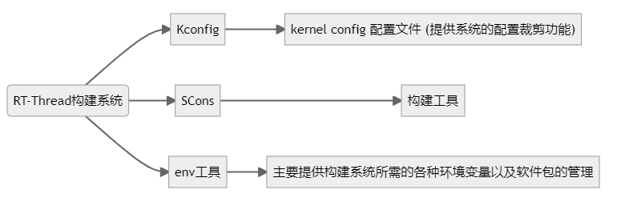
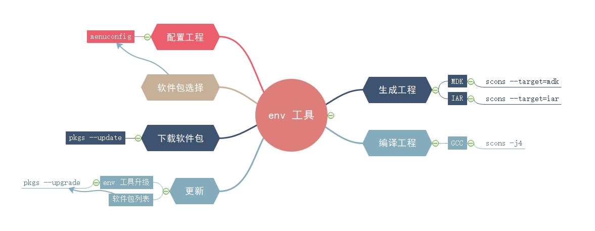

#RT-Thread的构建与配置系统（重点部分！！） 

  
这部分是要把Kconfig，Scons，ENV这三个搞明白，学精一点！！重点部分！！

###首先得搞明白他们三个什么关系！！

##Kconfig

 - C语言项目的裁剪配置本质上通过条件编译和宏展开
 - Kconfig文件的配置项会映射至rtconfig.h中
 - Kconfig文件随源码分散至各级子目录。

### 1.在Kconfig中编写相关代码，之后在env(menuconfig)中配置生成config.h中的相关宏定义
### 2.Kconfig文件形式
 
### 3.Kconfig在rtt中的常用语法
- 注释：#
- config语句：定义一组新的配置选项
- 配置变量类型决定了配置选项 例如bool类型，配置变量的选择就是y/n
- menu/endmenu语句:用于生成菜单
- if/endif语句：条件判断语句
- menuconfig：带菜单的配置项
- depends on
- choice/endchoice语句：定义多选项，但是只可以单选
- comment语句：定义提示信息
- source语句：用于读取另一个文件中的kconfig文件

##Scons构建工具

- 构建工具是一种软件，可以根据一定的规则或者指令，将源代码编译成可执行的二进制程序

- SCons:由python语言编写的开源构建系统，类似于GNU Make

- IDE通过图形化工具完成构建，根据用户所添加的源码生成类似于Makefile和sconscript的脚本文件，在底层调用类似make或者scons的工具来构建源码

- RT-Thread中的Scons的脚本结构

- 一个项目只有一个SConstruct,会有多个SConscript  

总结：SCons 使用 SConscript 和 SConstruct 文件来组织源码结构并进行构建，SConstruct是scons构建的主脚本，SConscript存放在源代码的子目录下，通常放在项目的子目录，以达到分层构建的目的。一个项目 (BSP) 只有一 SConstruct，但是会有多个 SConscript。一般情况下，每个存放有源代码的子目录下都会放置一个 SConscript。

RT-thread源码结构中Sconsxxxx和Kconfig文件的分析：

		-- rtconfig.py    ---- 控制SCons构建的配置文件，存放了如工具链，构建参数等配置。  
		-- SConscript
		-- SConstruct    ---- SCons的入口脚本，初始化了SCons构建rt-thread所需的必要环境
		-- Kconfig        ---- 顶层Kconfig文件，menuconfig的入口Kconfig文件
		-- rt-thread/
		--- src/
		---- SConscript   ---- 各级源码的scons子脚本，控制当前级别下的源码构建行为
		---- Kconfig      ---- 各级源码的Kconfig子脚本，存放当前级别下的配置项
		---- **.c

- 添加外设驱动基本步骤  
1.通过stm32cubemx来配置生成驱动文件，这时候Drivers里面还没有驱动文件  
2.编写Kconfig文件，可以先在hal库里面打开驱动文件，根据驱动文件里面相关的宏定义，来编写kconfig文件。  
3.打开env menuconfig，通过编写的Kconfig文件来打开驱动

###scons语法！ENV里面如何快速找到对应软件包！

##ENV
  
  

##注：
1. 有Kconfig的目录都可以使用ENV来配置，但不推荐，建议在顶层Kconfig目录下使用ENV来配置RT-Thread。
2. env 所在路径不要有中文或者空格存在；bsp 工程所在的路径不要有中文或者空格存在。

